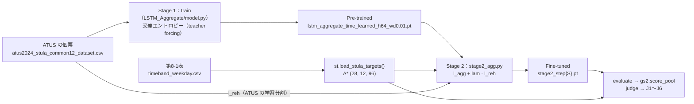
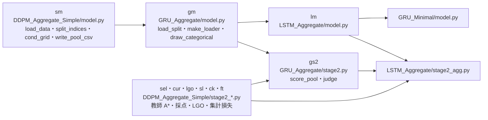

# ActSyn：日本の個票を使わずに、日本の活動スケジュール個票を生成する

米国 ATUS 2024 の個票で系列生成モデルを学習し、日本の社会生活基本調査の公表集計だけを教師にして、日本の個票を生成する。個票は、1 人 1 日の活動を 04:00 から 15 分刻みで並べた 96 スロットの列である。目標は、性 × 年齢 × 就業の 28 群それぞれで、日本の時刻別行動者率に合い、1 日の系列としても自然な個票を出すこと。

- **読み方**：§1〜§3 で枠組みと現状が分かる。§4 以降は、評価・実行・ファイルを調べるときに引く参照部である。
- **最終更新**：2026-10-09

## 1. 米国の個票で学び、日本の公表集計に合わせる 2 段構成

| | Stage 1（事前学習） | Stage 2（日本への適合） |
| --- | --- | --- |
| 使うデータ | ATUS 2024 平日の個票 3,736 人（学習 3,363 人・検証 373 人） | 社会生活基本調査 2021 調査票A の公表集計（教師 A*）。方法によっては、系列の形を守るために ATUS の学習分割も使う（リハーサル） |
| すること | 群を条件に、04:00 から 1 スロットずつ活動を生成するモデルを学習する | 生成した時刻別行動者率が A* に近づくよう、Stage 1 のモデルを更新する |

| 項目 | 定義 |
| --- | --- |
| 活動 | 両国の分類を突き合わせた共通 12 分類：睡眠・身の回り、食事、仕事、学業、家事、介護・育児、買い物、移動、余暇・交際、スポーツ、ボランティア、その他 |
| 群 | 性 2 × 年齢 7 区分（15 歳から 10 歳刻み、最上位は 75 歳以上）× 就業 2（有業・無業）= 28 群。ATUS で最も小さい群は日誌が 17 本 |
| 教師 A* | 時間帯編 第8-1表（平日）から作る、28 群 × 12 活動 × 96 スロットの時刻別行動者率。年齢 15 区分を人口加重で 7 区分に、行動 20 分類を 12 分類にまとめる |

現在の土台（`LSTM_Aggregate`）でのデータの流れ:



## 2. 現在の到達点（2026-10-09）

土台は、学習型の時刻符号を持つ 1 層の LSTM（`LSTM_Aggregate`、H = 64、約 4.2 万パラメータ）である。Stage 2 は、GRU・LSTM のどの方法でも教師との誤差が DDPM より大きく縮んだ。一方で、1 日の系列が ATUS 実から離れる問題が残っている。

### 2.1 Stage 1：生成の質を決めるのは、セルより時刻符号と weight decay

直前の活動と属性だけを入力にした最低限の構成から、部品を 1 つずつ足して比べた（種 42〜46 の 5 本、米国加重）。セルだけを GRU に替えた `GRU_Minimal` も同じ条件で学習した。

| 分かったこと | 根拠 |
| --- | --- |
| LSTM と GRU のセルの差はほぼ無い | 比べた 41 項目のうち、種 5 本の範囲が重ならなかったのは 3 項目 |
| 時刻符号は学習型（`Embedding(96, H)`）が最もよい | 12:00 の食事の誤差は、LSTM では時刻符号なし −4.65pt → 固定 −1.94pt → 学習型 −0.13pt。最大誤差が上限側の床を超えた活動は、12 のうち 8 → 7 → 4 |
| 固定の時刻符号（Transformer 型の φ）は鋭い山を作れない | φ の数値的な階数は float32 で 27。現実的な大きさの重みでは、幅約 1.5 時間より細い山を作れない |
| weight decay を強めるほど val は下がるが、生成が細切れになる | 予測のエントロピーと「15 分で終わるエピソードの割合」の相関が r = 0.81（24 構成 × 5 種 = 120 本）。相関だけで、介入では確かめていない |
| val で構成を選ぶと、生成の誤差が大きい構成を選ぶ | val の最良は 2 層・H128・wd 1。時刻別行動者率の誤差の最良は 1 層・H64・wd 0.01（LSTM、12 活動の MAE の平均 0.294pt）。構成ごとの平均で、val と誤差の相関は LSTM −0.60・GRU −0.35 |
| 大きいモデル（2 層・H128）は生成を良くしない | 時刻別行動者率の誤差は下がらず、LSTM の 2 層は 6 構成とも判定 C1 に不合格 |

- 学習型の時刻符号でも、日中の仕事が約 2pt 少なく、余暇が約 2pt 多い水準のずれが残る。実データの履歴を入れた予測では水準が合うので、ずれは自分の出力を履歴にして生成する段で積み重なる。
- 判定 C3（§4.1）は 24 構成すべてで不合格だった。どれも、日記の終わりと始まりで活動が異なる人の割合（`wrap_closure`）が ATUS 実と食い違った。暗記は 120 本すべてで 0 本。

### 2.2 Stage 2：教師との誤差は DDPM より大きく縮むが、系列が ATUS 実から離れる

試した方法は 4 つある。

| 方法 | モデル | 中身 |
| --- | --- | --- |
| DRaFT-K | `DDPM_Aggregate_Simple` | 拡散の逆過程の末尾 K ステップだけ勾配を通し、集計損失とリハーサルで重みを更新する |
| 日本へのずれ δ | `GRU_Aggregate`（H128） | 重みは固定する。logits に「時刻 × 活動」のずれ δ を足し、生成した行動者率が A* に合うよう δ を反復で直す。δ は属性の足し算（共通＋性＋年齢＋就業）で持つ |
| 傾けたリハーサル | `GRU_Aggregate`（H128） | 生成した個票に、集計が A* へ近づく重み（指数傾け）を付け、その重み付き交差エントロピーで重みを更新する |
| 連鎖の逆伝播 | `LSTM_Aggregate`（H64） | 引いた活動を次の入力にしたまま、96 スロットの生成の連鎖を通して集計損失を逆伝播する（straight-through Gumbel-softmax） |

| 方法 | 28 群の `rate_mse_split` | `bigram_jsd` | 1 日の切替回数（ATUS 実 12.81） | 判定 |
| --- | --- | --- | --- | --- |
| DRaFT-K | 2.59e-3（Pre-trained から −13.3%） | 0.0049 → 0.0023 | — | J1〜J6 の比較の基準 |
| 日本へのずれ δ | 3.05e-3 → 5.8e-4 | 0.0016 → 0.0092 | 12.91 → 12.61 | J3 不合格 |
| 傾けたリハーサル | 3.05e-3 → 5.6e-4 | 0.0016 → 0.0133 | 12.91 → 11.31 | J3・J4（起床時刻）不合格 |
| 連鎖の逆伝播 | 3.42e-3 → 2.25e-4 | 0.0021 → 0.0043 | 13.04 → 12.39 | 判定前 |

- 値は Pre-trained → Fine-tuned。GRU は E1 の 5 種の中央値、LSTM は種 42 の 1 本（学習率 1e-3・1000 step・λ = 0.01）。DDPM は λ = 0.003・step 200 の値で、`bigram_jsd` だけは LGO 7 fold の中央値。
- 教師との誤差（28 群の `rate_mse_split`）は、DDPM Fine-tuned の 0.22 倍（GRU の 2 方法）と 0.09 倍（LSTM）まで縮んだ。教師から外した群でも、GRU の 2 方法は 7 fold すべてで Pre-trained と DDPM Fine-tuned を下回った（J1・J2 合格）。
- 一方で、自己回帰の 3 方法はどれも `bigram_jsd` を増やした（GRU 5.8 倍・8.3 倍、LSTM 2.0 倍）。J3 の基準は Pre-trained の 1.2 倍以内なので、増え方の小さい LSTM（種 42）も基準を超えている。DDPM は `bigram_jsd` が半減したが、教師との誤差は 13% しか縮まなかった。
- LSTM の種 43〜46 の E1 と LGO 7 fold は 2026-10-09 時点で実行中。判定 J1〜J6 はその後に出す。

### 2.3 判断待ちの論点

| # | 論点 | 選択肢・状態 |
| --- | --- | --- |
| 1 | Stage 1 の構成を選ぶ基準 | 生成の質で選ぶ（1 層・H64、wd を 0.01〜0.1 へ下げる）か、val で選ぶ（2 層・H128・wd 1）か。`model.py` の既定は wd 1.0 のまま |
| 2 | Stage 2 の系列の崩れ（J3） | GRU の 2 方法は不合格のまま保留している。LSTM の判定が出たら 3 方法を並べて決める |
| 3 | Stage 2 の λ | 学習率 1e-3 での判定の後、λ を 0.01 から上下どちらへ振るかを決める |
| 4 | 生成で積み重なる水準のずれ | 出力のバイアスを学習後に補正する部品を足すか |
| 5 | 細切れの原因 | 生成の温度を下げ、wd 1 の構成の細切れが減るかを確かめる（学習し直しは不要） |

計画だけで未着手の実験が 2 つある。計画はどちらも [pretrain_variation_plan.md](src/models/GRU_Aggregate/docs/pretrain_variation_plan.md) にある。

- 事前学習のデータに、土日と別の年の ATUS を足す
- Stage 2 の教師に、社会生活基本調査 2016 を足す

## 3. モデルの変遷：細切れ → 総量の揺れ → 部品の切り分け

| 時期 | フォルダ | 主な結果 | 次へ移った理由 |
| --- | --- | --- | --- |
| 2026-06〜07 | `CVAE`・`CVAE_Embedding`・`CVAE_Aggregate` | NHTS・ATUS の CVAE で、集計マッチ転移の初版を作った | 個票が細切れになった。1 日の切替回数が実データ 12.64 に対し 48.1 |
| 2026-07〜09 | `DDPM`・`DDPM_Aggregate`・`DDPM_Aggregate_Tang`・`DDPM_Aggregate_DiT`・`DDPM_Aggregate_Simple` | 細切れを解消した（切替回数 12.87）。Stage 2 を指数傾けと DRaFT-K で実装し、λ の掃引・LGO・時刻符号のアブレーションまで行った | 少ない活動の総量が学習の途中で揺れ、損失（ε-MSE）がそれを縛らない。Stage 2 は集計とリハーサルの勾配が逆向き（cos = −0.27）で、教師との誤差が 13% しか縮まない |
| 2026-09-27〜30 | `GRU_Aggregate` | 交差エントロピーと `slot_bias`・学習後の補正で総量の揺れを抑えた（判定 C1・C2 合格）。Stage 2 は 2 方法とも、教師との誤差が DDPM の 0.22 倍まで縮んだ | 部品（`slot_bias`・CFG・補正・重み付きの損失・2 層・H128・固定の時刻符号）が重なり、どれが効いたか切り分けられない |
| 2026-10-02〜 | `LSTM_Aggregate`・`GRU_Minimal` | 最低限の構成から部品を 1 つずつ足して効果を測る | 現在の土台（§2） |

## 4. 評価は、Stage 1 で ATUS 実の再現を、Stage 2 で教師から外した群への適合を見る

判定の規則と予測は、各実験で結果を見る前に固定している。

### 4.1 Stage 1（米国加重）

Stage 1 の目的は ATUS の分布の再現なので、生成した群別の値を ATUS の調査ウェイト（TUFINLWGT）の群構成で平均し、ATUS 実と比べる。

| 見るもの | 指標 |
| --- | --- |
| 時刻別行動者率 | 12 活動ごとの誤差（生成 − ATUS 実）× 100（pt）。平均誤差・MAE・最大誤差と、誤差の大きい 15 分区間の上位 5 つ |
| 系列 | 1 日の切替回数、15 分で終わるエピソードの割合、`switch_emd`、`bigram_jsd`、`wrap_closure` |
| 多様性・暗記 | 個票間のハミング距離の広がり、学習データとの最近傍距離（DCR）による丸写しの検出 |

時刻別行動者率の床は 2 段ある。どちらも完全なモデル（ATUS 実から引き直したプール）で同じ量を 50 回測った 95% 分位で、ATUS の回答者を復元抽出しないものが下限側、復元抽出したものが上限側である。上限側を超えた誤差は、完全なモデルでは出ない。

| # | 合格の基準 |
| --- | --- |
| C1 総量の安定 | 少ない 5 活動（介護・育児、買い物、移動、スポーツ、ボランティア）のうち 4 以上で、総量の比（生成 / ATUS 実）の種間 sd が DDPM（Transformer 型の時刻符号）の 0.5 倍以下 |
| C2 総量の一致 | 同じ 5 活動のうち 4 以上で、総量の比の種平均が床の内（この床は ATUS の回答者の復元抽出で測る） |
| C3 系列の妥当さ | `switch_emd`・`bigram_jsd`・15 分で終わるエピソードの割合の差・`wrap_closure` の差が、時刻符号なし DDPM の種の最大以下。暗記 0 本 |

### 4.2 Stage 2（日本人口加重）

評価のプールは群あたり 2,000 本（乱数 12345）で、群別の値を日本の人口構成で加重する。実行は 3 種類ある。

| 実行 | 教師にする群 | 種 | 測るもの |
| --- | --- | --- | --- |
| E0 | なし（Pre-trained のまま） | 42〜46 | 出発点 |
| E1 | 28 群すべて | 42〜46 | 教師への適合、系列の変化、公表表との突合 |
| E2 | 28 群を 4 群 × 7 fold に分け、fold ごとに 4 群を外す（LGO） | 42 | 教師に使っていない群での適合 |

| # | 合格の基準 |
| --- | --- |
| J1 | E2 で外した群の `rate_mse_split` が、7 fold すべてで Pre-trained より小さい |
| J2 | 同じ値が、7 fold のうち 6 以上で DDPM Fine-tuned より小さい |
| J3 | 系列の指標（`bigram_jsd`・`switch_emd`・切替回数・15 分で終わるエピソードの割合・`wrap_closure` など）の ATUS 実との距離が、Pre-trained の 1.2 倍以内。暗記 0 本 |
| J4 | 起床・就寝の平均時刻のずれ（`wake_bias`・`bed_bias`）と日次行動者率の誤差（`exact_mae`）が、Pre-trained より小さい |
| J5 | 全国（28 群を人口で加重）の時刻別行動者率の MSE が、DDPM Fine-tuned（1.281e-3）より小さい |
| J6 | 28 群の `rate_mse_split`・`dev_rmse` が、DDPM Fine-tuned（2.590e-3・0.0387）より小さい |

- J3〜J6 は E1 の 5 種の中央値で判定する。
- J5・J6 は 28 群すべてを教師にした値で、学習した量そのものを測っている。教師に使っていない量での裏付けは、J1・J2（外した群）と J4（教師に使っていない公表表）が担う。
- J4 の突合先は、生活時間編 第70-3表（日次行動者率）と、平均時刻編 第3-2表（起床）・第24-1表（就寝）。

## 5. 環境とデータの準備

### 5.1 環境

依存関係は [uv](https://docs.astral.sh/uv/) で管理する（Python 3.14）。

```bash
uv sync
uv run python -c "import torch; print(torch.__version__)"
```

- GRU・LSTM の学習と Stage 2 は手元の Apple Silicon（MPS）で回している。DDPM は大阪大学 SQUID の GPU で回した。手順は [container/README.md](container/README.md)、ジョブスクリプトは [jobs/](jobs/) にある。
- `data/`・`outputs/`・`logs/`・`notebooks/` と、報告書・図の一部は Git 管理外である。生データは各配布元から取得し、下の前処理で `data/processed/` を作り直す。

### 5.2 ATUS 2024（Stage 1 の個票）

[BLS のデータページ](https://www.bls.gov/tus/data/datafiles-2024.htm)から 3 つの zip を取得し、展開した `.dat` を `data/raw/opened/ATUS2024/` に置く。

| ファイル | 内容 |
| --- | --- |
| `atusact_2024.dat` | Activity file（1 行 = 1 エピソード） |
| `atusresp_2024.dat` | Respondent file（調査ウェイト・曜日・就業状態） |
| `atusrost_2024.dat` | Roster file（年齢・性別） |

```bash
uv run python src/common/preprocess/atus/preprocess.py
```

出力は `data/processed/atus2024/atus2024_weighted_dataset.csv`（ATUS Lexicon 第 1 層の 17 分類、04:00 起点の 96 スロット、`TUFINLWGT` 付き）。

### 5.3 社会生活基本調査 2021 調査票A（教師と突合先）

e-Stat（統計コード 00200533）から Excel を取得し、`data/raw/opened/STULA2021/<statInfId>.xlsx` に置く。

| 表 | statInfId | 使い道 | 変換 | 出力（`data/processed/stula/`） |
| --- | --- | --- | --- | --- |
| 時間帯編 第8-1表（平日） | 000032224341 | 教師 A* | `parse_timeband.py` | `timeband_weekday.csv` |
| 生活時間編 第70-3表 | 000032224198 | J4 の日次行動者率 | `parse_timeuse.py` | `timeuse_participation.csv` |
| 平均時刻編 第3-2表（起床） | 000032224374 | J4 の起床時刻 | `parse_mean_time.py` | `meantime_wake.csv` |
| 平均時刻編 第24-1表（就寝） | 000032224412 | J4 の就寝時刻 | `parse_mean_time.py` | `meantime_bed.csv` |

```bash
uv run python src/common/preprocess/stula/parse_timeband.py
uv run python src/common/preprocess/stula/parse_timeuse.py
uv run python src/common/preprocess/stula/parse_mean_time.py
```

- 時刻は 0:00 起点から 04:00 起点へ回す。欠損の印は、`-` を 0（行動者なし）、`…`・`X` を非公表（NaN）として分ける。
- 起床の表は、就業状態 × 年齢の両方を持つ第3-2表を使う。表題が似た第3-1表・第1-4表は軸が足りない。
- `parse_timeband.py` は土曜・日曜・都道府県の表も変換する。ファイルが無い表は飛ばす。

### 5.4 共通 12 分類へのクロスウォーク

ATUS の 17 分類と社会生活基本調査の 20 分類を、共通 12 分類にそろえる。

```bash
uv run python src/common/preprocess/stula/crosswalk_atus_stula.py
```

- `data/processed/atus2024/atus2024_stula_common12_dataset.csv`：Stage 1 の入力
- `data/processed/stula/crosswalk_atus_stula.csv`・`.md`：論文に載せる対応表

意味の対応が取れないコードは「その他」（`OTHER_X`）にまとめる。両国の「その他」は中身が違うので、Stage 2 の採点では「その他」を除いた 11 活動の値も並べて出す。

### 5.5 教師 A* と ATUS の行動者率の書き出し（任意）

```bash
uv run python src/common/astar/export_astar.py         # → data/processed/stula/A_star_weekday.csv
uv run python src/common/astar/export_atus_rates.py    # → data/processed/atus2024/A_atus_weekday_{weighted,unweighted}.csv
uv run python src/common/astar/plot_atus_vs_astar.py   # 2 つを重ねた図
```

書き出した CSV は確認用である。学習は A* を毎回 `timeband_weekday.csv` から組み直す。

### 5.6 NHTS 2022（初期の CVAE だけが使う）

[NHTS](https://nhts.ornl.gov/) から CSV を取得し、`src/common/preprocess/nhts/preprocess.py` → `merge_weight.py` の順に実行する。CVAE は出力の `data/processed/weighted_dataset.csv` を読む。2 つのスクリプトのパスは旧い配置のままの相対パスなので、動かす前に手元の配置に合わせる。

## 6. LSTM_Aggregate（現在の土台）を動かす

### 6.1 Stage 1

```bash
uv run python src/models/LSTM_Aggregate/model.py --smoke                        # 動作確認（2 epoch、何も保存しない）
uv run python src/models/LSTM_Aggregate/model.py --seed 42                      # 既定：1 層・H64・wd 1.0・学習型の時刻符号
uv run python src/models/LSTM_Aggregate/model.py --seed 42 --weight-decay 0.01  # Stage 2 の Pre-trained に使う構成
uv run python src/models/GRU_Minimal/model.py --seed 42                         # セルだけを GRU に替えたもの（フラグは同じ）
```

| フラグ | 意味（既定） |
| --- | --- |
| `--seed S` | 学習の乱数の種（42）。データの分割は変えない |
| `--time-enc K` | 時刻符号 `none` / `fixed` / `learned`（`learned`） |
| `--hidden H`・`--num-layers L`・`--weight-decay W` | 幅（64）・層数（1）・重み行列だけに掛ける weight decay（1.0） |
| `--weighted-loss` | TUFINLWGT で重み付けした交差エントロピーで学習する（既定は重みなし） |
| `--pool-only`・`--no-pool` | 保存済みの ckpt から生成プールだけを作る・学習後に生成プールを作らない |

- 最適化は AdamW（学習率 1e-3）、256 人のミニバッチ、最大 1,000 epoch。検証の交差エントロピーが 30 epoch 改善しなければ止める。
- 生成プールは 28 群 × 256 本（乱数 12345、温度 1.0）。
- 保存先は `outputs/checkpoints/lstm_aggregate{…}.pt` と `outputs/generated/lstm_aggregate_samples{…}.csv`。名前は設定と種から決まる（例：wd 0.01・種 43 なら `lstm_aggregate_time_learned_h64_wd0.01_s43.pt`）。規則は `model.py` の docstring にある。

### 6.2 Stage 2（生成の連鎖の逆伝播）

```bash
uv run python src/models/LSTM_Aggregate/stage2_agg.py --smoke
uv run python src/models/LSTM_Aggregate/stage2_agg.py --seed 42 --zero-shot          # E0：Pre-trained のまま採点
uv run python src/models/LSTM_Aggregate/stage2_agg.py --seed 42 --lam 0.01 \
    --lr-cond 1e-3 --lr-time 1e-3 --lr-rest 1e-3 --steps 1000                         # E1（種 43〜46 も同じ）
uv run python src/models/LSTM_Aggregate/stage2_agg.py --seed 42 --lam 0.01 --fold 3 \
    --lr-cond 1e-3 --lr-time 1e-3 --lr-rest 1e-3 --steps 1000                         # E2（fold 0〜6）
uv run python src/models/LSTM_Aggregate/stage2_agg.py --judge --lam 0.01 \
    --lr-cond 1e-3 --lr-time 1e-3 --lr-rest 1e-3 --steps 1000                         # J1〜J6
```

- 1 回の更新で 7 群 × 256 本を生成し、集計損失 `l_agg` とリハーサル `l_reh`（ATUS の交差エントロピー）の勾配を足して AdamW を 1 歩進める。早期終了は使わず、判定には最終 step を使う。
- コードの既定（学習率 cond・time 1e-4、その他 1e-5、300 step）は、2026-10-08 に結果を見る前に固定した値である。種 42 では `rate_mse_split` が 1.43e-3 で止まった。止めていたのは学習率 × step で決まる重みの移動量の上限だったので、2026-10-09 から学習率 1e-3・1000 step で回している。
- 既定と違う学習率・step 数は保存名に入る（例：`_lam0.01_lr0.001_steps1000`）ので、既定の結果を上書きしない。
- 1 回の更新は約 0.27 秒（MPS）。ckpt は `outputs/checkpoints/stage2_lstm_…/stage2_step{S}.pt` に 25 step ごと、採点は `data/processed/aggregates/stage2_lstm_….csv` に出る。

### 6.3 評価と図

```bash
uv run python src/models/LSTM_Aggregate/eval_curves.py      # 時刻別行動者率の誤差（活動ごとの pt・上位 5 区間）
uv run python src/models/LSTM_Aggregate/eval_vs_gru.py      # 系列・総量・群・判定 C1〜C3（eval_curves.py の後に回す）
uv run python src/models/LSTM_Aggregate/grid_summary.py     # 層数 × 幅 × wd の 24 構成のまとめ
uv run python src/models/LSTM_Aggregate/plot_stage2_curves.py --lam 0.01 \
    --lr-cond 1e-3 --lr-time 1e-3 --lr-rest 1e-3 --steps 1000
uv run python src/eval/learning_curves.py --models lstm gru_minimal
```

表は `data/processed/aggregates/` に、図は各モデルのフォルダの `figures/` に出る。

### 6.4 以前のモデルを動かす

各 `model.py` の冒頭の docstring に、使い方・フラグ・保存先と、どのモデルからの差分かが書いてある。

| モデル | Stage 1 | Stage 2 | 計画・処理の流れ |
| --- | --- | --- | --- |
| `GRU_Aggregate`（H128・wd 1） | `model.py --seed 42` の後、`--calibrate --guidance 1.25` で `slot_bias` を補正する | `stage2.py`（δ）・`stage2_finetune.py`（傾けたリハーサル）。どちらも `--zero-shot`・`--fold K`・`--judge` を持つ | [plan.md](src/models/GRU_Aggregate/docs/plan.md)・[stage2_plan.md](src/models/GRU_Aggregate/docs/stage2_plan.md) |
| `DDPM_Aggregate_Simple` | `model.py`（SQUID では `jobs/train_ddpm_simple*.sh`） | `stage2_finetune.py`（DRaFT-K）→ `stage2_select.py`（ckpt の事後選択）・`stage2_lgo.py`（LGO） | [Stage1.md](src/models/DDPM_Aggregate_Simple/docs/pipeline/Stage1.md)・[Stage2.md](src/models/DDPM_Aggregate_Simple/docs/pipeline/Stage2.md) |
| `DDPM_Aggregate` | `model.py` | `japan_match_experiment.py`（指数傾け） | [DDPM_Aggregate_guide.md](src/models/DDPM_Aggregate/DDPM_Aggregate_guide.md) |

## 7. テスト

各テストは `main()` に素の assert と診断の print を並べた単体スクリプトで、pytest は使わない。一部のテストは前処理済みのデータ（§5）を読む。

```bash
# 評価（モデルに依存しない）
uv run python src/eval/test_individual_metrics.py
uv run python src/eval/test_feasibility.py
uv run python src/eval/test_conditioning.py
uv run python src/eval/test_schedule_plausibility.py
uv run python src/eval/test_clock_diagnostics.py
uv run python src/eval/test_slot_rate_errors.py
uv run python src/eval/test_atus_group_rates.py
uv run python src/eval/test_stula_derived_times.py

# LSTM・GRU
uv run python src/models/LSTM_Aggregate/test_model.py
uv run python src/models/LSTM_Aggregate/test_stage2_agg.py
uv run python src/models/GRU_Minimal/test_model.py
uv run python src/models/GRU_Aggregate/test_model.py
uv run python src/models/GRU_Aggregate/test_stage2.py
uv run python src/models/GRU_Aggregate/test_stage2_finetune.py

# DDPM
uv run python src/models/DDPM_Aggregate_Simple/test_backbone.py
uv run python src/models/DDPM_Aggregate_Simple/test_stage2.py
uv run python src/models/DDPM_Aggregate/test_tilting.py
uv run python src/models/DDPM_Aggregate/test_memorization_report.py
uv run python src/models/DDPM_Aggregate_Tang/test_backbone.py
uv run python src/models/DDPM_Aggregate_DiT/test_backbone.py
```

## 8. リポジトリ構成：共通部品は DDPM_Aggregate_Simple と GRU_Aggregate にある

```text
.
├── src/
│   ├── common/
│   │   ├── preprocess/atus/     ATUS 2024 → 96 スロット × 17 分類
│   │   ├── preprocess/stula/    社会生活基本調査の公表表 → CSV、共通 12 分類へのクロスウォーク
│   │   ├── preprocess/nhts/     NHTS 2022（初期の CVAE 用）
│   │   └── astar/               教師 A* と ATUS の時刻別行動者率の書き出し
│   ├── eval/                    モデルに依存しない評価（個票・実現可能性・条件付け・時刻・行動者率の誤差）
│   │   └── diagnostics/         個別の実験のための診断（Stage 1 の比較、Stage 2 の勾配など）
│   └── models/
│       ├── CVAE/ CVAE_Embedding/ CVAE_Aggregate/      初期の CVAE
│       ├── DDPM/ DDPM_Aggregate/                      条件付き DDPM と、指数傾けの Stage 2
│       ├── DDPM_Aggregate_Tang/ DDPM_Aggregate_DiT/   バックボーンの差し替え
│       ├── DDPM_Aggregate_Simple/                     簡素版の DDPM と、Stage 2 の共通部品（教師・損失・採点・LGO）
│       ├── GRU_Aggregate/                             GRU（slot_bias・CFG・補正）と、Stage 2 の δ・傾けたリハーサル
│       ├── LSTM_Aggregate/                            ★現在の土台。Stage 1 と Stage 2（連鎖の逆伝播）
│       └── GRU_Minimal/                               LSTM_Aggregate のセルだけを GRU に替えたもの
├── jobs/                        SQUID（PBS）のジョブスクリプト（DDPM 用）
├── container/                   Singularity イメージの定義とビルド手順
├── data/                        生データと前処理の結果（Git 管理外）
└── outputs/                     ckpt・生成プール・ログ（Git 管理外）
```

モジュールの依存（矢印の先が元を import する。名前はコード中の変数名）:



- データの読み込み・分割・条件の符号化・生成プールの CSV 形式は `sm` が唯一の出所で、GRU と LSTM は写し書きせずに import する。ここを直すと、すべてのモデルの比較に影響する。
- フォルダごとに同じ名前の `model.py` があるので、各ファイルの `_load` が importlib で一意の名前を付けて読み込む。
- `DDPM_Aggregate_Simple` は `DDPM_Aggregate` を import しない自己完結のコピーで、片方を直しても他方には伝わらない。

## 9. 報告書と計画書

| 内容 | ファイル |
| --- | --- |
| LSTM・GRU 最低限の実験のまとめ（Stage 1 の 5 実験と Stage 2） | `src/models/LSTM_Aggregate/docs/experiment_summary.md` ※ |
| 上の個別の報告（セル・時刻符号・幅・weight decay・24 構成） | `src/models/LSTM_Aggregate/docs/Stage1_*.md` ※ |
| GRU の計画と Stage 1 | [plan.md](src/models/GRU_Aggregate/docs/plan.md)・[Stage1_gru_results.md](src/models/GRU_Aggregate/docs/Stage1_gru_results.md) |
| GRU の Stage 2 | [stage2_plan.md](src/models/GRU_Aggregate/docs/stage2_plan.md)・[Stage2_results.md](src/models/GRU_Aggregate/docs/Stage2_results.md)・[Stage2_finetune_results.md](src/models/GRU_Aggregate/docs/Stage2_finetune_results.md) |
| GRU の H128 への切り替え | `src/models/GRU_Aggregate/docs/h128_results.md` ※ |
| 事前学習データのバリエーション実験の計画 | [pretrain_variation_plan.md](src/models/GRU_Aggregate/docs/pretrain_variation_plan.md) |
| DDPM の Stage 1（アブレーション・少ない活動の診断・過学習の検討） | [Stage1_ablation_results.md](src/models/DDPM_Aggregate_Simple/docs/Stage1_ablation_results.md)・[Stage1_rare_activity_diagnosis.md](src/models/DDPM_Aggregate_Simple/docs/Stage1_rare_activity_diagnosis.md)・[Stage1_overfitting_rebuttal.md](src/models/DDPM_Aggregate_Simple/docs/Stage1_overfitting_rebuttal.md) |
| DDPM の Stage 2（λ の決め方・評価） | [Stage2_lambda_calibration.md](src/models/DDPM_Aggregate_Simple/docs/Stage2_lambda_calibration.md)・[Stage2_evaluation_results.md](src/models/DDPM_Aggregate_Simple/docs/Stage2_evaluation_results.md) |
| AggDDPM の読解ガイド（拡散モデル入門者向け） | [DDPM_Aggregate_guide.md](src/models/DDPM_Aggregate/DDPM_Aggregate_guide.md) |

※ は Git 管理外で、手元の作業コピーにだけある。

## 10. 用語集

| 用語 | 意味 |
| --- | --- |
| 個票 | 1 人 1 日の活動を 96 スロットで並べた列 |
| エピソード | 個票の中で、同じ活動が続く区間 |
| 時刻別行動者率 | 群のうち、あるスロットにある活動をしている人の割合 |
| 総量 | 時刻別行動者率の 1 日の平均（その活動のスロット数の平均 / 96） |
| 教師 A* | 日本の公表表から作った、28 群 × 12 活動 × 96 スロットの時刻別行動者率 |
| Pre-trained / Fine-tuned | Stage 1 だけを終えたモデル / Stage 2 まで終えたモデル |
| 時刻符号 | 生成するスロットの時刻をモデルに渡す入力。なし（`none`）・固定の Transformer 型（`fixed`）・学習型（`learned`） |
| 米国加重 / 日本人口加重 | 群別の値を、ATUS の調査ウェイトの群構成 / 日本の人口構成で平均すること。Stage 1 は前者、Stage 2 は後者を使う |
| 床 | 有限標本だけで出る誤差の大きさ。完全なモデルのプールや ATUS の復元抽出で測る。床の内の差は乖離と呼ばない |
| 切替回数 | 1 日に活動が変わる回数。ATUS 実は米国加重で 12.64、Stage 2 の採点の集計で 12.81 |
| `bigram_jsd` | 「今の活動 → 次の活動」の遷移の分布（同じ活動に留まる遷移は除く）の、生成と ATUS 実の Jensen–Shannon ダイバージェンス |
| `switch_emd` | 1 日の切替回数の分布の、生成と ATUS 実の Earth Mover's Distance |
| `wrap_closure` | 日記の終わり（翌 03:45〜04:00）と始まり（04:00〜04:15）で活動が異なる人の割合 |
| `rate_mse_split` | 群別の時刻別行動者率と A* の二乗誤差。群のプールを半分に分け、2 つの誤差の積を平均して生成側の雑音を抜く |
| `dev_rmse` | 群別の値から人口加重の平均を引いた偏差を、A* の偏差と比べた RMSE。群の違いを当てられているかを測る |
| LGO | leave-groups-out。28 群を 4 群 × 7 fold に分け、fold ごとに 4 群を教師から外す |
| リハーサル | Stage 2 で ATUS の個票の交差エントロピー（`l_reh`）を併走させ、系列の形を守る項。その重みが λ |
| `slot_bias`・補正 | `GRU_Aggregate` の「スロット × 活動」ごとの出力バイアスと、学習後に生成の総量を合わせる反復 |

## 参考文献

- Min Tang, Peng Lu, Qing Feng (2025). *Generating Feasible and Diverse Synthetic Populations Using Diffusion Models*. arXiv:2508.09164
- Kevin Clark, Paul Vicol, Kevin Swersky, David J. Fleet (2024). *Directly Fine-Tuning Diffusion Models on Differentiable Rewards*. ICLR 2024, arXiv:2309.17400
- Eric Jang, Shixiang Gu, Ben Poole (2017). *Categorical Reparameterization with Gumbel-Softmax*. ICLR 2017, arXiv:1611.01144
- Sepp Hochreiter, Jürgen Schmidhuber (1997). *Long Short-Term Memory*. Neural Computation 9(8)
- Kyunghyun Cho et al. (2014). *Learning Phrase Representations using RNN Encoder–Decoder for Statistical Machine Translation*. EMNLP 2014
- Jonathan Ho, Ajay Jain, Pieter Abbeel (2020). *Denoising Diffusion Probabilistic Models*. NeurIPS 2020
- Jonathan Ho, Tim Salimans (2022). *Classifier-Free Diffusion Guidance*. arXiv:2207.12598
- William Peebles, Saining Xie (2023). *Scalable Diffusion Models with Transformers*. ICCV 2023, arXiv:2212.09748
