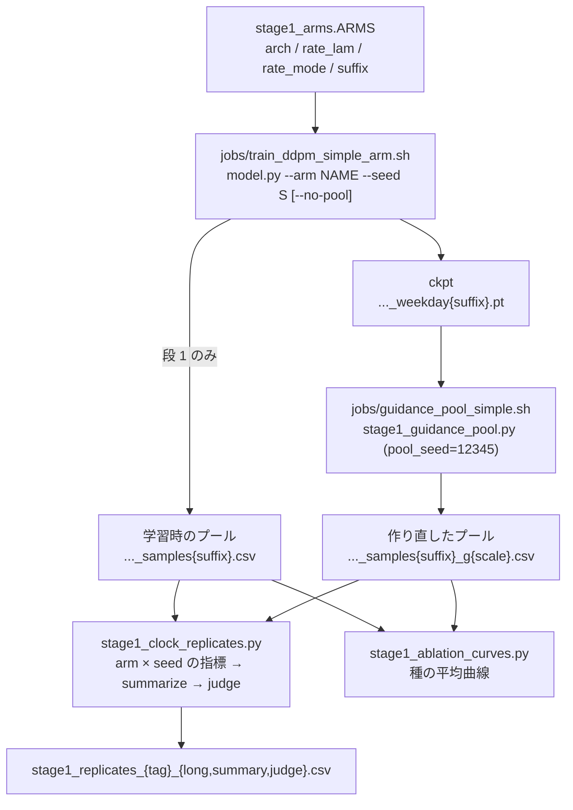
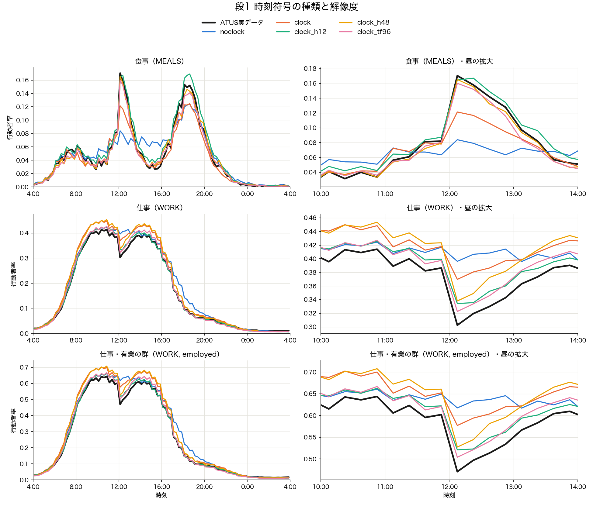
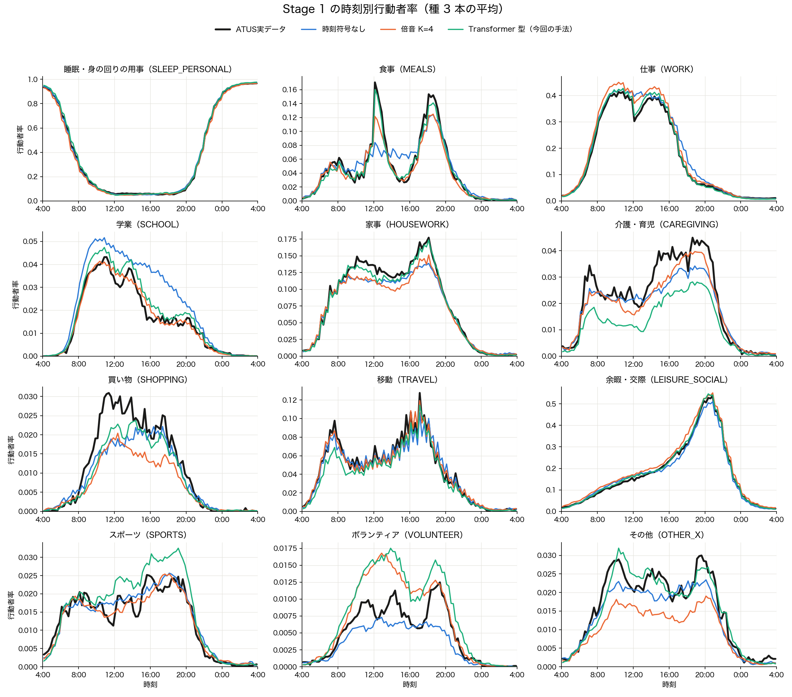
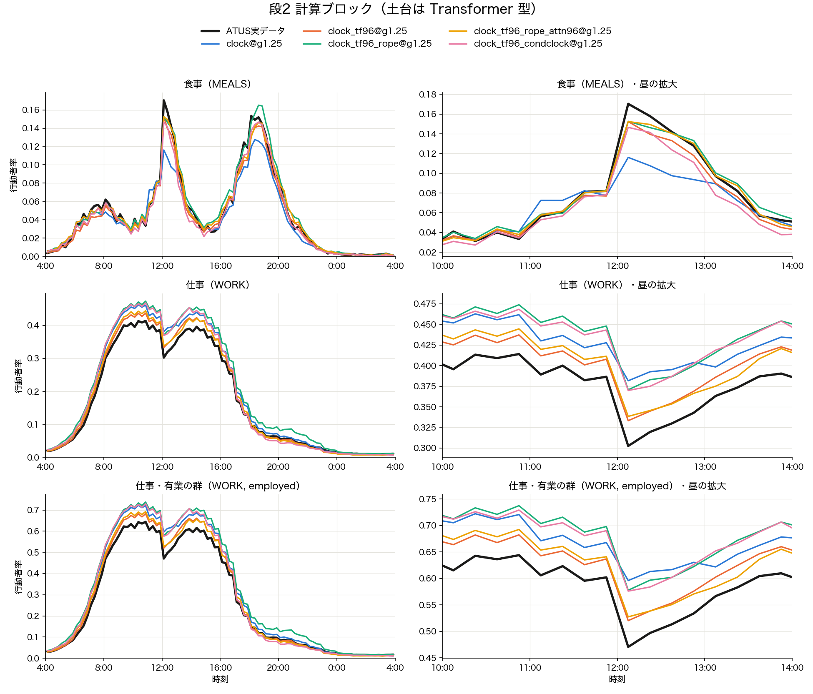
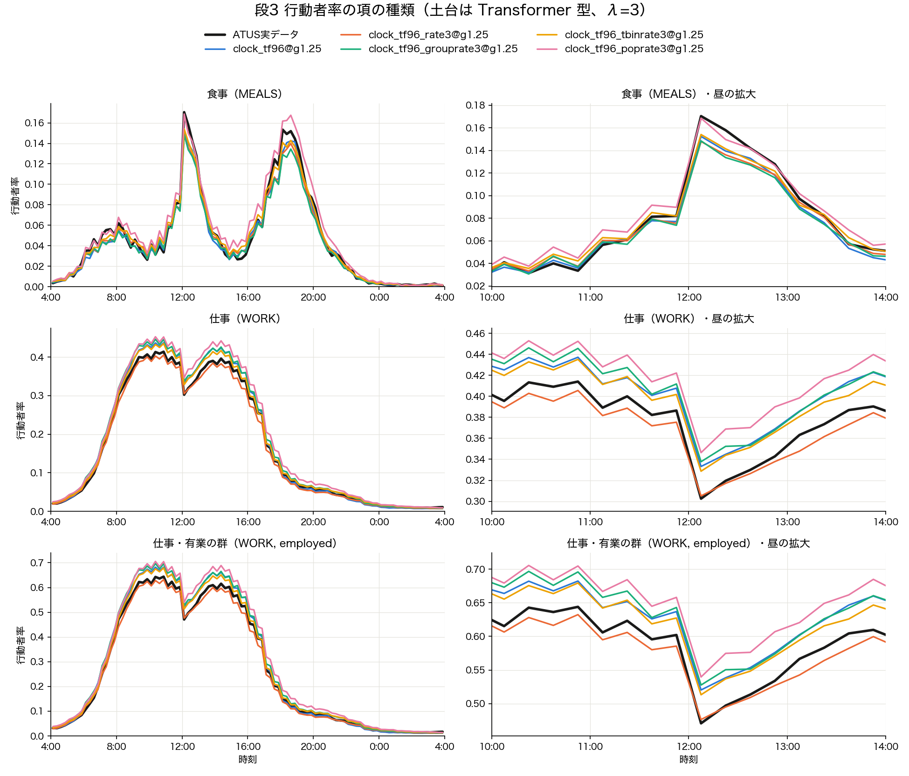

# Stage 1: 時刻別行動者率を合わせるためのアブレーション（2026-09-27）

**対象**: AggDDPM-Simple の Stage 1（Pre-trained）。時刻の表現・計算ブロック・損失を 1 要因ずつ変え、
生成プールの時刻別行動者率が ATUS 実データに近づくかを、学習の種 42 / 43 / 44 の反復で調べた。
計画は `~/.claude/plans/stage1-crispy-hoare.md`、処理の流れは [pipeline/Stage1.md](./pipeline/Stage1.md)。

**問い**: 時刻符号 K=4 の Stage 1 は、12:00 の食事の山（MEALS 0.121、実 0.170）と仕事の谷
（WORK 0.370、実 0.303）を再現できない。原因は (a) 生成時の CFG、(b) 時刻の表現力、
(c) 計算ブロック、(d) 損失 のどれか。どの手を打てば行動者率が合うか。

---

## 1. 結論

| 問い | 結論 |
|---|---|
| (a) CFG が原因か | **主因ではない**。guidance 1.25→1.0 で WORK 12:00 は 0.382→0.363（非分離）、MEALS 12:00 は不変 |
| (b) 時刻の表現力か | **主因**。96 スロットの全帯域を持つ時刻符号で MEALS 12:00 が 0.121→0.160〜0.165（完全分離） |
| 土台に選んだ時刻符号 | **Transformer 型**（`clock_tf96`）。事前規則では switch_emd の悪化で失格だったが、ユーザーの判断で採用（§4.3） |
| (c) 計算ブロック | **効かない**。RoPE / 96 解像度の attention / 条件×時刻のバイアスは、どれも主指標で土台に届かない |
| (d) 損失 | **どれも土台と完全分離しない**。規則上の勝者は t 区間別（`tbinrate3`）だが差は種の幅の中。batch 版は日中の WORK の水準を平均で 0.034 下げる（非分離）。当初案（r̄ 目標）の「縮む」予測は検出できず |
| Stage 2 に渡す Stage 1 | **`clock_tf96`（ε のみ）を推奨**（§8）。損失を足した 4 arm は全て種 43 で系列が崩れた |

一番効いたのは**時刻の表現力**で、損失の工夫はその上で種のばらつきを超える効果を出さなかった。
残るずれは、有業の群の WORK の水準（日中の平均）が種ごとに ±0.04 揺れることで、どの arm でも種の間の揺れが
arm 間の差より大きい。

---

## 2. 実験設定

### 2.1 学習

| 項目 | 値 |
|---|---|
| モデル | `model.py` の UNet1D。構造は `ArchSpec`、arm は `stage1_arms.ARMS`（唯一の出所） |
| データ | ATUS 2024 平日、共通 12 分類、28 群（性 × 年齢 7 × 就業）、train 3363 / val 373 |
| 損失 | ε-MSE（段 3 で `L_rate` を λ=3 で追加） |
| 早期終了 | val の ε-MSE、patience 200、最大 1000 epoch |
| 種 | 42 / 43 / 44（学習の乱数だけを変え、分割は固定） |
| 実行 | SQUID DBG（1 GPU、10 分枠）。`jobs/train_ddpm_simple_arm.sh` |
| commit | 段 1 `36babc5`、段 2 `dc3b805`、段 3 `fc40056`（学習だけ `--no-pool`、`f460c67` 以降） |

### 2.2 評価

| 項目 | 値 |
|---|---|
| プール | 28 群 × 256 本、ancestral 1000 ステップ、guidance 1.25 |
| 段 1 | 学習ジョブの `sanity_check` が書いたプール |
| 段 0・2・3 | `stage1_guidance_pool.py` で作り直したプール（`pool_seed=12345`、arm 間で共通乱数）。ラベルに `@g1.25` を付ける |
| 集計 | 群内は生成の本数で平均、群間は日本の人口で加重（`stage2_curves.weighted_slot_rates`）。ATUS 実も同じ重み |
| 主指標 | `gap_MEALS_12:00`、`gap_WORK_12:00`、`err_period_under_3.4h`、`gap_WORK_12:00_employed` / `_nonemployed`（ATUS 実との差、小さいほど良い） |
| ガードレール | `switch_emd`、`bigram_jsd`、`gap_single_slot_ratio`、`gap_wrap_closure_rate`、`memorized` |
| 判定の規則（事前に固定） | ガードレールのどれかで候補の 3 本が全て基準の 3 本より悪ければ失格。残りの中で主指標の平均の順位和が最小の arm（同順位はパラメータ数の少ない方） |
| 完全分離 | 2 つの arm の 3 本の値の範囲が重ならない（偶然なら片側 1/20）。表では `*` |
| スクリプト | `src/eval/diagnostics/stage1_clock_replicates.py`（`--judge`）。表は `data/processed/aggregates/stage1_replicates_{tag}_*.csv` |

★プールの乱数による揺れ: 同じ `clock_tf96` の重みでも、学習時のプールと作り直したプールで MEALS 12:00 が
0.160 と 0.152、switch_emd が 0.47 と 0.43 と違う。段をまたいで数値を比べるときは、この程度の揺れを見込む。

### 2.3 処理の流れ



---

## 3. 段 0: CFG の強さ（時刻符号 K=4、共通乱数）

| 指標 | ATUS 実 | guidance 1.25（既定） | guidance 1.0 |
|---|---|---|---|
| MEALS 12:00 | 0.170 | 0.116±0.008 | 0.114±0.006 |
| WORK 12:00 | 0.303 | 0.382±0.035 | 0.363±0.039 |
| WORK 12:00・有業 | 0.471 | 0.596±0.054 | 0.563±0.058 |
| WORK 12:00・無業 | 0.005 | 0.002±0.001 | 0.009±0.005* |
| switch_emd | — | 0.21±0.08 | 0.34±0.10 |

- CFG を弱めても、WORK 12:00 の過大（+0.08）は 2 割強（−0.019）しか縮まず、非分離である。MEALS 12:00 は動かない。
- 行動者率のずれの主因は、生成時の CFG ではなくモデル側にある。以降の段は guidance 1.25 のまま比べる。

---

## 4. 段 1: 時刻符号の種類と解像度（損失は ε のみ）

### 4.1 指標（基準 = `clock`、* は基準と完全分離）

| 指標 | ATUS 実 | noclock | clock（倍音 K=4） | clock_h12 | clock_h48 | clock_tf96 |
|---|---|---|---|---|---|---|
| MEALS 12:00 | 0.170 | 0.084±0.009* | 0.121±0.004 | 0.165±0.017* | 0.165±0.029* | 0.160±0.008* |
| WORK 12:00 | 0.303 | 0.396±0.040 | 0.370±0.028 | 0.334±0.066 | 0.338±0.015 | 0.323±0.020 |
| WORK 12:00・有業 | 0.471 | 0.618±0.061 | 0.577±0.044 | 0.521±0.102 | 0.527±0.024 | 0.504±0.032 |
| MEALS 12:00・有業 | 0.192 | 0.081±0.014* | 0.134±0.008 | 0.170±0.017* | 0.187±0.029* | 0.181±0.011* |
| 誤差 3.4h 未満 | — | 0.0270* | 0.0176 | 0.0125* | 0.0150 | 0.0115* |
| err_MEALS | — | 0.048* | 0.016 | 0.016 | 0.019 | 0.008* |
| switch_mean | 12.64 | 13.18 | 12.79 | 13.40* | 12.55 | 12.66 |
| switch_emd | — | 0.61±0.40 | **0.29±0.07** | 0.82±0.38* | 0.51±0.14* | 0.47±0.04* |
| bigram_jsd | — | 0.0053 | 0.0050 | 0.0082* | 0.0067 | 0.0062 |
| wrap_closure | 0.069 | 0.080 | 0.099 | 0.076* | 0.078* | 0.068* |
| dcr_gap（暗記なし） | — | −0.49 | −0.39 | −0.40 | −0.40 | −0.40 |
| params | — | 1,759,124 | 1,770,068 | 1,789,524 | 1,877,076 | 1,877,076 |



図 1. 段 1 の arm の時刻別行動者率（種 3 本の平均、日本人口加重）。右列は 10:00〜14:00 の拡大。

### 4.2 読み

- 時刻符号の帯域を広げると（K=4 の最短周期 6h → 全帯域）、12:00 の 1 スロット幅の立ち上がりが再現される。
  事前の線形当てはめ（K=4 で MEALS 0.103、K=48 で 0.169）どおりの向きで、時刻の表現力が主因という仮説を支持する。
- 事前予測「K=48 > K=12 > K=4、tf96 は K=12 と K=48 の間」は**半分外れた**。3 つの高解像度 arm は主指標で互いに
  種の幅の中にあり、順位和では tf96 が最良だった。線形の当てはめで 34 成分しか持たない Transformer 型が
  劣らないのは、非線形の層を通すと低次元でも鋭い形を作れるためと考えられる（未検証）。
- 代償として、3 つとも switch_emd（個人の切替回数の分布の ATUS との距離）が K=4 の 3 本全てより悪い。
  ただし時刻符号なし（0.61）より悪いのは K=12 だけで、switch_mean は K=48 / tf96 で実データにほぼ一致する。

### 4.3 12 活動の全日（今回の手法 = Transformer 型）



図 1b. 12 活動の時刻別行動者率（種 3 本の平均、日本人口加重、学習時のプール）。

活動ごとの ‖ATUS 実 − 生成‖²（96 スロットの和、種 3 本の平均±sd）:

| 活動 | 時刻符号なし | 倍音 K=4 | Transformer 型 | Transformer 型 / K=4 |
|---|---|---|---|---|
| 睡眠・身の回り | 0.040±0.029 | 0.087±0.105 | 0.042±0.050 | 0.48 |
| 食事 | 0.048±0.011 | 0.016±0.003 | 0.008±0.004 | 0.51 |
| 仕事 | 0.126±0.053 | 0.080±0.065 | 0.053±0.031 | 0.66 |
| 学業 | 0.017±0.020 | 0.008±0.006 | 0.005±0.006 | 0.67 |
| 家事 | 0.025±0.026 | 0.024±0.018 | 0.010±0.008 | 0.43 |
| 介護・育児 | 0.013±0.008 | 0.003±0.003 | 0.014±0.013 | **4.19** |
| 買い物 | 0.0023±0.0005 | 0.0039±0.0014 | 0.0023±0.0018 | 0.58 |
| 移動 | 0.007±0.001 | 0.008±0.004 | 0.010±0.006 | **1.29** |
| 余暇・交際 | 0.070±0.026 | 0.071±0.053 | 0.034±0.030 | 0.48 |
| スポーツ | 0.0027±0.0021 | 0.0017±0.0005 | 0.0025±0.0011 | **1.51** |
| ボランティア | 0.0009±0.0009 | 0.0040±0.0062 | 0.0031±0.0025 | 0.78 |
| その他 | 0.0015±0.0008 | 0.0046±0.0011 | 0.0018±0.0010 | 0.39 |

- Transformer 型は 12 活動のうち 9 つで K=4 より誤差が小さい。食事の 12:00・18:00 の山、仕事の 12:00 の谷、
  家事・余暇の日中の水準が実データに寄る。
- 悪化は 3 つ。**介護・育児**は日中から夕方まで一様に過小（例 12:00 で 0.012、実 0.022）で、種の揺れも大きい
  （sd 0.013）。**移動**は朝 8 時の山が低い（0.07、実 0.097）。**スポーツ**は 16〜20 時を過大に出す。
  どれも行動者率 0.05 未満の少ない活動で、時刻の自由度が増えた分だけ少数の個票の揺れを拾った可能性がある（未検証）。

### 4.4 判定

- **事前の規則**では 3 つとも switch_emd で失格し、勝者は `clock`（K=4）だった（`stage1_replicates_stage1_judge.csv`）。
- **ユーザーの判断で `clock_tf96` を土台に採用した**。理由は、行動者率の改善（MEALS 12:00 のずれ 0.049→0.010）に対して
  switch_emd の悪化（0.29→0.47）は時刻符号なし（0.61）より小さく、標準の Transformer の位置符号
  （底 10000 の sin/cos）をそのまま時刻スロットに当てたものなので論文で説明しやすいこと。
- 論文では「switch_emd を K=4 から 0.18 悪化させる代わりに、12:00 の行動者率のずれを 5 分の 1 にした」と明記する。

---

## 5. 段 2: 計算ブロック（土台は `clock_tf96`、損失は ε のみ、共通乱数のプール）

### 5.1 指標（基準 = `clock_tf96@g1.25`）

| 指標 | ATUS 実 | clock_tf96 | + RoPE | + RoPE + 96 解像度 attention | + 条件×時刻のバイアス (R=4) |
|---|---|---|---|---|---|
| MEALS 12:00 | 0.170 | 0.152±0.011 | 0.153±0.015 | 0.152±0.004 | 0.147±0.012 |
| WORK 12:00 | 0.303 | 0.333±0.032 | 0.371±0.039 | 0.338±0.022 | 0.370±0.033 |
| WORK 12:00・有業 | 0.471 | 0.520±0.050 | 0.578±0.060 | 0.527±0.033 | 0.576±0.051 |
| WORK 12:00・無業 | 0.005 | 0.002±0.001 | 0.004±0.003 | 0.004±0.004 | 0.005±0.001* |
| 誤差 3.4h 未満 | — | 0.0125 | 0.0119 | 0.0129 | 0.0123 |
| err_MEALS | — | 0.0086 | 0.0125 | 0.0048* | 0.0094 |
| switch_emd | — | 0.43±0.02 | 0.59±0.31 | 0.74±0.34 | 0.51±0.34 |
| bigram_jsd | — | 0.0061 | 0.0062 | 0.0078 | 0.0083 |
| dcr_gap（暗記なし） | — | −0.44 | −0.39 | −0.32* | −0.26* |
| params | — | 1,877,076 | 1,877,076 | 1,910,612 | 2,360,192 |
| 主指標の順位和 | — | **11（勝者）** | 12 | 14 | 13 |



図 2. 段 2 の arm（参考に K=4 の `clock@g1.25` を重ねた）。

### 5.2 読み

- 3 つともガードレールは通ったが、主指標で土台に届かない。勝者は `clock_tf96` のまま。
- RoPE（attention に相対時刻）は WORK を全体に押し上げ、条件×時刻のバイアスも有業の WORK を悪化させた。
  条件×時刻のバイアスは無業の WORK 12:00 だけを改善した（完全分離）。群ごとの形を足す部品は、
  有業の水準のずれを直す向きには働かなかった。
- 96 解像度の attention は MEALS の曲線全体の誤差（err_MEALS）を半減させたが（完全分離）、12:00 の点では差が無い。
- dcr_gap は条件×時刻のバイアスと attn96 で基準から上へ動いた（完全分離）。どちらも床の内で暗記ではないが、
  パラメータの多い部品ほど train 側へ寄る傾向として記録する。

---

## 6. 段 3: 損失（土台は `clock_tf96`、λ_rate=3、共通乱数のプール）

### 6.1 指標（基準 = `clock_tf96@g1.25`）

| 指標 | ATUS 実 | ε のみ | + L_rate batch | group（性×就業） | tbin（SNR 4 区間） | pop（r̄ 目標・当初案） |
|---|---|---|---|---|---|---|
| MEALS 12:00 | 0.170 | 0.152±0.011 | 0.148±0.013 | 0.149±0.010 | 0.154±0.011 | 0.169±0.024 |
| WORK 12:00 | 0.303 | 0.333±0.032 | 0.305±0.022 | 0.338±0.020 | 0.329±0.032 | 0.346±0.016 |
| WORK 12:00・有業 | 0.471 | 0.520±0.050 | 0.476±0.034 | 0.528±0.031 | 0.513±0.050 | 0.540±0.026 |
| 日中の WORK の水準のずれ（08–17 時の平均） | 0 | +0.022±0.038 | −0.012±0.036 | +0.026±0.017 | +0.016±0.028 | +0.037±0.006 |
| 誤差 3.4h 未満 | — | 0.0125 | 0.0138 | 0.0139 | 0.0123 | 0.0128 |
| 誤差 8h〜4h | — | 0.0200 | 0.0207 | 0.0135* | 0.0184 | 0.0094* |
| switch_emd | — | 0.43±0.02 | 0.85±0.94 | 0.63±0.51 | 0.70±0.62 | 0.85±0.49 |
| night_intrusion | — | 0.013 | 0.020* | 0.014 | 0.023* | 0.018 |
| dcr_gap（暗記なし） | — | −0.44 | −0.37 | −0.28* | −0.29* | −0.38 |
| val ε-MSE（共通の雑音） | — | 0.00983 | 0.00986 | 0.00994 | 0.00985 | 0.01005 |
| 主指標の順位和 | — | 13 | 13 | 22 | **11（規則上の勝者）** | 16 |

日中の WORK の水準は `stage1_replicates_stage3_work_level.csv`、val ε-MSE と x̂0 の分散比は
`stage1_replicates_stage3_shrinkage.csv`（val 373 人 × 8 回、全 ckpt で同じ雑音）。



図 3. 段 3 の arm（種 3 本の平均）。

### 6.2 読み

- **どの損失も主指標で土台と完全分離しない**。規則（順位和）では t 区間別が勝者だが、差は種の幅の中で、
  「t 区間別が効いた」とは言えない。
- **batch 版は日中の WORK の水準を下げる**（+0.022→−0.012、図 3 で橙が黒に重なる）。L_rate が狙う
  「全員に共通する偏り」がまさにこの水準のずれで、K=4 でも同じ向き（WORK 12:00 0.370→0.342）だった。
  ただし種ごとの幅（±0.036）が効果（0.034）と同程度で、3 本では分離しない。
- **L_rate を足した 4 arm は全て種 43 で系列が崩れる**（switch_mean 13.8〜14.6、switch_emd 1.2〜1.9）。
  種 42 / 44 ではむしろ土台より良い値が多い（batch 版の switch_emd 0.32 / 0.31、土台 0.45 / 0.43）。
  種 43 の最良 epoch は 4 arm とも 658 で、ε のみ（784）より早い。拡散の t・ε の乱数が arm 間で共通なので、
  同じ早い epoch が選ばれて学習途中の重みが残った可能性がある（仮説・未検証）。
- **当初案（pop, r̄ 目標）**: 理論で予測した「デノイザが r̄ へ縮む」兆候は検出できなかった。val ε-MSE は
  最も高いが種の幅の中（0.01005 vs 0.00983±0.00045）、x̂0 の分散比も他の arm と同じ（t=10 で 0.996）。
  小さい t では ε-MSE が x0 の誤差を SNR 倍（t=10 で約 1000 倍）の重みで罰するので、λ=3·(1/B) 程度の
  縮める力は勝てないと考えられる。一方で MEALS 19:00 と無業の MEALS 12:00 を実データより過大にし
  （完全分離）、日中の WORK の水準のずれは最も大きい（+0.037）。目標を r̄ にしても、個票と対にした
  現行の定義より良くなる点は見つからなかった。

---

## 7. 事前予測との照合

| 予測 | 結果 |
|---|---|
| 段 1: K=48 > K=12 > K=4、tf96 は K=12 と K=48 の間 | 高解像度 3 つ > K=4 は的中。3 つの間の順序は種の幅の中で決まらず、順位和は tf96 が最良 |
| 段 3: pop は batch より val ε-MSE・single_slot・switch_emd が悪い | **外れ**。val ε-MSE は最も高いが非分離、single_slot（0.252 vs 0.260）と switch_emd（0.85 vs 0.85）は差が無い |
| 補: 表現力があれば L_rate の副作用（switch_emd の悪化）は縮む | **外れ**。K=4 でも tf96 でも switch_emd は平均で悪化し、tf96 では種 43 に集中した |

---

## 8. Stage 2 への含意と次の一手

**推奨: Stage 2 は `clock_tf96`（ε のみ）から始める。**
理由は 3 つ。(1) 損失を足しても主指標で分離する改善が無い。(2) 損失を足すと種 43 で系列が崩れ、
結果が学習の種に左右される。(3) 余計な項が無い方が論文で説明しやすい。規則どおり `tbinrate3` を選ぶことも
できるが、差が種の幅の中なので推奨しない。

次に確かめること:

1. **全帯域の時刻符号で Stage 2 が日本の時刻構造を作れるか**。K=4 の Stage 2 は周期 3.4h 未満の帯域を
   4.5% しか埋められなかった（2026-09-24 の関門 B、`src/eval/diagnostics/stage2_clock_compare.py`）。日本の教師 A* の MEALS 12:00 は 0.415 と
   さらに鋭い。`clock_tf96` の種 3 本から Stage 2 を回し、3.4h 未満の帯域の埋まり方と MEALS 12:00 を K=4 と比べる。
2. **種のばらつきの扱い**。日中の WORK の水準は種ごとに ±0.04 揺れ、arm 間の差より大きい。論文の主張には
   種を 5 本以上に増やすか、種の平均（アンサンブル）で評価する必要がある。
3. **L_rate と早期終了の相性**（種 43 の崩れ）。最良 epoch 658 の重みと 784 付近の重みの断片化を比べれば、
   仮説を直接確かめられる。
4. **Transformer 型の底**。底 10000 は 96 位置には大きすぎ（独立な成分 34）、96 スロットに合わせた底なら
   線形の当てはめで 0.154 まで戻る。標準形のまま使う方が説明しやすいので、比較は付録の扱いでよい。

---

## 9. 再現

```bash
# 学習（SQUID）
ARM=clock_tf96 SEED=43 jobs/submit.sh -v ARM,SEED jobs/train_ddpm_simple_arm.sh
ARM=clock_tf96_rate3 SEED=43 NO_POOL=1 jobs/submit.sh -v ARM,SEED,NO_POOL jobs/train_ddpm_simple_arm.sh
# 共通乱数のプール（SQUID）
ARM=clock_tf96 SEED=43 GUIDANCE=1.25 jobs/submit.sh -v ARM,SEED,GUIDANCE jobs/guidance_pool_simple.sh
# 評価（手元、ckpt とプールは scp -p で mtime を保って持ち帰る）
.venv/bin/python src/eval/diagnostics/stage1_clock_replicates.py \
    --arms clock noclock clock_h12 clock_h48 clock_tf96 --base clock --judge --tag stage1
.venv/bin/python src/eval/diagnostics/stage1_clock_replicates.py \
    --arms clock_tf96@g1.25 clock_tf96_rate3@g1.25 clock_tf96_grouprate3@g1.25 \
           clock_tf96_tbinrate3@g1.25 clock_tf96_poprate3@g1.25 --base clock_tf96@g1.25 --judge --tag stage3
.venv/bin/python src/models/DDPM_Aggregate_Simple/stage1_ablation_curves.py \
    --arms noclock clock clock_h12 clock_h48 clock_tf96 --tag stage1 --title "段1 時刻符号の種類と解像度"
```

★段 2 の `rope_attn96` と `condclock` は、学習ジョブの生成が DBG の 10 分枠で打ち切られた（学習と ckpt は完了）。
  段 2・3 は全 arm を `guidance_pool_simple.sh` の共通乱数のプールで評価したので、この打ち切りは結果に影響しない。
