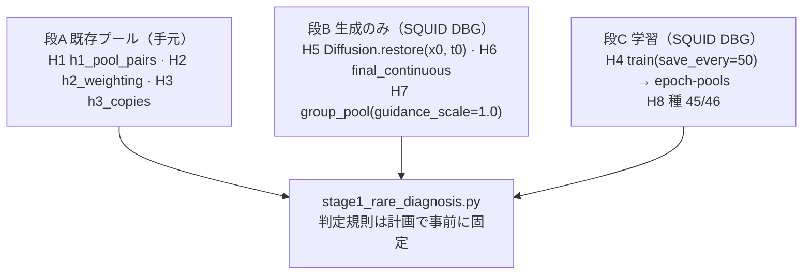
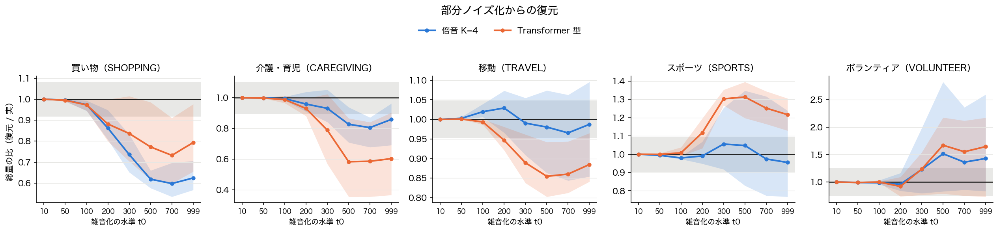
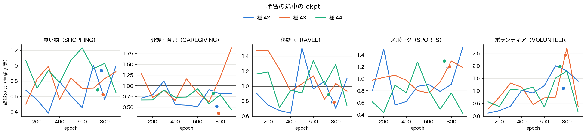

# Stage 1: 少ない活動の行動者率が外れる原因（2026-09-27）

**対象**: `clock_tf96`（Transformer 型の時刻符号）の Stage 1 が外している 5 活動（買い物・介護・育児・移動・スポーツ・ボランティア）。
計画は `~/.claude/plans/stage1-crispy-hoare.md`、前段の報告は [Stage1_ablation_results.md](./Stage1_ablation_results.md) §4.3。

**問い**: 何が少ない活動の行動者率を外しているのか。原因が分かれば、それを狙う手法を文献から選ぶ。

**用語**（この報告の中で一意に使う）:

| 用語 | 定義 |
|---|---|
| 総量 | 1 日の平均行動者率（その活動のスロット数の平均 / 96） |
| 総量の比 | 生成の総量 / ATUS 実データの総量（1 なら一致） |
| 行動者 | その日に 1 スロットでもその活動をした人 |
| 1 人あたりの長さ | 行動者 1 人あたりのスロット数 |
| 床 | ATUS の回答者を復元抽出（200 回）したときの比の sd × 2（データ自身の揺れ、約 95%） |

---

## 1. 結論

| # | 原因の候補 | 判定 | 根拠 |
|---|---|---|---|
| H1 | 生成の乱数（プール 256 人/群） | **否定** | 同じ ckpt の 2 プールの差は種間 sd の 0.09〜0.29 倍 |
| H2 | 評価の加重（日本人口） | **否定** | ATUS の群構成で加重しても外れ方は同じ |
| H3 | 少数の行動者の暗記 | **否定** | 生成の行動者から train までの距離は、holdout の実際の行動者と同じかそれより遠い |
| H4 | **ckpt の選び方（学習中に総量が動く）** | **支持（主因）** | 最良 epoch ±200 の途中の ckpt で、総量の比の種内 sd が 0.20〜0.75。種内の揺れ ≥ 種間の揺れ（5 活動すべて）。val の ε-MSE はその間ほぼ平ら |
| H5 | 逆過程のどの段階か | **SNR ≈ 1 の帯（t = 100〜500）** | 総量のずれの平均は t0 = 100 で 0.02、500 で 0.34、999 で 0.32。細部の段階（t ≤ 100）でもほぼ純粋な雑音の段階（t > 500）でもない |
| H6 | 最後の argmax | **否定** | 値 ≥ 0.3 で argmax を取れないスロットは argmax 後の総量の 0.03〜4.9% |
| H7 | CFG（guidance 1.25） | **副次的** | 1.0 にすると買い物・移動の総量の比が 0.03〜0.09 上がる。介護・スポーツ・ボランティアは効かない |
| H8 | Transformer 型に固有 | **否定** | 種 5 本では K=4 とどの指標も完全分離しない。3 本で見えた「介護が短い」は種のばらつき |

**原因のまとめ**: 少ない活動の総量は、1 日の配置が決まる SNR ≈ 1 の帯で決まる。そこでの振る舞いは学習の epoch ごとに大きく変わるが、
val の ε-MSE はほとんど変わらない。val は 373 人・各 epoch で t と ε を引き直す揺れる指標なので、その最小値で選んだ ckpt の総量は
**実質的に学習の軌跡上の偶然の 1 点**になる。時刻符号の種類、生成の乱数、argmax、暗記は原因ではない。

---

## 2. 症状（既存の生成プール、`clock_tf96` 種 42/43/44）

| 活動 | 誤差 / 床 | 総量の比（種 42/43/44） | 主なずれ |
|---|---|---|---|
| 介護・育児 | 21 倍 | 0.55 / 0.35 / 0.88 | 行動者 1 人あたりの長さが短い（3.7〜6.5 スロット、実 8.3） |
| ボランティア | 18 倍 | 0.66 / 2.18 / 1.91 | 行動者の割合が不安定（2.9〜7.8%、実 4.5%） |
| 移動 | 6.4 倍 | 0.84 / 0.79 / 0.95 | 1 人あたりの移動の回数が少ない（1.74〜1.95、実 2.13） |
| 買い物 | 5.8 倍 | 0.99 / 0.62 / 0.75 | 行動者の割合が不安定（19〜32%、実 29%） |
| スポーツ | 5.6 倍 | 1.29 / 1.12 / 1.29 | 行動者が多すぎる（24〜28%、実 22%） |

誤差 / 床は ‖ATUS 実 − 生成‖²（96 スロット）を ATUS の復元抽出での同じ量で割った値。参考: 食事 5.3 倍、仕事 14 倍。
誤差の 4〜6 割は総量のずれで、時刻の形のずれではない。

---

## 3. 仮説の検証の流れ



**事前の規則から変えた点**（どれも測り方の不備を直したもので、判定の閾値は変えていない）:

- **H3**: 完全一致・ハミング距離 2 以下の率は、holdout の実際の行動者でも 0 になり区別がつかない。
  最近傍までの距離（DCR）の平均で比べた。
- **H6**: 連続値の活動別の和は、全チャネルに薄く乗った値（漏れ）まで数えてしまう。
  t0 = 999 のスロットごとの連続値を別に保存し（`--mode final-continuous`）、僅差の負けだけを数えた。
- **H4**: 小プール（64 人/群）自身の揺れを復元抽出で見積もり、差し引いても判定が変わらないことを確かめた。

---

## 4. 結果

### 4.1 段 A（H1〜H3、既存プール）

**H1 生成の乱数**（同じ ckpt の学習時プールと `@g1.25` プール、総量の比）

| arm | 活動 | 学習時のプール | @g1.25 | プール間の差 / 種間 sd |
|---|---|---|---|---|
| clock_tf96 | 介護・育児 | 0.55 / 0.35 / 0.88 | 0.58 / 0.39 / 0.92 | 0.14 |
| clock_tf96 | ボランティア | 0.66 / 2.18 / 1.91 | 0.68 / 2.24 / 1.75 | 0.10 |
| clock_tf96 | スポーツ | 1.29 / 1.12 / 1.29 | 1.24 / 1.19 / 1.31 | 0.59 |

スポーツの比が閾値（1/3）を超えるのは、種の間の揺れ自体が小さい（どの種も 1.1〜1.3 倍の過大）ためで、揺れではなく一貫した偏りである。
他の 9 組は 0.09〜0.29。

**H2 評価の加重**: |log 総量の比| の種平均は、日本人口加重と ATUS の群構成で差が 0.04 以内（例: tf96 の介護 0.597 / 0.610）。

**H3 暗記**: 行動者から train までの DCR の平均は、生成 23.2〜32.9、holdout の実際の行動者 22.9〜30.4。
生成の方が train に近いことはなく、総量の比との相関の符号も arm・活動ごとにばらばら。

### 4.2 H5 逆過程のどの段階でずれるか

ATUS 平日の実個票 3,736 人を雑音水準 t0 まで進め、`Diffusion.restore` で戻した。t0 が小さければ細部だけ、大きければ「誰がどの活動をするか」まで作り直す。



図 1. t0 と総量の比。線は種 3 本の平均、帯は種の範囲、灰色は床。

| t0 | 10 | 50 | 100 | 200 | 300 | 500 | 700 | 999 |
|---|---|---|---|---|---|---|---|---|
| SNR | 455 | 32 | 8.5 | 1.9 | 0.65 | 0.08 | 0.007 | 0.000 |
| 総量の比の \|ずれ\| の平均（30 組） | 0.000 | 0.005 | 0.019 | 0.096 | — | 0.342 | — | 0.320 |
| 介護・育児（tf96、種平均） | 1.00 | 1.00 | 0.99 | 0.93 | 0.79 | 0.58 | 0.59 | 0.60 |
| スポーツ（tf96、種平均） | 1.00 | 1.00 | 1.01 | 1.12 | 1.30 | 1.31 | 1.25 | 1.22 |

- 総量が床を超える最小の t0（t*）は、30 組中 20 組が 200〜300、7 組が 500 以上、100 以下は 0 組、3 組は床の内。
- ずれは t0 = 100 → 500 で平均 0.33 生じ、500 → 999 では 0.05 しか足されない。
- SNR = 1 は t = 258。one-hot の信号と雑音が同じ大きさになり、1 日の配置が決まる帯にあたる。

### 4.3 H6 最後の argmax

| arm | 僅差の負け / argmax 後の総量（15 組の範囲） | 漏れ（値 < 0.1 の和、総量換算） |
|---|---|---|
| clock | 0.0003〜0.040 | 0.0013〜0.0045 |
| clock_tf96 | 0.0023〜0.049 | 0.0014〜0.0069 |

- 最初の測り方（連続値の和 vs argmax 後）では最大 +84% の差が出たが、その正体は漏れだった。
- 僅差の負けを足し戻しても総量の比はほとんど動かない（例: tf96 種 43 の介護 0.366 → 0.372）。
  逆過程の出力はすでにほぼ one-hot で、足りない分は連続値の段階で既に足りない。

### 4.4 H7 CFG（`clock_tf96`、guidance 1.0 と 1.25 は同じ乱数の種）

| 活動 | 総量の比 g1.0 | g1.25 | guidance の差 | プール間の差（H1） | 判定 |
|---|---|---|---|---|---|
| 買い物 | 1.03 / 0.71 / 0.78 | 0.94 / 0.64 / 0.75 | 0.063 | 0.027 | 支持 |
| 介護・育児 | 0.62 / 0.39 / 0.96 | 0.58 / 0.39 / 0.92 | 0.028 | 0.038 | 否定 |
| 移動 | 0.85 / 0.82 / 1.00 | 0.83 / 0.81 / 0.95 | 0.025 | 0.007 | 支持 |
| スポーツ | 1.35 / 1.27 / 1.35 | 1.24 / 1.19 / 1.31 | 0.081 | 0.044 | 否定（実から離れる） |
| ボランティア | 0.75 / 2.39 / 2.04 | 0.68 / 2.24 / 1.75 | 0.172 | 0.080 | 否定（実から離れる） |

guidance を下げると 5 活動とも総量が少し増える。不足している活動（買い物・移動）は実に寄るが、過大な活動（スポーツ・ボランティア）はさらに離れる。
効果の大きさ（0.03〜0.17）は、スポーツを除いて種の間の揺れ（sd 0.08〜0.80）より小さい。

### 4.5 H4 ckpt の選び方

`clock_tf96_traj`（構造・損失・種は `clock_tf96` と同じ）を `--save-every 50` で再学習した。最良 epoch は元の学習と完全に一致した
（769 / 784 / 737、val も同じ値）ので、途中の ckpt は元の学習の軌跡そのものである。100 epoch ごとに 64 人/群の小プールを共通乱数で作った。



図 2. epoch と総量の比。線は途中の ckpt、丸は最良の ckpt（最良 epoch の位置）。

| 活動 | 種内 sd（最良 epoch ±200） | 種間 sd（最良の ckpt） | 小プールの揺れ（sd） | 判定 |
|---|---|---|---|---|
| 買い物 | 0.21 | 0.17 | 0.045 | 支持 |
| 介護・育児 | 0.31 | 0.24 | 0.033 | 支持 |
| 移動 | 0.20 | 0.06 | 0.023 | 支持 |
| スポーツ | 0.25 | 0.06 | 0.076 | 支持 |
| ボランティア | 0.75 | 0.67 | 0.199 | 支持 |

- 小プールの揺れを差し引いても 5 活動とも判定は変わらない。
- 同じ区間の val の ε-MSE（25 epoch ごと）は、epoch 600 以降 0.0084〜0.0135 の間を上下するだけで下がる傾向がない。
  例えば種 43 の介護は epoch 600 / 700 / 800 / 900 で 0.83 / 0.63 / 1.20 / 1.88 と動くが、val は 0.0106 / 0.0114 / 0.0129 / 0.0102。
- 移動とスポーツは最良の ckpt どうしがそろう（0.79〜0.88、1.20〜1.30）一方、途中では大きく動く。どの種も似た位置で止まるのは偶然の可能性がある。

### 4.6 H8 Transformer 型と K=4（種 5 本）

25 の（活動 × 指標）すべてで完全分離なし。介護の長時間の行動者の割合は tf96 0.009〜0.090、K=4 0.014〜0.054（実 0.059）。

---

## 5. 解決手法の候補（文献）

原因（H4・H5）に直接当たるものを、研究 wiki（`LLM-wiki/2_wiki`）と外部の論文から挙げる。実装はしていない。

| 狙う原因 | 手法 | 出典 | 本件への当てはめ | 注意 |
|---|---|---|---|---|
| H4 学習中の揺れ | 重みの指数移動平均（EMA）、事後に EMA の長さを選ぶ post-hoc EMA | Karras ほか, CVPR 2024（EDM2） | 途中の重みを平均して、ckpt ごとの総量の揺れを均す | **AggDDPM-Simple では EMA を削除済み（決定事項）**。今回の H4 はその判断に関わる新しい証拠 |
| H4 ckpt の選び方 | ε-MSE ではなく生成物の指標で ckpt を選ぶ | （本リポジトリの `stage2_select.evaluate_ckpt` と同じ仕組み） | 途中の ckpt から小プールを作り、総量の比と断片化の指標で選ぶ | 選び方に評価の指標を使うと、評価とは別の保留データが要る |
| H5 SNR ≈ 1 の帯 | 学習の雑音水準の配分を中間の帯に寄せる（logit-normal）、時刻ごとの損失の重み（Min-SNR） | Esser ほか, ICML 2024（SD3）/ Hang ほか, ICCV 2023 | 総量を決める t = 100〜500 の学習の割合を増やす（今は t を一様に引くので 40%） | 画像での結果。少ない活動に効くかは未検証 |
| 少数派が出にくい | 少数派への誘導（minority guidance） | Um・Lee・Ye, ICLR 2024 | 生成時に低密度の個票（少ない活動の行動者）へ寄せる | 過大な活動（スポーツ・ボランティア）には逆効果の恐れ |
| H4・H5 を損失で直接縛る | 再帰型（1 スロットずつ・時刻を明示）＋交差エントロピー | TimeGrad（Rasul ほか, ICML 2021）/ Causal Diffusion Forcing（Chen ほか, NeurIPS 2024）/ wiki [[concepts/transformer-architecture]] | 各スロットの活動の確率を最尤で合わせるので、少ない活動の総量が損失で直接決まる | 96 ステップの誤りの蓄積と断片化。1 スロット = 12 分類なら拡散は要らず softmax で足りる |
| 総量を生成物で合わせる | 生成物への報酬で微調整（Stage 2 と同じ仕組みで目標を ATUS 自身に） | wiki [[concepts/reward-fine-tuning]] / DRaFT（Clark ほか, ICLR 2024） | 学習データと目標が同じなので、Stage 2 の綱引きは原理的には起きにくい（未検証） | 集計だけ合わせると断片化で稼ぐ解に逃げうる（[[concepts/evaluation-metrics]] の reward hacking） |

- CFG（H7）は副次的な原因。wiki [[concepts/classifier-free-guidance]] の DiT の実測（guidance 1.0→1.25 で recall 0.67→0.62）と同じ向きで、
  guidance を下げると不足している活動は寄るが過大な活動は離れる。
- H6（argmax）は否定されたので、離散の拡散（Multinomial Diffusion など）へ移す動機は「argmax の丸め」ではなくなった。

---

## 6. 再現

```bash
# 段 A（手元）
.venv/bin/python src/eval/diagnostics/stage1_rare_diagnosis.py --part existing
# 段 B・C（SQUID DBG）
for s in 42 43 44; do
  ARM=clock_tf96 SEED=$s MODE=restore jobs/submit.sh -v ARM,SEED,MODE jobs/rare_diag_simple.sh
  ARM=clock_tf96 SEED=$s MODE=final-continuous jobs/submit.sh -v ARM,SEED,MODE jobs/rare_diag_simple.sh
  ARM=clock_tf96 SEED=$s GUIDANCE=1.0 jobs/submit.sh -v ARM,SEED,GUIDANCE jobs/guidance_pool_simple.sh
  ARM=clock_tf96_traj SEED=$s NO_POOL=1 SAVE_EVERY=50 \
      jobs/submit.sh -v ARM,SEED,NO_POOL,SAVE_EVERY jobs/train_ddpm_simple_arm.sh
  ARM=clock_tf96_traj SEED=$s MODE=epoch-pools EVERY=100 WITH_BEST=1 \
      jobs/submit.sh -v ARM,SEED,MODE,EVERY,WITH_BEST jobs/rare_diag_simple.sh
done
for a in clock_tf96 clock; do for s in 45 46; do
  ARM=$a SEED=$s jobs/submit.sh -v ARM,SEED jobs/train_ddpm_simple_arm.sh
done; done
# 集計（手元、結果は scp -p で mtime を保って持ち帰る）
.venv/bin/python src/eval/diagnostics/stage1_rare_diagnosis.py --part restore
.venv/bin/python src/eval/diagnostics/stage1_rare_diagnosis.py --part final
.venv/bin/python src/eval/diagnostics/stage1_rare_diagnosis.py --part guidance
.venv/bin/python src/eval/diagnostics/stage1_rare_diagnosis.py --part trajectory --best-epochs 42:769 43:784 44:737
.venv/bin/python src/eval/diagnostics/stage1_rare_diagnosis.py --part seeds
```

K=4（`clock`）の restore / final-continuous も同じ形で投入した。表は `data/processed/aggregates/stage1_rare_diag_*.csv`（git 管理外）。
