# Stage 1 の処理の流れ（AggDDPM-Simple 事前学習）

**対象**: `src/models/DDPM_Aggregate_Simple/model.py` のみ。
`DDPM_Aggregate_Tang` は別系統（x0 の値域が -1/+1、EMA あり、adaLN、DDIM 可）で
Stage 2 につながらないため、この図には含めない。

**関連**: [Stage 2 の処理の流れ](./Stage2.md) ／
[Stage2_design.md](../Stage2_design.md)（設計） ／
[Stage2_implementation.md](../Stage2_implementation.md)（実装記録） ／
[Stage1_overfitting_rebuttal.md](../Stage1_overfitting_rebuttal.md)（過学習の検証）

図中の識別子はすべてコード中の実名である。行番号は `model.py` を指す。

---

## 図①: データフロー（生データ → 学習バッチ）

```mermaid
flowchart LR
    subgraph RAW["生データ data/raw/opened/ATUS2024/"]
        direction TB
        R1["atusact_2024.dat<br/>行動記録 (ACT_PATH)"]
        R2["atusresp_2024.dat<br/>就業・調査日 (RESP_PATH)"]
        R3["atusrost_2024.dat<br/>年齢・性別 (ROST_PATH)"]
    end

    subgraph P1["P1 src/common/preprocess/atus/preprocess.py"]
        direction TB
        F1["load_activity()<br/>TUCASEID, TUACTIVITY_N 順に読む"]
        F2["clean_tier1(dur, tier1)<br/>TUTIER1CODE を Act 17分類へ集約"]
        F3["slots_from_categories(dur, cats, num_cat)<br/>N_SLOTS=96 / SLOT_MIN=15 (04:00 起点)"]
        F4["build_schedules(act)<br/>s0..s95 を組み立てる"]
        F5["attach_conditions(case_ids)<br/>COND_COLS: TUCASEID, TUFINLWGT,<br/>age, gender, day_of_week, telfs"]
        F1 --> F2 --> F3 --> F4 --> F5
    end

    MID["OUT_DATASET<br/>data/processed/atus2024/<br/>atus2024_weighted_dataset.csv"]

    subgraph P2["P2 src/common/preprocess/stula/crosswalk_atus_stula.py"]
        direction TB
        G1["atus_to_common(df)<br/>ATUS_TO_COMMON で Act 17 を Common 12 へ"]
        G2["Common: SLEEP_PERSONAL .. OTHER_X<br/>NUM_COMMON=12 / EXCLUDED は OTHER_X"]
        G1 --> G2
    end

    IN["ATUS_OUT = model.DATA_PATH<br/>data/processed/atus2024/<br/>atus2024_stula_common12_dataset.csv"]

    subgraph LOAD["load_data(DATA_PATH) :199"]
        direction TB
        H1["day_of_week.between(2, 6)<br/>DAY_FILTER='weekday' → N=3736 行"]
        H2["cond_idx (N,3) int64<br/>COND_SPEC: gender(2) / age(7) / telfs(2)"]
        H3["schedules (N,96) int64<br/>値は Common の 0..11"]
        H4["weights (N,) float64<br/>WEIGHT_COL='TUFINLWGT'"]
        H1 --> H2
        H1 --> H3
        H1 --> H4
    end

    D["cond_to_d(cond_idx) :222<br/>d = g*(N_A*N_E) + a*N_E + e<br/>D_GROUPS = 28"]

    subgraph SPLIT["split_indices(N) :241 → make_loaders(...) :256"]
        direction TB
        S1["torch.randperm(N, seed=SEED=42)<br/>VAL_RATIO=0.1 → train_idx 3363 / val_idx 373"]
        S2["train_loader<br/>WeightedRandomSampler(w=weight[train_idx])<br/>BATCH_SIZE=256, replacement=True"]
        S3["val_loader<br/>shuffle=False, 非加重"]
        S1 --> S2
        S1 --> S3
    end

    OUT["1バッチ: cond_idx (B,3) / sched (B,96)<br/>→ 図② へ"]

    R1 --> F1
    R2 --> F5
    R3 --> F5
    F5 --> MID --> G1
    G2 --> IN --> H1
    H2 --> D
    H2 --> S1
    H3 --> S1
    H4 --> S1
    S2 --> OUT
    S3 --> OUT
```

**要点**

- P1・P2 は**オフラインで別途実行**する。`model.py` は `ATUS_OUT` の CSV 1 枚だけを読む。
- `cond_idx` は one-hot ではなく**整数インデックス (N,3)**。one-hot 化するのは埋め込み層側。
- 群インデックス `d` の定義（`d_index` :174）は `stage2_targets.d_index` :59 と一致していなければ
  ならない。Stage 2 の教師テンソルの行がこの `d` で引かれるため。
- `split_indices` が学習／ホールドアウト分割の**唯一の出所**である。
  `memorization_report` :920 と `stage1_overfit_check.py` も同じ関数を呼んで再現する。

---

## 図②: 学習ループとサニティチェック

```mermaid
flowchart TB
    IN["1バッチ: cond_idx (B,3) / sched (B,96)<br/>(図① から)"]

    subgraph LOSS["Diffusion.loss(model, sched, cond_idx) :537"]
        direction TB
        L1["x0 = sched_to_x0(sched) :272<br/>one_hot して (B,12,96)、値は 0 か 1"]
        L2["t = randint(0, T_STEPS) (B,)<br/>T_STEPS=1000、一様"]
        L3["eps = randn_like(x0) (B,12,96)<br/>標準正規"]
        L4["x_t = q_sample(x0, t, eps) :529<br/>sqrt_acp[t]*x0 + sqrt_1m_acp[t]*eps<br/>betas は BETA_START=1e-4 から BETA_END=0.02 の線形"]
        L5["drop_mask (B,) bool<br/>rand(B) が P_UNCOND=0.1 未満なら True (CFG 条件dropout)"]
        L1 --> L4
        L2 --> L4
        L3 --> L4
    end

    EMB["emb = timestep_embedding(t) + embed_cond(cond_idx, B, drop_mask)<br/>(B,256)<br/>★time_mlp を通さない (sinusoidal を直接加算)<br/>drop_mask が True の行は null_emb に置換"]

    subgraph NET["UNet1D.forward(x_t, t, cond_idx, drop_mask) :449"]
        direction TB
        N0["in_conv Conv1d(IN_CH=12 → c1=64, k=KERNEL_SIZE)"]
        N1["d1a, d1b : ResBlock1D(64,64)<br/>h1 (B,64,96)"]
        N2["ds1 : Conv1d stride=2"]
        N3["d2a, d2b : ResBlock1D(64→128) → attn2 : AttnBlock1D(128)<br/>h2 (B,128,48)"]
        N4["ds2 : Conv1d stride=2"]
        N5["d3a, d3b : ResBlock1D(128,128) → attn3<br/>h3 (B,128,24)"]
        N6["m1 → m_attn → m2<br/>m (B,128,24)"]
        N7["u3 : ResBlock1D(cat of m and h3)<br/>u (B,128,24)"]
        N8["interpolate x2 → us2 → u2 : ResBlock1D(cat of u and h2) → u2_attn<br/>u (B,128,48)"]
        N9["interpolate x2 → us1 → u1 : ResBlock1D(cat of u and h1)<br/>u (B,64,96)"]
        N10["out_norm → SiLU → out_conv (重み・バイアスをゼロ初期化)"]
        N0 --> N1 --> N2 --> N3 --> N4 --> N5 --> N6 --> N7 --> N8 --> N9 --> N10
        N1 -.->|"skip"| N9
        N3 -.->|"skip"| N8
        N5 -.->|"skip"| N7
    end

    EPS["eps_hat (B,12,96)"]
    OBJ["loss = F.mse_loss(eps_hat, eps)"]

    subgraph EPOCH["run_epoch :724 → train :749"]
        direction TB
        E1["train_loader を1周 → tr<br/>optimizer.zero_grad → loss.backward → optimizer.step<br/>AdamW(lr=LR=2e-4, weight_decay=0.0)"]
        E2["val_loader を1周 → va<br/>optimizer=None なので model.eval() かつ勾配なし"]
        E3{"va が best_val - EARLY_STOP_MIN_DELTA(1e-4)<br/>を下回るか"}
        E4["best_state = deepcopy(model.state_dict()), epoch=ep<br/>epochs_no_improve = 0"]
        E5["epochs_no_improve += 1<br/>EARLY_STOP_PATIENCE=200 に達したら break"]
        E1 --> E2 --> E3
        E3 -->|"yes"| E4
        E3 -->|"no"| E5
    end

    SAVE["model.load_state_dict(best_state) で最良重みへ戻す<br/>torch.save の payload はキー 'model' のみ (EMA なし)<br/>MODEL_SAVE_PATH: outputs/checkpoints/<br/>ddpm_simple_pretrain_common12_weekday.pt"]

    subgraph SANITY["sanity_check(model, n_per_group=256) :994"]
        direction TB
        V1["group_pool(model, 256) :851<br/>cond_grid() を repeat_interleave → Diffusion.sample<br/>ancestral 1000ステップ + CFG (GUIDANCE_SCALE=1.25)<br/>pool (28, 256, 96)"]
        V2["gen = pool.reshape(-1, 96)<br/>gen_d = repeat(arange(28), 256)<br/>w_gen = im.group_reweight(gen_d, w_real, d_real, 28)"]
        V3["fragmentation_stats :901<br/>switches / ep_len / single_slot_ratio / wrap_closure_rate"]
        V4["活動シェア sr (実) と sg (生成)<br/>および差の絶対値の総和"]
        V5["memorization_report :920<br/>DCR / NNDR を train と holdout で比較"]
        V6["pool_to_rates(pool) :879<br/>(28, 12*96) act-major → Stage 2 の採点に渡す形式"]
        V7["GEN_SAVE_PATH に CSV 出力<br/>group_d, sampler, gender, age7, employment, s0..s95"]
        V1 --> V2
        V2 --> V3
        V2 --> V4
        V2 --> V5
        V1 --> V6
        V2 --> V7
    end

    IN --> LOSS
    IN --> EMB
    L2 --> EMB
    L5 --> EMB
    L4 --> N0
    EMB -.->|"各 ResBlock1D の emb_proj で加算 (adaLN ではない)"| NET
    N10 --> EPS
    EPS --> OBJ
    L3 --> OBJ
    OBJ --> E1
    E4 --> SAVE
    E5 --> SAVE
    SAVE --> V1
```

**要点**

- 損失は ε 予測の MSE ただ 1 項。集計表は Stage 1 では一切使わない
  （教師 `A*` が入るのは [Stage 2](./Stage2.md) から）。
- 条件は**個人属性のみ** (`gender`, `age7`, `telfs`)。`emb` は時刻埋め込みとの**和**で、
  各 `ResBlock1D` の `emb_proj` を通して加算注入する。adaLN ではない。
- `out_conv` のゼロ初期化により、学習開始時の `eps_hat` は恒等的に 0 になる。
  これは `E[eps]=0` より最適な定数予測器である。
- 検証損失で選んだ重みがそのまま生成に使われる。**EMA を持たない**ので、
  `DDPM_Aggregate` にあった「val は raw・生成は EMA」という不整合が無い。
- サンプラは **ancestral のみ**（`ddim_sample` を持たない）。

**Tang バックボーンとの差分**（この図に現れないもの）

| 項目 | AggDDPM-Simple（本図） | DDPM_Aggregate_Tang |
|---|---|---|
| x0 の値域 | 0 か 1 、逆過程の clamp は 0..1 | -1 か +1 、clamp は -1..1 |
| 時刻埋め込み | `timestep_embedding` を直接加算 | `time_mlp` を通す（+98,816 params） |
| 条件注入 | `ResBlock1D.emb_proj` で加算 | `DoubleConv1D.mod` で adaLN |
| EMA | 無し | `EMA_DECAY=0.999`、ckpt に `ema` キー |
| サンプラ | ancestral のみ | ancestral / DDIM |
