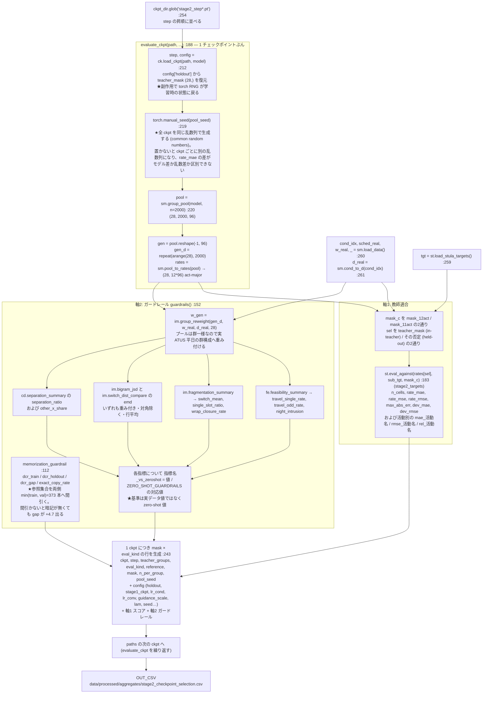

# Stage 2 の処理の流れ（集計表だけでの微調整）

**対象**: `src/models/DDPM_Aggregate_Simple/stage2_*.py`。
この 2 枚は [Stage2_implementation.md](../Stage2_implementation.md) §3 にあったアスキー図を
置き換えたものである。設計上の根拠は [Stage2_design.md](../Stage2_design.md)、
実装判断の根拠表は [Stage2_implementation.md](../Stage2_implementation.md) §3 に残してある。

**関連**: [Stage 1 の処理の流れ](./Stage1.md)

図中の識別子はすべてコード中の実名である。モジュール別名は `stage2_finetune.py` の
`_load()` が付けるものと同じ（`sm`=`model`, `st`=`stage2_targets`, `sl`=`stage2_loss`,
`ck`=`stage2_checkpoint`）。教師は `a_star` / `A*` で表記を統一してある
（`dist(p,q)` の一般形だけが例外）。

---

## 図③: 1 更新の構造（`stage2_finetune.run` :524）

```mermaid
flowchart TB
    subgraph INIT["初期化 :541-621"]
        direction TB
        I0["check_shapes(K, d_sub, n) :232<br/>K&gt;=1 / D_sub&gt;=1 / n が2以上の偶数か<br/>★生成を1回でも回す前に落とす (本番の1更新は約40秒)"]
        I1["model = sm.load_pretrained(STAGE1_CKPT) :561<br/>ddpm_simple_pretrain_common12_weekday_20260819.pt<br/>1,759,124 params すべて学習対象 (凍結しない)"]
        I2["optimizer = build_optimizer(model) :200<br/>split_param_groups :171 が3群へ分ける<br/>cond 4,680 (0.27%) = cond_embeds+cond_proj+null_emb → LR_COND=1e-4<br/>emb 312,512 (17.8%) = emb_proj → LR_EMB=2e-5 ★時刻と条件の共有注入路<br/>conv 1,441,932 (82.0%) → LR_CONV=1e-5<br/>AdamW(weight_decay=0.0)"]
        I3["tgt = st.load_stula_targets() :554<br/>data/processed/stula/timeband_weekday.csv<br/>group_rates_tbl (28,12,96) と pop (2,7,2)"]
        I4["a_star_all = sl.teacher_tensor(tgt, dev) :555 → (28,12,96)<br/>omega_all = sl.chi2_weights(a_star_all, eps) :556<br/>eps=inf なら全て1 (主A の素の MSE)、有限なら 1/(A*+eps) を平均1に正規化 (主B の χ²)"]
        I5["teacher_mask = build_teacher_mask(holdout) :140<br/>(28,) bool。held-out 群だけ False<br/>teacher_groups = flatnonzero(teacher_mask)"]
        I6["chunk = resolve_chunk(K, d_sub, n, chunk) :274<br/>check_memory_budget :260 で K*chunk が MEMORY_BUDGET=6600 以下か検査<br/>★loss=jsd は chunk を使えないので K*B で測り直す :549"]
        I7["rng = np.random.default_rng(seed) :579<br/>★群サブサンプリング専用の乱数源。torch とは別で、<br/>再開時は ck.load_ckpt(np_rng=rng) が戻す"]
        I8["atus = atus_batches() :583<br/>sm.make_loaders の train_loader を無限に回す<br/>val_loader は val_epsilon_mse :453 が使う"]
        I9["grid = sm.cond_grid() :578 → (28,3)<br/>base_config :601 に stage1_ckpt / lr_cond / lr_emb / lr_conv / guidance_scale を入れる"]
    end

    subgraph STEP["1 更新 (step = 1..steps、早期終了なし) :623"]
        direction TB

        P0["d_pick = rng.choice(teacher_groups, d_sub) :626<br/>cond = grid[d_pick].repeat_interleave(n) → (d_sub*n, 3) 群優先<br/>a_star = a_star_all[d_pick] / omega = omega_all[d_pick] :632-633"]
        P1["optimizer.zero_grad(set_to_none=True) :635"]

        subgraph AGG["集計側 aggregate_step :295 (eval モードで微分。backward まで内部で済ませる)"]
            direction TB
            BR{"loss_kind が jsd、または chunk が total 以上か"}

            subgraph ONE["1パス _aggregate_step_one_pass :393"]
                direction TB
                O1["zs = _draw_tail_noise(total, K, dev) :352"]
                O2["x0 = diffusion.sample_differentiable(model, cond, K, zs) :765"]
                O3["diag = _x0_diagnostics(x0) :357<br/>x0_floor_frac / x0_max / st_p_max_mean"]
                O4["y = sm.straight_through(x0, tau=1.0) :785<br/>前向きは one-hot、後ろ向きは softmax の微分"]
                O5["a_A, a_B = sl.group_rates_split(y, n) :87<br/>群ごとに前半 n/2 と後半 n/2 へ二分"]
                O6["l_agg = sl.agg_loss_from_rates(a_A, a_B, a_star, omega) :123<br/>((a_A - A*)*(a_B - A*)*omega).mean() — 群 d・活動 c・時刻 s の3軸とも平均"]
                O7["l_agg.backward()"]
                O1 --> O2 --> O3 --> O4 --> O5 --> O6 --> O7
            end

            subgraph TWO["2パス _aggregate_step_two_pass :417 (gradient caching)"]
                direction TB
                T1["zs = _draw_tail_noise(total, K, dev)<br/>★1パス側でも同じ順で引く。chunk で軌跡が変わらないため"]
                T2["x_K = diffusion._sample_head(model, cond, K) :720<br/>t = 999 から K まで no_grad で進める<br/>★2パス間で唯一キャッシュするテンソル"]
                T3["no_grad で _sample_tail → _x0_diagnostics → straight_through → y<br/>a_A, a_B = sl.group_rates_split(y, n)<br/>l_agg = float(sl.agg_loss_from_rates(...))"]
                T4["g_A, g_B = sl.loss_grad(a_A, a_B, a_star, omega) :194<br/>g_A = omega*(a_B - A*)/scale, scale = |D_sub|*12*96 (交差ペア)<br/>g_per = sl.per_sample_grad(g_A, g_B, n) :215 → (B,12,96)"]
                T5["for start in range(0, total, chunk):<br/>x0_c = _sample_tail(model, x_K[start:end], K, cond[start:end], zs_c) :739<br/>末尾 K ステップだけ再計算 (ここだけグラフを作る)"]
                T6["y_c = sm.straight_through(x0_c, tau)<br/>y_c.backward(gradient=g_per[start:end])<br/>キャッシュした上流勾配を VJP として注入<br/>start を chunk ずつ進めて T5 と T6 を繰り返す"]
                T1 --> T2 --> T3 --> T4 --> T5 --> T6
            end

            BR -->|"yes"| ONE
            BR -->|"no"| TWO
        end

        GN1["agg_gnorm = grad_norms(optimizer, 'agg') :640 / :494<br/>cond / emb / conv の3群それぞれの L2 ノルム<br/>★straight_through と clamp を抜けて来たかを見る唯一の量。<br/>実測では λ=auto のとき集計は更新方向の 3.4% しか占めない"]

        subgraph REH["リハーサル側 (train モード。Stage 1 と同じ損失)"]
            direction TB
            H1["model.train() :645<br/>b_cond, b_sched = next(atus) — ATUS 個票 256 本"]
            H2["l_atus = diffusion.loss(model, b_sched, b_cond) :647<br/>ε-MSE + CFG 条件dropout (Stage1 図② と同一の関数)"]
            H3["lam_auto なら lam_samples へ (|l_agg|, l_atus) を積み :653-666<br/>LAM_WARMUP_STEPS=5 更新の中央値の比で lam を決めて固定<br/>★--resume では ckpt の lam を引き継ぎ、再推定しない :591-597<br/>★実測 cos(g_agg, g_atus) = −0.27。2つの勾配は逆を向いている"]
            H4["(lam * l_atus).backward() :668"]
            H1 --> H2 --> H3 --> H4
        end

        GN2["total_gnorm = grad_norms(optimizer, 'total') :669<br/>集計側 + リハーサル側を足した後の勾配ノルム<br/>★agg との比が「集計がどれだけ効いているか」そのもの"]
        UPD["optimizer.step() :670"]
        LOG["ログ :673-702<br/>a_full = 0.5*(a_A + a_B)<br/>rate_mae, other_x_share, agg_gnorm, total_gnorm, x0_diag<br/>sl.g_diagnostics(g_A, a_star, n) :258 (jsd では呼ばない)"]
        VAL["val_every ごとに L_atus_val = val_epsilon_mse(...) :690 / :453<br/>ATUS val 分割の ε-MSE。固定 seed で毎回同じ (t, ε)<br/>★大域 RNG を退避・復元するので学習の乱数列を汚さない<br/>300 更新は学習分割の約23エポック相当"]
        SV{"step が save_every(25) の倍数、または最終 step か"}
        CK["ck.save_ckpt(..., {**base_config, 'lam': lam}, np_rng=rng) :705<br/>outputs/checkpoints/stage2/stage2_step(step).pt<br/>config に holdout / stage1_ckpt / lr / guidance を入れて事後選択へ渡す<br/>★np_rng も保存する。torch だけでは再開後の d_pick が別系列になる"]

        NEXT["次の step へ (P0 に戻る)"]

        P0 --> P1 --> AGG
        AGG --> GN1 --> REH
        REH --> GN2 --> UPD --> LOG --> VAL --> SV
        SV -->|"yes"| CK
        SV -->|"no"| NEXT
        CK --> NEXT
    end

    INIT --> P0
    NEXT --> POST["steps に達したら終了<br/>学習後: stage2_select.py → 図④"]
```

**要点**

- **`backward()` を 2 回に分けて呼ぶ**ので、集計側とリハーサル側の計算グラフを同時に持たない。
  ピークメモリは和ではなく `max(集計側, リハーサル側)` である（設計書 §4.5）。
- **`chunk` が `total` 未満なら 2 パス勾配蓄積へ自動で切り替わる**（`resolve_chunk`）。
  `x_K` を 1 パス目で保存するので前段（`T-K` ステップ）は 1 回しか回らず、2 回回るのは末尾 K だけ。
  勾配は一括計算と厳密に一致する（近似ではない。`test_two_pass_matches_full_batch` が
  最大差 1e-10 台で固定している）。
  **ただし `loss_kind="jsd"` は例外で常に 1 パス**。JSD は群平均の非線形関数で split-batch が
  使えず、2 パスに要る `g`（`∂L/∂ā` の解析形）を持たない。したがって jsd のピークは
  `K×chunk` ではなく `K×B` で決まり、`run` が `chunk=d_sub*n` で測り直す（`:549`）。
- 素朴な勾配蓄積が使えないのは、損失がバッチ全体の非線形関数だからである。
  部分ごとに損失を計算して足すと `n=4/chunk=2` で正解 0.0025 に対し 0.1625 と 65 倍ずれる。
- 教師は**教師ネットワークではなく公表集計表**（社会生活基本調査 令和3年 第8-1表）である。
  `teacher_mask` が制約するのは**損失だけ**で、生成と評価は常に 28 群すべてを対象にする。
- **乱数源は 2 つある**（`torch` = `x_T` と `zs`、`numpy` = `d_pick`）。`save_ckpt` / `load_ckpt` が
  両方を扱う。numpy 側を渡し忘れると、再開後の `d_pick` が step 1 からの並びを繰り返す。
  **例外は出ず、学習ログも正常に見える。**
- **`L_agg` も `rate_mae` も `g_diagnostics` も `straight_through` と `clamp` より上流の量**である。
  代理勾配が潰れて θ が全く動いていなくても、これらは正常値を出す。空回りが見えるのは
  `agg_gnorm_*`（θ の勾配ノルム）と `x0_floor_frac`（下側 clamp の飽和率）だけである。
- **★2 つの勾配は直交ではなく逆を向いている**（実測 `cos(g_agg, g_atus) = −0.27`）。
  リハーサルは ATUS へ、集計は `A*` へ引くので当然だが、`λ=auto` では
  `λ‖g_atus‖ / ‖g_agg‖ = 22〜51 倍`で、集計側は更新方向を **1.9° 回すだけ**である
  （集計成分のシェア 3.4%）。`0.03X` で 86.6% になる。実測表は
  [Stage2_implementation.md](../Stage2_implementation.md) §6.2。
- **層別 LR は 2 群ではなく 3 群**である。`emb_proj`（旧「条件経路」の 98.5%）は
  `timestep_embedding(t) + embed_cond(...)` という **和** を受け取るので条件専用ではない。
  群ごとに違う値を持つのは `cond` 群の 4,680 params（全体の 0.27%）だけで、
  日米差の 64.2%（`dev` 成分）を動かせるのはそこである。
- 設計判断（12 チャネルのまま再正規化しない／split-batch 不偏推定／群は等重み／早期終了なし）
  の根拠は [Stage2_implementation.md](../Stage2_implementation.md) §3 の表を参照する。

---

## 図④: 事後チェックポイント選択（`stage2_select.run` :251）

**要点**

- **軸1 は `teacher_groups=28` のとき循環している**（学習の目的関数そのものを測っている）。
  非循環にするには `--holdout-groups` で群を抜いて学習し、`held-out` 行を読む。
- **軸2 の基準は実データ値ではなく zero-shot 値**（`ZERO_SHOT_GUARDRAILS` :97）。
  **ただし暗記チェック（`dcr_*`）だけは zero-shot 基準を持たない。**Stage 1 の実測が無く、
  比を出すと出所不明の数字になるため、生の値を ckpt の順に並べて `dcr_gap` の推移を見る。
  Stage 1 の時点で全指標がノイズ床の外にあるので、「壊さない」ではなく
  「悪化させない／改善する」で主張を立てる（設計書 §9.5）。
- **全 ckpt のプールは共通乱数 `pool_seed` で作る**。`ck.load_ckpt` が学習時の torch RNG を
  復元する副作用を持つため、`torch.manual_seed` を**その後に**置かないと ckpt ごとに
  別の乱数列で生成することになる。`n=2000` でもセル当たりの MC 標準偏差は
  `σ=√(A*(1−A*)/n)` で最大 0.0112 あり、`rate_mae` の水準 0.0288 と同じ桁になる。
- 学習側に早期終了は無い。固定ステップ予算で回し切ってから、この 2 軸で事後に選ぶ。
- `bigram_jsd` と `switch_emd` は重み付きの値で固定する。重み無しだと別の値
  (0.0059 / 0.7765) になり、過去の記録に両方が混在している。
