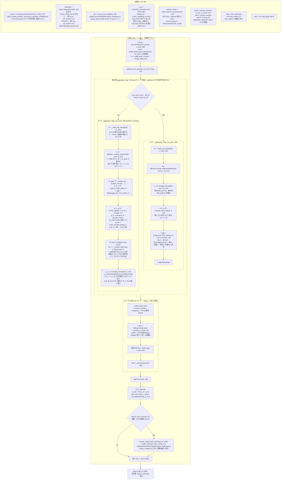
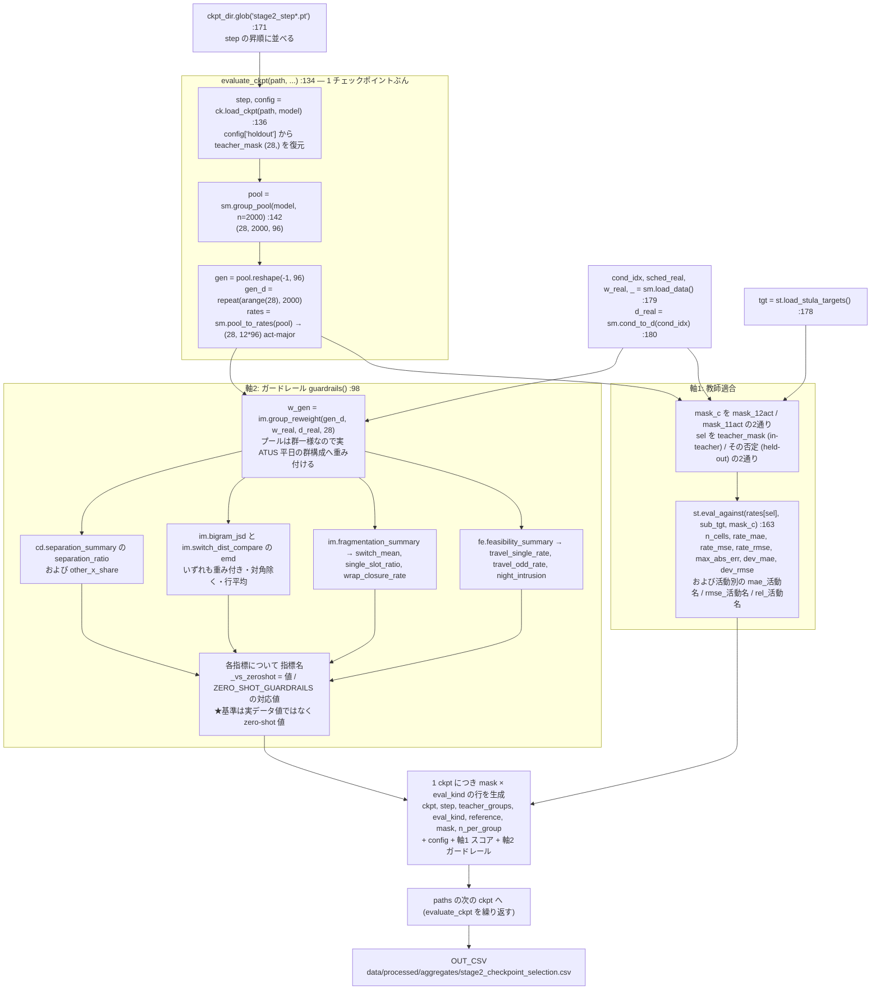

# Stage 2 の処理の流れ（集計表だけでの微調整）

**対象**: `src/models/DDPM_Aggregate_Simple/stage2_*.py`。
この 2 枚は [Stage2_implementation.md](../Stage2_implementation.md) §3 にあったアスキー図を
置き換えたものである。設計上の根拠は [Stage2_design.md](../Stage2_design.md)、
実装判断の根拠表は [Stage2_implementation.md](../Stage2_implementation.md) §3 に残してある。

**関連**: [Stage 1 の処理の流れ](./Stage1.md)

図中の識別子はすべてコード中の実名である。モジュール別名は `stage2_finetune.py` の
`_load()` が付けるものと同じ（`sm`=`model`, `st`=`stage2_targets`, `sl`=`stage2_loss`,
`ck`=`stage2_checkpoint`）。

---

## 図③: 1 更新の構造（`stage2_finetune.run` :301）

**要点**

- **`backward()` を 2 回に分けて呼ぶ**ので、集計側とリハーサル側の計算グラフを同時に持たない。
  ピークメモリは和ではなく `max(集計側, リハーサル側)` である（設計書 §4.5）。
- **`chunk` が `total` 未満なら 2 パス勾配蓄積へ自動で切り替わる**（`resolve_chunk`）。
  `x_K` を 1 パス目で保存するので前段（`T-K` ステップ）は 1 回しか回らず、2 回回るのは末尾 K だけ。
  勾配は一括計算と厳密に一致する（近似ではない。`test_two_pass_matches_full_batch` が
  最大差 1e-10 台で固定している）。
- 素朴な勾配蓄積が使えないのは、損失がバッチ全体の非線形関数だからである。
  部分ごとに損失を計算して足すと `n=4/chunk=2` で正解 0.0025 に対し 0.1625 と 65 倍ずれる。
- 教師は**教師ネットワークではなく公表集計表**（社会生活基本調査 令和3年 第8-1表）である。
  `teacher_mask` が制約するのは**損失だけ**で、生成と評価は常に 28 群すべてを対象にする。
- 設計判断（12 チャネルのまま再正規化しない／split-batch 不偏推定／群は等重み／早期終了なし）
  の根拠は [Stage2_implementation.md](../Stage2_implementation.md) §3 の表を参照する。

---

## 図④: 事後チェックポイント選択（`stage2_select.run` :170）

**要点**

- **軸1 は `teacher_groups=28` のとき循環している**（学習の目的関数そのものを測っている）。
  非循環にするには `--holdout-groups` で群を抜いて学習し、`held-out` 行を読む。
- **軸2 の基準は実データ値ではなく zero-shot 値**（`ZERO_SHOT_GUARDRAILS` :83）。
  Stage 1 の時点で全指標がノイズ床の外にあるので、「壊さない」ではなく
  「悪化させない／改善する」で主張を立てる（設計書 §9.2）。
- 学習側に早期終了は無い。固定ステップ予算で回し切ってから、この 2 軸で事後に選ぶ。
- `bigram_jsd` と `switch_emd` は重み付きの値で固定する。重み無しだと別の値
  (0.0059 / 0.7765) になり、過去の記録に両方が混在している。
