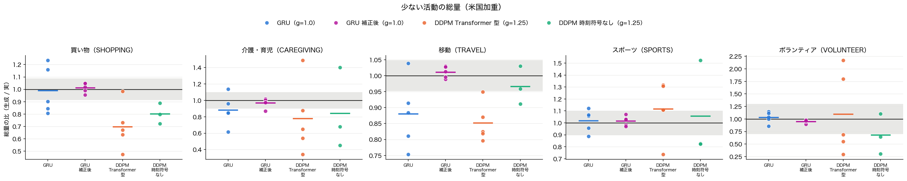
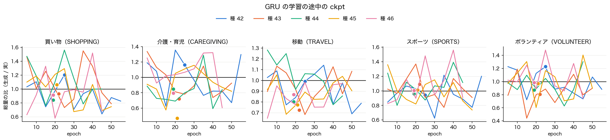
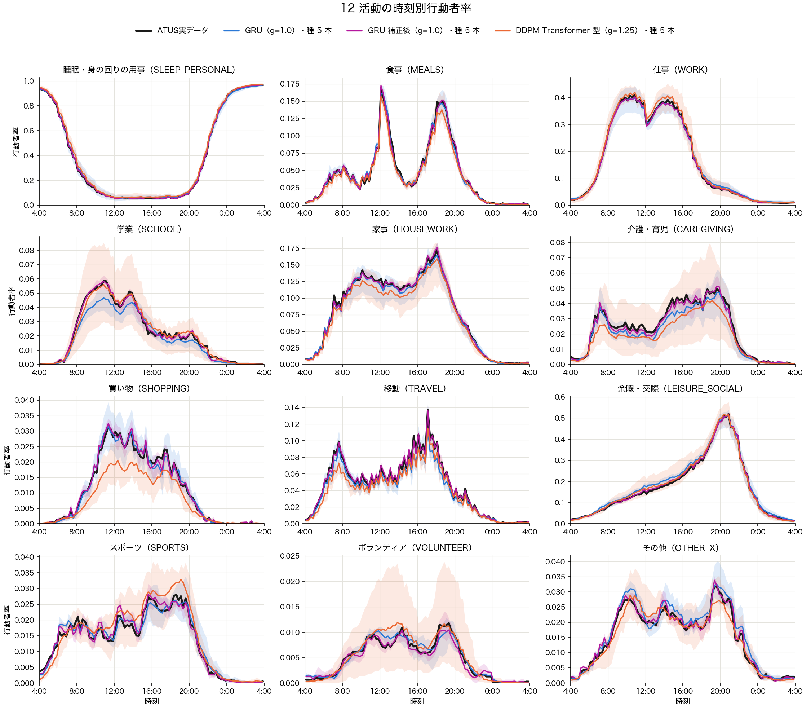

# Stage 1 結果: 再帰型（GRU）＋交差エントロピー

作成 2026-09-27。計画は [plan.md](plan.md)、比べる DDPM の診断は [Stage1_rare_activity_diagnosis.md](../../DDPM_Aggregate_Simple/docs/Stage1_rare_activity_diagnosis.md)。

## 1. 結論

- **追記（§6）: 学習後に `slot_bias` を補正した `gru_cal` は C1・C2 に合格（5/5・5/5）、C3 は不合格**。
  - C3 で落ちたのは種 44 の switch_emd だけ（0.928、基準 0.852）。種 44 は補正の前から睡眠・食事・家事を細切れに作っており、補正で移動のエピソードが実データ並みに増えた分、1 日の切替が 13.48 回（実 12.64）になった。
  - wrap_closure は補正で基準の内に入った（種の最大 0.0441 → 0.0248、基準 0.0256）。
- 以下は補正前の `gru` の結果。
- **判定は C1・C2・C3 とも不合格**（事前に固定した基準）。
  - C1: 少ない活動の総量の種間 sd が DDPM の半分以下になったのは 5 活動中 3（介護・育児、スポーツ、ボランティア）。買い物と移動は DDPM と同程度か大きい。
  - C2: 総量の比の種平均が床の内に入ったのは 5 活動中 3（買い物、スポーツ、ボランティア）。介護・育児と移動は 0.88 で少ない。
  - C3: 4 指標のうち wrap_closure（03:45 → 翌 04:00 で活動が変わる人の割合）だけが基準を超えた。GRU は 5 本とも実データより多い（0.081〜0.114、実 0.069）。
- **総量を縛る仕組みは、実データの履歴で予測したときには効いている**。その総量の種間 sd は 0.014〜0.049。種による揺れの大部分は、**自分の出力で履歴を作って生成する段階**で加わる（種間 sd 0.069〜0.159）。
- **判定の外では、GRU は DDPM Transformer 型より実データに近い**。
  - 12 活動の ‖実 − 生成‖²（種平均）は 12 活動すべてで GRU が小さい。
  - 米国加重の曲線の MSE は 1.51e-4（DDPM 2.42e-4）。
  - 遷移（bigram_jsd）と 1 スロットだけの区間の差は DDPM Transformer 型より小さく、切替の分布（switch_emd）は同程度。暗記は 0 本。

## 2. 設定

| 項目 | GRU | DDPM Transformer 型（`ddpm_tf96`） | DDPM 時刻符号なし（`ddpm_noclock`） |
|---|---|---|---|
| 種 | 42〜46 | 42〜46 | 42〜44 |
| 生成プール | 28 群 × 256 本、g = 1.0 | 学習時のプール、g = 1.25 | 学習時のプール、g = 1.25 |
| 最良 epoch | 25 / 22 / 19 / 21 / 19 | 診断の報告を参照 | — |
| val（重み付き交差エントロピー） | 0.4853〜0.4863 | — | — |
| 学習時間（手元 MPS） | 1 本 約 10 分 | — | — |

- 評価はすべて米国加重（生成の群別の値を ATUS の TUFINLWGT の群構成で平均）。
- 床は、ATUS の回答者を復元抽出したときの比の sd × 2。
- 集計は [stage1_gru_compare.py](../../../eval/diagnostics/stage1_gru_compare.py)。

## 3. 判定

| # | 基準 | 結果 | 判定 |
|---|---|---|---|
| C1 | 5 活動のうち 4 以上で、GRU の種間 sd ≤ DDPM Transformer 型の種間 sd × 0.5 | 3/5（介護・育児、スポーツ、ボランティア） | 不合格 |
| C2 | 5 活動のうち 4 以上で、\|GRU の種平均 − 1\| ≤ 床 | 3/5（買い物、スポーツ、ボランティア） | 不合格 |
| C3 | 4 指標で GRU の種の最大 ≤ 時刻符号なし DDPM の種の最大、暗記 0 本 | wrap_closure の差だけ超過（0.0441 > 0.0256）。暗記 0 本 | 不合格 |

事前の予測との照合:

| 予測 | 結果 |
|---|---|
| C1 は満たす | 外れた（3/5） |
| Q2 のずれは移動で最大になる | 系統的なずれは移動が最大（生成が平均 0.92 倍、5 本中 4 本で少ない）。ただし種ごとの揺れは介護・育児と買い物の方が大きい |
| C3 でいちばん危ういのは switch_emd | 外れた。落ちたのは wrap_closure |

## 4. 結果

### 4.1 Q1 総量の比（生成 / 実）



- 図には §6 の `gru_cal`（赤紫）も並べてある。

| 活動 | GRU（種 42〜46） | 種平均 | 種間 sd | DDPM Transformer 型 種平均 | 種間 sd | 床 |
|---|---|---|---|---|---|---|
| 買い物 | 1.23 / 0.84 / 0.90 / 1.16 / 0.81 | 0.99 | 0.19 | 0.70 | 0.19 | ±0.09 |
| 介護・育児 | 1.14 / 0.85 / 0.96 / 0.62 / 0.85 | 0.88 | 0.19 | 0.78 | 0.44 | ±0.10 |
| 移動 | 1.04 / 0.75 / 0.88 / 0.81 / 0.91 | 0.88 | 0.11 | 0.85 | 0.06 | ±0.05 |
| スポーツ | 0.89 / 1.12 / 0.96 / 1.06 / 1.07 | 1.02 | 0.09 | 1.12 | 0.24 | ±0.10 |
| ボランティア | 1.15 / 1.04 / 1.00 / 0.86 / 1.11 | 1.03 | 0.11 | 1.10 | 0.83 | ±0.30 |

- 種 42 の g = 1.25 のプールは、g = 1.0 と比べて総量の比が 0.02 以内しか変わらない（買い物 1.21、介護・育児 1.16、移動 1.03、スポーツ 0.89、ボランティア 1.13）。GRU では CFG の影響は小さい。

### 4.2 Q1 途中の ckpt での総量の比（64 人/群の小プール）



| 活動 | GRU 種内 sd（最良 ± 30 epoch） | DDPM 種内 sd（最良 ± 200 epoch） | 生成の乱数だけの sd |
|---|---|---|---|
| 買い物 | 0.26 | 0.21 | 0.12 |
| 介護・育児 | 0.21 | 0.32 | 0.10 |
| 移動 | 0.14 | 0.20 | 0.03 |
| スポーツ | 0.20 | 0.25 | 0.07 |
| ボランティア | 0.22 | 0.72 | 0.11 |

- 「生成の乱数だけの sd」は、GRU 種 42 の最良の ckpt から生成の乱数だけを変えて 8 本作った小プールの sd。
- GRU の種内 sd は生成の乱数だけの sd の 2〜4 倍で、GRU でも ckpt ごとに総量が動いている。買い物以外の 4 活動では DDPM より小さい。
- ★GRU の窓（± 30 epoch）には過学習が進んだ epoch（val が最良より最大 0.09 悪い）が入る。DDPM の窓では val はほぼ平らだった。窓の性質が違うので、種内 sd の大小は参考にとどめる。

### 4.3 Q2 実データの履歴で予測した総量と、自分で生成した総量

種による揺れを 2 段に分けた（比の種間 sd）:

| 活動 | 実データの履歴で予測 / 実（学習分割） | 生成 / 実データの履歴で予測 | 生成 / 実（全体） |
|---|---|---|---|
| 買い物 | 0.049 | 0.145 | 0.194 |
| 介護・育児 | 0.047 | 0.159 | 0.190 |
| 移動 | 0.048 | 0.069 | 0.109 |
| スポーツ | 0.015 | 0.078 | 0.094 |
| ボランティア | 0.014 | 0.104 | 0.112 |

- 「実データの履歴で予測」は `teacher_forced_rates`：各スロットの入力に実データの直前の活動を入れたときの、予測確率の加重平均。
- 交差エントロピーと `slot_bias` が縛るのは 1 列目の量で、その種間 sd は 0.014〜0.049 に収まっている。
- 1 列目が 0 にならないのは、早期終了（epoch 19〜25）で勾配が 0 の点まで学習していないため（スロットごとの差の最大 0.025〜0.031）。
- 2 列目（自分の出力で履歴を作ったことによるずれ）が、種による揺れの大部分を占める。
- 移動は 2 列目の平均が 0.92 で、5 本中 4 本で生成が少ない。平均が 1 から最も離れているのは移動。

### 4.4 Q3 系列の妥当さ

| 指標 | GRU 平均 / 最大 | DDPM Transformer 型 平均 / 最大 | DDPM 時刻符号なし 平均 / 最大 | 判定 |
|---|---|---|---|---|
| switch_emd | 0.374 / 0.531 | 0.374 / 0.496 | 0.614 / 0.852 | 合格 |
| bigram_jsd | 0.0027 / 0.0039 | 0.0066 / 0.0086 | 0.0053 / 0.0060 | 合格 |
| single_slot の差 | 0.0046 / 0.0080 | 0.0097 / 0.0171 | 0.0219 / 0.0372 | 合格 |
| wrap_closure の差 | 0.0285 / 0.0441 | 0.0124 / 0.0237 | 0.0113 / 0.0256 | **不合格** |

- wrap_closure の値そのもの: 実 0.069、GRU 0.081〜0.114、DDPM Transformer 型 0.054〜0.093、DDPM 時刻符号なし 0.069〜0.095。
- GRU は 04:00 から順に生成するので、最初のスロットを決める時点で 03:45 の活動を見られない。DDPM は 96 スロットを同時に作るので、両端を合わせられる。wrap_closure の超過は、この生成の順序から来ている見込み（未検証）。
- 1 日の切替回数は GRU 12.32〜12.93（実 12.64）。
- 暗記（DCR の差が床の上）は全 arm で 0 本。

### 4.5 Q4 12 活動の時刻別行動者率



- 線は種平均、帯は種の最小〜最大。§6 の `gru_cal`（赤紫）も並べてある。

| 活動 | GRU ‖実 − 生成‖² | DDPM Transformer 型 |
|---|---|---|
| 睡眠・身の回り | 0.0563 | 0.0603 |
| 食事 | 0.0041 | 0.0083 |
| 仕事 | 0.0327 | 0.0658 |
| 学業 | 0.0031 | 0.0104 |
| 家事 | 0.0093 | 0.0208 |
| 介護・育児 | 0.0038 | 0.0161 |
| 買い物 | 0.0010 | 0.0031 |
| 移動 | 0.0101 | 0.0109 |
| 余暇・交際 | 0.0522 | 0.0766 |
| スポーツ | 0.0007 | 0.0024 |
| ボランティア | 0.0002 | 0.0022 |
| その他 | 0.0010 | 0.0016 |

- ‖実 − 生成‖² は 96 スロットの和で、表の値は種平均。

| 代表点 | 実 | GRU | DDPM Transformer 型 |
|---|---|---|---|
| 食事 07:00 | 0.045 | 0.048 | 0.045 |
| 食事 12:00 | 0.169 | 0.161 | 0.157 |
| 食事 19:00 | 0.135 | 0.136 | 0.116 |
| 仕事 12:00 | 0.298 | 0.305 | 0.319 |
| 移動 08:00 | 0.078 | 0.073 | 0.062 |

- 学業は 10〜12 時で GRU が低い（0.046 前後、実 0.058）。

### 4.6 MSE（4 通りの粒度、判定には使わない）

| 指標 | GRU | DDPM Transformer 型 | DDPM 時刻符号なし | 完全なモデルの範囲 |
|---|---|---|---|---|
| 曲線（米国加重）vs ATUS 実 | 1.51e-4（0.92〜2.64） | 2.42e-4（1.39〜3.70） | 3.33e-4（2.03〜4.49） | 0.86e-5〜2.8e-5 |
| 曲線（日本人口加重）vs ATUS 実 | 1.54e-4（0.95〜2.59） | 2.38e-4（1.39〜3.65） | 3.07e-4（1.80〜3.87） | 0.90e-5〜2.7e-5 |
| 群ごと vs ATUS 実 | 1.34e-3（1.24〜1.48） | 1.58e-3（1.47〜1.85） | 1.78e-3（1.54〜2.09） | 1.8e-4〜1.1e-3 |
| 群ごと vs 日本の教師 A*（論文の `rate_mse`） | 3.41e-3（3.05〜3.91） | 3.54e-3（3.26〜3.96） | 3.60e-3（3.13〜4.16） | — |

- 括弧は種の最小〜最大で、その行の平均と同じ桁（曲線の 2 行は × 10⁻⁴、群ごとの 2 行は × 10⁻³）。
- 「完全なモデルの範囲」は、生成プールが有限であることによる揺れ（下限）から、それに ATUS の標本誤差を足した値（上限）まで。
- 論文の `rate_mse` は日米の生活の違いを含む。ATUS の実データそのものを採点しても 3.66e-3 になるので、Stage 1 の比較には使わない。
- 論文の値（時刻符号なし 種 42 で 2.987e-3）は群あたり 2,000 本のプールで測った値。256 本では 3.125e-3 になり、差の 1.4e-4 はプールが小さいことによる揺れの大きさと合う。

## 5. 次の手の候補（判断待ち）

計画書 §4.3 の規則により、ここで止めて判断を仰ぐ。→ 1 行目を §6 で実施した。

- **推奨:** まず 1 行目。4.3 で種による揺れの大部分を占めると分かった「生成の段」を直接縛り、学習し直しが要らない。C3 は程度を許容するか粗 → 細にするかを別に決める。

| 対象 | 候補 | 狙い | 手間 |
|---|---|---|---|
| C1・C2（生成段階の揺れ） | 学習後に `slot_bias` だけを、生成した総量が実データに合うよう反復で補正する | 4.3 の 2 列目を直接縛る。部品は 96 × 12 の数だけで説明しやすい | 小（学習し直し不要） |
| C1・C2 | scheduled sampling（Bengio et al., NeurIPS 2015）：学習で入力の一部を自分の出力に置き換える | 実データの履歴と自分の出力の履歴のずれ（exposure bias）を学習で減らす | 中（再学習 5 本） |
| C1・C2 | 最良 epoch 付近の ckpt の重みを平均する | 4.2 の ckpt ごとの揺れをならす | 小 |
| C3（wrap_closure） | 粗 → 細の順で生成する（1 日の概要を先に決めてから細かくする）。計画書 §8 の案 | 1 日の両端を最初の段で同時に決められる | 大 |
| C3 | 程度を許容する（GRU 平均 0.029、時刻符号なし DDPM 平均 0.011。ほかの 3 指標は DDPM より良い） | 説明しやすさを優先する | なし |

## 6. 追記: 学習後の `slot_bias` の補正（計画書 §9）

§5 の 1 行目を実施した。学習後に、生成した総量が学習分割の行動者率に合うよう `slot_bias`（96 × 12）だけを反復で動かした arm を `gru_cal` と呼ぶ。

- **設定：** 幅 0.5・8 回・1 回のプール 28 群 × 1,024 本。
  - 当初の幅 1.0 は反復が振動したので、評価のプールを作る前に変えた（計画書 §9.3）。
  - 補正のプールの種は 20000〜20008 で、評価のプール（種 12345、28 群 × 256 本、g = 1.0）とは別。
- **補正の収束：** 最後の補正の後、補正のプールでの総量の比（生成 / 目標）は 12 活動・5 本とも 0.94〜1.10（ボランティア以外は 0.96〜1.04）。
- **補正で動いた量：** 種 43・44 で測ると、`slot_bias` の変化は平均 0.18、最大 1.9〜2.1。

### 6.1 判定

| # | `gru`（補正前） | `gru_cal`（補正後） |
|---|---|---|
| C1 | 3/5 で不合格 | **5/5 で合格** |
| C2 | 3/5 で不合格 | **5/5 で合格** |
| C3 | wrap_closure で不合格 | switch_emd（種 44）で不合格 |

事前の予測（計画書 §9.2）との照合:

| 予測 | 結果 |
|---|---|
| C1・C2 は満たす | 当たった |
| C3 の wrap_closure は変わらない | 外れた。種の最大が 0.0441 → 0.0248 に下がり、基準の内に入った。04:00 と 03:45 の各活動の割合が実データに合ったためと見ている（未検証） |

### 6.2 総量の比（生成 / 実、評価のプール）

| 活動 | `gru_cal`（種 42〜46） | 種平均 | 種間 sd | `gru` の種間 sd | DDPM Transformer 型の種間 sd | 床 |
|---|---|---|---|---|---|---|
| 買い物 | 1.05 / 0.99 / 1.02 / 1.05 / 0.95 | 1.01 | 0.040 | 0.194 | 0.186 | ±0.09 |
| 介護・育児 | 1.02 / 1.00 / 0.98 / 0.87 / 0.97 | 0.97 | 0.057 | 0.190 | 0.442 | ±0.10 |
| 移動 | 0.99 / 1.03 / 1.01 / 1.03 / 1.00 | 1.01 | 0.018 | 0.109 | 0.061 | ±0.05 |
| スポーツ | 0.98 / 0.97 / 1.03 / 1.07 / 1.03 | 1.02 | 0.041 | 0.094 | 0.236 | ±0.10 |
| ボランティア | 0.89 / 0.97 / 0.95 / 0.96 / 0.98 | 0.95 | 0.034 | 0.113 | 0.831 | ±0.30 |

- 自分で生成した総量 / 実データの履歴で予測した総量は、種平均 0.97〜1.01、種間 sd 0.017〜0.065（補正前 0.069〜0.159）。

### 6.3 系列の妥当さ

| 指標 | `gru_cal` 平均 / 最大 | `gru` 平均 / 最大 | DDPM 時刻符号なし 平均 / 最大 | 判定 |
|---|---|---|---|---|
| switch_emd | 0.477 / **0.928**（種 44） | 0.374 / 0.531 | 0.614 / 0.852 | 不合格 |
| bigram_jsd | 0.0020 / 0.0023 | 0.0027 / 0.0039 | 0.0053 / 0.0060 | 合格 |
| single_slot の差 | 0.0049 / 0.0094 | 0.0046 / 0.0080 | 0.0219 / 0.0372 | 合格 |
| wrap_closure の差 | 0.0235 / 0.0248 | 0.0285 / 0.0441 | 0.0113 / 0.0256 | 合格 |

- 1 日の切替回数: `gru_cal` 12.80〜13.48（種 44 が 13.48）、`gru` 12.32〜12.93、実 12.64。補正で 5 本とも 0.3〜0.5 回増えた。
- 種 44 の switch_emd の中身（1 人あたりのエピソードの数、米国加重）:

| | 実 | `gru` 種 44 | `gru_cal` 種 44 |
|---|---|---|---|
| 睡眠・身の回り | 2.76 | 2.87 | 2.90 |
| 食事 | 1.89 | 1.93 | 1.99 |
| 家事 | 1.82 | 1.96 | 2.03 |
| 移動 | 2.13 | 1.92 | 2.17 |
| 12 活動の合計 | 13.64 | 13.93 | 14.48 |

  - `slot_bias` はスロットごとの割合を動かせるが、1 回の長さ（同じ総量を何回に分けるか）は動かせない。
  - 移動のエピソードは実データ並みに直ったが、補正の前からあった睡眠・食事・家事の余分は残った。
- 暗記は 0 本。

### 6.4 12 活動の曲線と MSE

| | `gru_cal` | `gru` | DDPM Transformer 型 |
|---|---|---|---|
| ‖実 − 生成‖² の 12 活動の和（種平均） | 0.0148 | 0.1745 | 0.2784 |
| 曲線（米国加重）の MSE | 1.29e-5（1.07〜1.48） | 1.51e-4 | 2.42e-4 |
| 群ごとの MSE vs ATUS 実 | 1.14e-3（1.05〜1.23） | 1.34e-3 | 1.58e-3 |
| 群ごと vs 日本の教師 A*（`rate_mse`） | 3.31e-3（3.20〜3.41） | 3.41e-3 | 3.54e-3 |

- ★曲線の MSE は、補正で合わせた量（学習分割の米国加重の曲線）とほぼ同じ量を測っている。完全なモデルの範囲（0.86e-5〜2.8e-5）に入ったのは補正の直接の結果で、独立な確認にはならない。
- 群ごとの MSE は、`slot_bias` が全群で共通なので補正では直接合わせていない。1.34e-3 → 1.14e-3 に下がったが、完全なモデルの範囲の上限（1.08e-3）の少し上に残る。
- 代表点: 食事 12:00 は 0.172（実 0.169）、移動 08:00 は 0.080（実 0.078）、仕事 12:00 は 0.294（実 0.298）。

### 6.5 次の手の候補（判断待ち）

| 候補 | 狙い | 手間 |
|---|---|---|
| C3 の超過を許容する（種 44 の 1 本だけ。switch_emd の種平均 0.477 は時刻符号なし DDPM の 0.614 より小さい） | 説明しやすさを優先する | なし |
| 「続ける」バイアスも補正する（直前と同じ活動の logits に足すスロットごとのバイアスを、切替の割合が実データに合うよう `slot_bias` と同じ反復で動かす） | `slot_bias` が動かせない 1 回の長さを合わせる | 小〜中 |
| 種 44 を除く | — | 事前に決めていない除外なので採らない |

## 7. 再現

```bash
# 学習と生成プール（種 42〜46）、g = 1.25 の比較プール（種 42）
.venv/bin/python src/models/GRU_Aggregate/model.py --seed 42
.venv/bin/python src/models/GRU_Aggregate/model.py --seed 42 --pool-only --guidance 1.25
# slot_bias の補正（_cal の ckpt とプール）
.venv/bin/python src/models/GRU_Aggregate/model.py --seed 42 --calibrate
# 評価（表は data/processed/aggregates/stage1_gru_*.csv、図は src/models/GRU_Aggregate/figures/）
.venv/bin/python src/eval/diagnostics/stage1_gru_compare.py --part all
```
