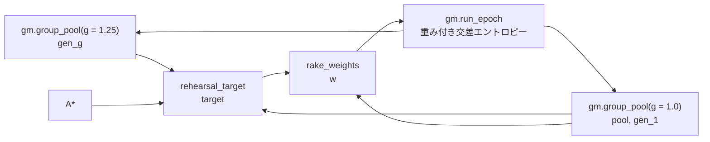
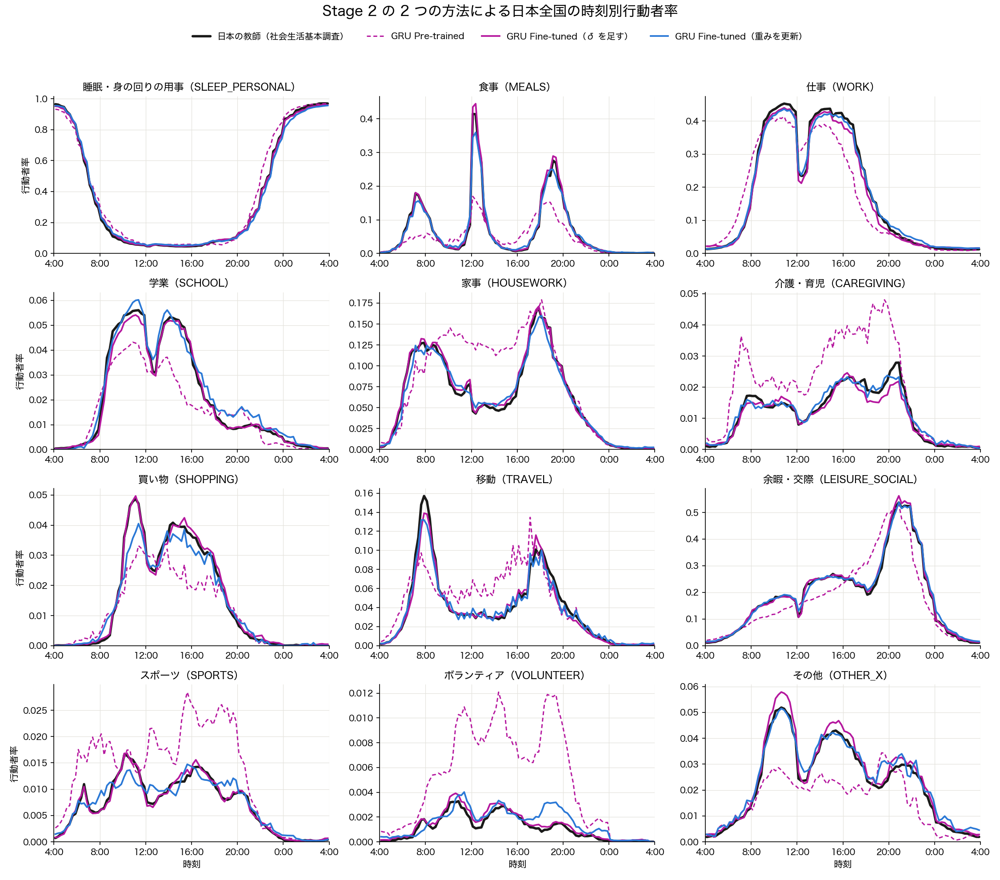
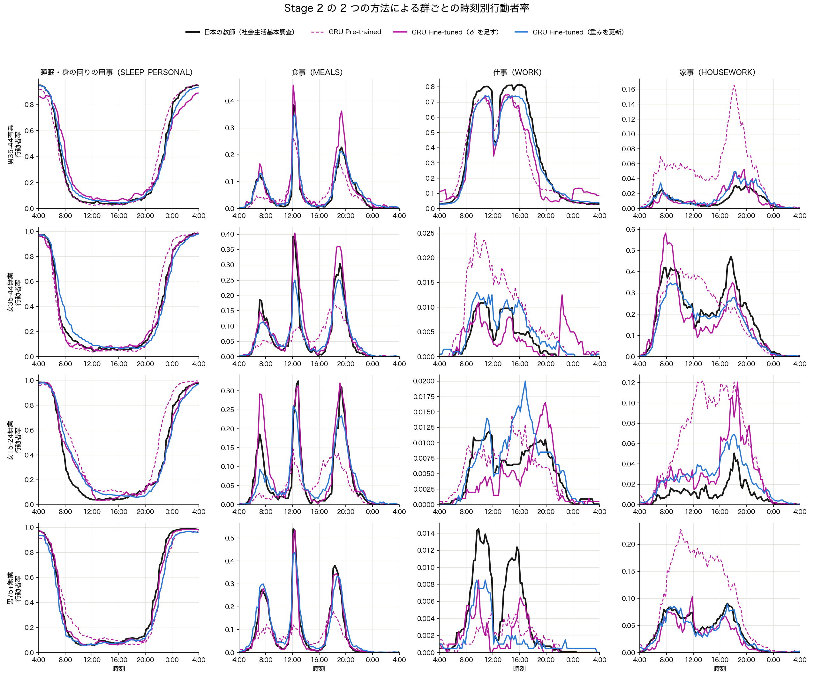

# GRU_Aggregate Stage 2：重みを更新する版の結果

- **日付：** 2026-09-29
- **コード：** [stage2_finetune.py](../stage2_finetune.py)（評価・判定は [stage2.py](../stage2.py) と共通）
- **比べる相手：** δ を足す版（[Stage2_results.md](Stage2_results.md)）
- **評価：** δ 版と同じ。E0〜E2、判定 J1〜J6、群あたり 2,000 本、乱数 12345、g = 1.25

## 1. 要約

| # | δ を足す版 | 重みを更新する版（v2） |
|---|---|---|
| J1 教師から外した群での改善 | 合格（7/7 fold） | 合格（7/7 fold） |
| J2 外した群で DDPM に勝つ | 合格（7/7 fold） | 合格（7/7 fold） |
| J3 系列を壊さない | 不合格（2 指標） | **不合格（5 指標）** |
| J4 公表表（起床・就寝・日次行動者率） | 合格 | **不合格**（起床時刻のずれが悪化） |
| J5 全国の曲線 | 合格（3.9e-5） | 合格（1.3e-4） |
| J6 28 群の適合 | 合格（5.8e-4） | 合格（4.3e-4） |

- **良くなった点：**
  - 28 群への適合（J6）が δ 版より良い。
  - 教師から外した群では 7 fold 中 5 で δ 版より良い。外すと悪化する群が 1 つもない（δ 版は 2 群）。
  - 日次行動者率（公表表、教師に使っていない）の誤差が最小。
- **悪くなった点：** 系列が δ 版よりさらに ATUS から離れた。切り替えが減り、1 回の活動が長くなる。
- **傾けなしの対照：** 系列の形はほとんど変わらなかった。したがって系列の変化は、リハーサルという手続きではなく、日本の教師へ合わせる傾けから来ている。

## 2. 方法

反復 10 回（δ 版と同じ）。反復ごとに次を行う。

1. g = 1.25 で採点用のプールを引き、教師への適合 gen_g を測る。
2. g = 1.0 でリハーサル用のプールを引く（gen_1）。
3. 群ごとに、目標 log target = log gen_1 + 0.5 ·（log A* − log gen_g）を置く。
4. 96 スロットの周辺への反復比例フィッティングで、各系列に指数傾けの重みを付ける。
5. その重み付き交差エントロピーで、GRU の重みを 1 周（lr 1e-4）学習する。



- **指数傾けを使う理由：** 行動者率の制約を満たす分布のうち、元のモデルに KL で最も近い分布だから。δ 版は、各スロットの logits を履歴によらず同じだけ動かす。
- **教師から外した群の扱い：** その群の系列はリハーサルに入れない。外した群は、群の間で共有する重みを通してだけ変わる。
- **学習率：** 結果を見る前に規則を決めた。種 42・E1 の最後の反復で、教師への `rate_mse` が 1.5e-3 を超えたら lr 3e-4 でやり直す。
  - 結果は 5.2e-4（δ 版は 7.6e-4）だったので、lr 1e-4 のまま進めた。
- **最初の版（v1）の誤り：**
  - v1 は、リハーサルの系列を評価と同じ g = 1.25 で引いていた。
  - 条件付きの分布が CFG で強めた群の違いを覚え、次の生成でまた g = 1.25 が掛かる。そのため、反復ごとに群の違いが膨らんだ（群の分離 1.02 → 1.81）。
  - v1 の結果は `_ftv1` に残してある。v1 の判定は J1・J2・J4〜J6 が合格、J3 は 7 指標中 5 が不合格。

## 3. 結果

### 3.1 判定の数値（5 種の中央値）

| 指標 | Pre-trained | δ | v1 | v2 | DDPM Fine-tuned |
|---|---|---|---|---|---|
| 全国の曲線の MSE（J5） | 1.36e-3 | 3.9e-5 | 3.8e-4 | 1.3e-4 | 1.28e-3 |
| 28 群の `rate_mse_split`（J6） | 3.07e-3 | 5.8e-4 | 1.15e-3 | **4.3e-4** | 2.59e-3 |
| 28 群の `dev_rmse`（J6） | 0.044 | 0.025 | 0.031 | **0.019** | 0.039 |
| `bigram_jsd`（J3） | 0.0018 | 0.0079 | 0.0255 | 0.0153 | — |
| `switch_emd`（J3） | 0.52 | 0.44 | 1.46 | 1.31 | — |
| 1 日の切り替えの回数（ATUS 実 12.8） | 13.1 | 12.8 | 14.1 | **11.3** | — |
| 15 分で終わる活動の割合（ATUS 実 0.234） | 0.238 | 0.218 | 0.248 | **0.188** | — |
| 群の分離 | 0.94 | 1.24 | 1.87 | 1.20 | — |
| `bed_bias`（時、J4） | −0.78 | −0.29 | −0.31 | **−0.14** | — |
| `wake_bias`（時、J4） | +0.35 | +0.32 | −0.04 | **+0.46** | — |
| `exact_mae`（J4） | 0.101 | 0.062 | 0.058 | **0.049** | — |

- J3 で v2 が不合格になったのは 5 指標：`bigram_jsd`・`switch_emd`・`switch_mean`・`single_slot_ratio`・`night_intrusion_rate`。
- v2 の `wake_bias` は種によって +0.09〜+0.46 時とばらつく。

### 3.2 教師から外した群（種 42）

| fold | Pre-trained | δ | v2 | DDPM |
|---|---|---|---|---|
| 0 | 5.09e-3 | 1.32e-3 | **1.05e-3** | 3.74e-3 |
| 1 | 3.98e-3 | **0.81e-3** | 1.16e-3 | 2.75e-3 |
| 2 | 2.89e-3 | 1.06e-3 | **0.77e-3** | 2.82e-3 |
| 3 | 2.38e-3 | 1.09e-3 | **0.44e-3** | 2.12e-3 |
| 4 | 2.98e-3 | **0.67e-3** | 0.98e-3 | 2.72e-3 |
| 5 | 2.52e-3 | 1.11e-3 | **0.70e-3** | 2.25e-3 |
| 6 | 2.81e-3 | 1.80e-3 | **0.85e-3** | 2.55e-3 |

- 値は held-out の `rate_mse_split`。
- **群ごとに見ると（12 × 96 の差の 2 乗の平均）：**
  - 外すと Pre-trained より悪化する群：δ は 2 群（男 75+ 有業・女 35-44 有業）、v2 は 0 群。
  - v2 が δ より良い群：28 群中 15。
- **男 35-44 有業の 0〜4 時の仕事：** 教師 0.034、δ 0.112、v2 0.046。δ 版の課題 §5.2（深夜の仕事の行き過ぎ）は、重みを共有するとほぼ消える。

### 3.3 系列の形

**活動ごとのエピソード（種 42、ATUS の群構成で加重）**

| 活動 | 回数：ATUS 実 | Pre-trained | δ | v2 | 長さ（スロット）：ATUS 実 | Pre-trained | δ | v2 |
|---|---|---|---|---|---|---|---|---|
| 睡眠・身の回りの用事 | 2.76 | 2.79 | 2.84 | 2.56 | 13.9 | 13.8 | 12.8 | 14.5 |
| 食事 | 1.89 | 1.88 | 2.25 | 1.99 | 2.33 | 2.34 | 2.92 | 3.12 |
| 仕事 | 1.10 | 1.14 | 1.20 | 0.99 | 14.7 | 13.9 | 13.6 | 17.5 |
| 家事 | 1.82 | 2.03 | 1.72 | 1.38 | 4.15 | 3.72 | 3.35 | 4.07 |
| 介護・育児 | 0.57 | 0.56 | 0.35 | 0.28 | 3.85 | 3.70 | 3.12 | 4.45 |
| 移動 | 2.13 | 2.08 | 1.85 | 1.59 | 2.05 | 2.09 | 2.07 | 2.25 |
| 余暇・交際 | 2.16 | 2.15 | 2.26 | 1.92 | 7.73 | 7.81 | 8.33 | 9.38 |

- 回数は 1 人あたりのエピソードの数。長さはエピソードの平均の長さ（スロット数）。
- **v2：** ほぼすべての活動で、回数が減って長さが伸びる。移動も 2.08 → 1.59 回に減る。
- **δ：** 食事が回数・長さともに増える（[Stage2_results.md](Stage2_results.md) §5.1）。家事・介護は回数も長さも減る。

**傾けなしの対照（種 42、`--no-tilt`、STEP = 0 で同じ手続き）**

| 指標 | Pre-trained | 対照 | v2 |
|---|---|---|---|
| 1 日の切り替えの回数 | 12.9 | 12.4 | 10.7 |
| 15 分で終わる活動の割合 | 0.233 | 0.236 | 0.168 |
| `bigram_jsd` | 0.0018 | 0.0028 | 0.0128 |
| 28 群の `rate_mse_split` | 3.2e-3 | 3.2e-3 | 4.5e-4 |

- リハーサルそのもの（自分の生成で学習し直すこと）は、系列の形をほとんど変えない。
- 切り替えの減少は、日本の教師へ合わせる傾けから来ている。

### 3.4 図



- 全国の 12 活動（5 種の平均）。
- v2（青）は教師の形に沿うが、食事の鋭い山が低い（昼食 0.35、教師 0.41）。δ（赤紫）は山の高さまで合う。



- その群を教師から外した fold の曲線（種 42）。
- v2 は男 35-44 有業の深夜の仕事の行き過ぎがない。一方で、女 35-44 無業の昼食の山が低い（0.25、教師 0.39）。

## 4. 考察

- **集計への適合と、教師に使っていない群への広がりは、重みを更新する方が良い。**
  - δ 版の弱点は、属性の足し算に交互作用がないこと、長い活動で効きが増幅すること（§5.2）だった。重みを共有するモデルでは、この弱点が出ない。
- **系列の形は、重みを更新する方が ATUS から大きく離れる。**
  - 見立て（未検証）：指数傾けの重みは、各スロットの因子の積 Π_s exp(η[s, x_s]) である。そのため、日本で増やしたいセルに長く留まる系列ほど、重みが掛け算で大きくなる。
  - 実効標本数は 20〜34% で、重みはこうした系列に偏る。
- **この変化が日本の生活の形か、壊れかは、まだ区別できない。**
  - 日本へ寄る方向の証拠：日次行動者率（公表表）の誤差は v2 が最小（0.049）で、就寝時刻のずれも最小（−0.14 時）。日次行動者率は「その日に 1 回でもした人の割合」なので、少ない人が長く行う形になると値が変わる。
  - 逆の証拠：起床時刻のずれは Pre-trained より悪化した（+0.46 時）。
  - J3 は ATUS との距離で測るので、日本の構造と壊れを区別できない。これは δ 版と同じ限界（[Stage2_results.md](Stage2_results.md) §5.1）。
- **CFG と自己生成の学習：** リハーサルの系列を生成と同じ g で引くと、CFG が反復ごとに複利で効く（v1）。最尤が合わせるのは g = 1.0 の分布である。

## 5. 次の手順（案）

| 案 | 中身 | 答える問い |
|---|---|---|
| A | 2 つの方法を、個票の正解がある転移先（ATUS の土日・別の年）で比べる。[データのバリエーション計画](pretrain_variation_plan.md) の段 A | 系列の変化が本当の構造か、壊れか |
| B | リハーサルに ATUS の実データを一部混ぜ、系列の形を保つ | 集計への適合と系列の形を両立できるか |
| C | 起床時刻のずれの原因（睡眠と身の回りの用事をまとめた分類）を確かめる（[Stage2_results.md](Stage2_results.md) §5.3） | J4 の不合格が分類の問題か |

## 6. 再現

```bash
.venv/bin/python src/models/GRU_Aggregate/test_stage2_finetune.py
.venv/bin/python src/models/GRU_Aggregate/stage2_finetune.py --seed 42              # E1（種 42〜46）
.venv/bin/python src/models/GRU_Aggregate/stage2_finetune.py --seed 42 --fold 3     # E2（fold 0〜6）
.venv/bin/python src/models/GRU_Aggregate/stage2_finetune.py --seed 42 --no-tilt    # 傾けなしの対照
.venv/bin/python src/models/GRU_Aggregate/stage2_finetune.py --judge                # J1〜J6
.venv/bin/python src/models/GRU_Aggregate/plot_stage2_curves.py --methods           # 図
```
