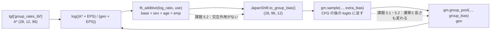
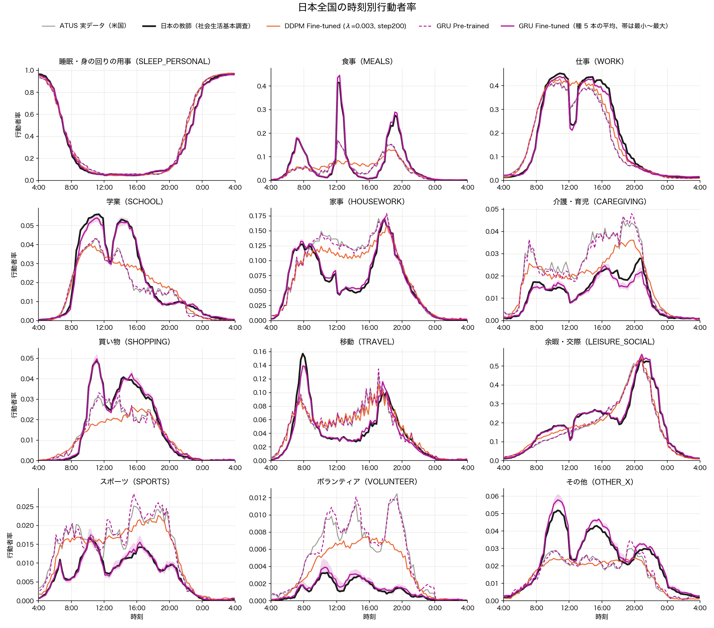
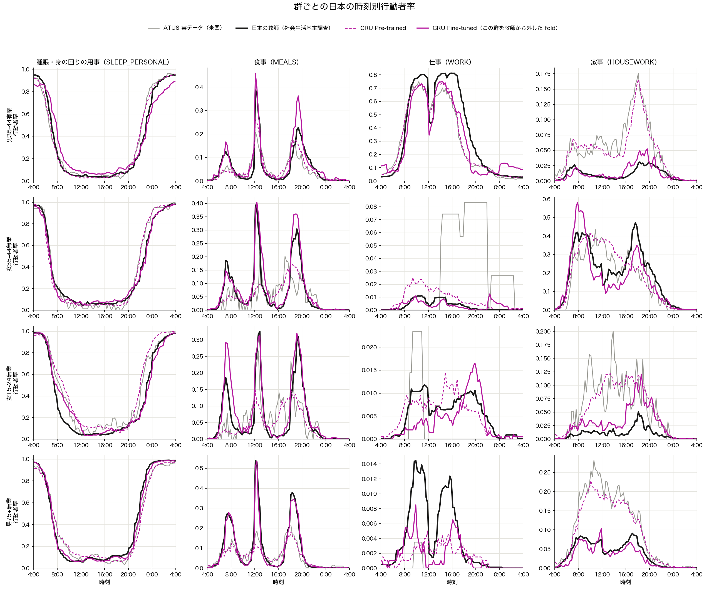

# GRU_Aggregate Stage 2 の結果と課題

- **日付：** 2026-09-28
- **計画書：** [stage2_plan.md](stage2_plan.md)（判定 J1〜J6 は §6 で結果を見る前に固定）
- **コード：** [stage2.py](../stage2.py)・[plot_stage2_curves.py](../plot_stage2_curves.py)
- **状態：** J3 が不合格。採用するかどうかは**判断待ち**（§5.1）
- **重みを更新する版：** 同じ評価での比較は [Stage2_finetune_results.md](Stage2_finetune_results.md)

## 1. 要約

| # | 判定 | 結果 |
|---|---|---|
| J1 | 合格 | 教師から外した群の `rate_mse_split` が 7 fold すべてで Pre-trained より小さい |
| J2 | 合格 | 同じ値が 7 fold すべてで DDPM Fine-tuned より小さい |
| J3 | **不合格** | `bigram_jsd` 4.4 倍、`single_slot_ratio` 5.2 倍（基準は 1.2 倍以内） |
| J4 | 合格 | 就寝時刻のずれ 0.78 → 0.29 時。起床時刻のずれは 0.35 → 0.32 時で、ほとんど動かない |
| J5 | 合格 | 全国の曲線の MSE 3.9e-5（DDPM 1.28e-3） |
| J6 | 合格 | 28 群の `rate_mse_split` 5.8e-4（DDPM 2.59e-3）、`dev_rmse` 0.025（DDPM 0.039） |

- **採用の条件：** J1・J3・J5・J6 のすべて。いまは J3 だけが満たせていない。
- **DDPM に対する優位を主張する条件：** J2・J4。どちらも満たした。

## 2. 実行したもの

| 実験 | 中身 | 本数 |
|---|---|---|
| E0 | δ = 0（Pre-trained、`gru_calg125`、g = 1.25） | 種 42〜46 の 5 本 |
| E1 | 28 群すべてを教師にして δ を当てはめる（10 反復） | 種 42〜46 の 5 本 |
| E2 | 4 群を教師から外して当てはめ、外した群で評価する（`stratified_folds`） | 種 42 × 7 fold |

- **評価の設定：** 群あたり 2,000 本、乱数 12345、g = 1.25。DDPM と同じ設定。
- **最後の反復の教師への `rate_mse`：** 5.9〜7.6e-4（E1 の 5 本）。反復 0（δ = 0）は 3.0〜3.3e-3。
- **中断：** 05:30〜15:50 は Mac のスリープで計算が止まっていた（結果への影響はない）。



## 3. 判定の数値

### J1・J2：教師から外した群の `rate_mse_split`（種 42）

| fold | GRU Fine-tuned | GRU Pre-trained | DDPM Fine-tuned |
|---|---|---|---|
| 0 | 1.32e-3 | 5.09e-3 | 3.74e-3 |
| 1 | 0.81e-3 | 3.98e-3 | 2.75e-3 |
| 2 | 1.06e-3 | 2.89e-3 | 2.82e-3 |
| 3 | 1.09e-3 | 2.38e-3 | 2.12e-3 |
| 4 | 0.67e-3 | 2.98e-3 | 2.72e-3 |
| 5 | 1.11e-3 | 2.52e-3 | 2.25e-3 |
| 6 | 1.80e-3 | 2.81e-3 | 2.55e-3 |

### J3：実 ATUS との距離（5 種の中央値）

| 指標 | Fine-tuned | Pre-trained | 比 | 判定 |
|---|---|---|---|---|
| `bigram_jsd` | 0.0079 | 0.0018 | 4.36 | **不合格** |
| `single_slot_ratio` | 0.0162 | 0.0031 | 5.16 | **不合格** |
| `night_intrusion_rate` | 0.00090 | 0.00077 | 1.17 | 合格（境界の近く） |
| `switch_emd` | 0.439 | 0.519 | 0.85 | 合格 |
| `switch_mean` | 0.118 | 0.294 | 0.40 | 合格 |
| `wrap_closure_rate` | 0.0181 | 0.0250 | 0.73 | 合格 |
| `pairwise_hamming_std` | 0.0042 | 0.0131 | 0.32 | 合格 |
| exact copy・暗記 | 0 本 | — | — | 合格 |

### J4〜J6（5 種の中央値）

| 指標 | GRU Fine-tuned | GRU Pre-trained | DDPM Fine-tuned |
|---|---|---|---|
| `bed_bias`（時） | −0.29 | −0.78 | — |
| `wake_bias`（時） | +0.32 | +0.35 | — |
| `exact_mae` | 0.062 | 0.101 | — |
| 全国の曲線の MSE | 3.9e-5 | 1.36e-3 | 1.28e-3 |
| 28 群の `rate_mse_split` | 5.8e-4 | 3.07e-3 | 2.59e-3 |
| 28 群の `dev_rmse` | 0.025 | 0.044 | 0.039 |

- J5・J6 は 28 群すべてが教師なので循環している。教師に使っていない群での裏付けは J1・J2 だけ。

## 4. 図



- 28 群を日本人口で加重した 12 活動の曲線。
- **GRU Fine-tuned（実線）：** 種 5 本の平均の線と、最小〜最大の帯。12 活動すべてで教師（黒）にほぼ重なる。
- **DDPM Fine-tuned（橙）：** ATUS（灰）からあまり動いていない。
- **残るずれ：** 移動の朝の山（0.14、教師は 0.16）と、介護・育児の 19〜21 時が低いこと。



- 4 群 × 4 活動。GRU Fine-tuned は、その群を教師から外した fold の δ で生成した曲線（種 42）。
- **教師に使っていない群でも日本へ寄る。** 例：男 35-44 有業の家事は 0.15 → 0.04（教師は 0.03）。
- **外れる箇所：** 男 35-44 有業の 0 時以降の仕事（§5.2）と、女 15-24 無業の朝食の山（0.29、教師は 0.18）。

## 5. 課題

### 5.1 J3 不合格：遷移と活動の長さが ATUS から離れる（判断待ち）

| 指標 | GRU Pre-trained → Fine-tuned | DDPM Pre-trained → Fine-tuned |
|---|---|---|
| `bigram_jsd` | 0.0018 → **0.0079** | 0.0049 → 0.0023 |
| `single_slot_ratio` の距離 | 0.0031 → **0.016** | 0.024 → 0.008 |

- **`bigram_jsd` は 5 種すべてで上がる**（0.0015〜0.0024 → 0.0071〜0.0086）。乱数のばらつきではない。
  - この指標は同じ活動が続く遷移を除いた P(次の活動 | 今の活動) を、ATUS と行ごとに比べる。
  - 種 42 の上昇は、特定の行に集中せず、全活動の行に広がっている。

    | 今の活動 | 寄与（Pre-trained → Fine-tuned） |
    |---|---|
    | 移動 | 0.0003 → 0.0020（全体の約 28%） |
    | 睡眠・身の回りの用事 | 0.0003 → 0.0010 |
    | 家事 | 0.0001 → 0.0008 |
    | 余暇・交際 | 0.0002 → 0.0008 |
    | 仕事 | 0.0001 → 0.0006 |

- **`single_slot_ratio`（15 分で終わるエピソードの割合）の低下は主に食事による。**
  - 15 分で終わる食事は 32% → 24%（ATUS は 33%）。
  - 食事のエピソードが全体に占める割合は 13.6% → 16.5%（ATUS は 13.9%）。
  - 食事のエピソードが増え、しかも長くなった。
- **原因の見立て：** δ は、時刻 × 活動ごとに logit を一律に動かす。そのため、ある活動の次に何が来るか、1 回の活動がどれだけ続くかも、時刻ごとに変わる。
- **区別できないこと：** これが日本の生活の形なのか、系列が壊れたのかは区別できない。区別には日本の個票が要るが、`data/raw/protected/` なので使えない。
- **DDPM との比較は、動かした量が揃っていない：** DDPM は行動者率をほとんど動かしていない（全国の MSE 1.38e-3 → 1.28e-3）。GRU は 1.36e-3 → 3.9e-5 まで動かした。
- **採否の選択肢：**

  | 案 | 中身 | 注意 |
  |---|---|---|
  | A（推奨） | δ を α 倍（0.25〜1.0）にして、行動者率の適合と `bigram_jsd` の兼ね合いの曲線を描く。約 30 分 | 結果を見てから α を選ぶことになる。そのことを明記する |
  | B | 限界として受け入れて採用する | 「2 指標は ATUS との距離なので、日本へ寄せれば離れる」と書く |
  | C | 採用しない。δ の形を変えて、遷移や活動の長さを保つ制約を入れる | 実装と再学習が要る |

  - 案 A の見込み：JSD はずれの 2 乗で増えるので、α = 0.3 前後で 1.2 倍の境界に届く。そのとき全国の MSE は約 6.7e-4 で、DDPM（1.28e-3）をまだ下回る見込み。

### 5.2 教師から外した群で仕事が外れる

- 28 群のうち 26 群は、外したときの誤差が Pre-trained より下がった。**悪化したのは 2 群**：

  | 群 | fold | 人口比 | Pre-trained | 外したときの Fine-tuned | 比 | 最大の活動（誤差に占める割合） |
  |---|---|---|---|---|---|---|
  | 男 75+ 有業 | 6 | 1.3% | 1.99e-3 | 3.57e-3 | 1.80 | 仕事（69%） |
  | 女 35-44 有業 | 5 | 5.7% | 1.57e-3 | 1.97e-3 | 1.26 | 仕事（58%） |

  - 誤差は、12 活動 × 96 スロットの差の 2 乗の単純平均（`rate_mse_split` とは別の集計）。
  - 改善した有業の群でも、仕事が誤差の 50〜61% を占める（男 25-34 有業、男 35-44 有業、男 55-64 有業）。
- **例：男 35-44 有業の 0〜4 時の仕事**（fold 3 の δ）

  | 教師 A* | Pre-trained | E1（教師に入れた） | E2（外した） |
  |---|---|---|---|
  | 0.034 | 0.033 | 0.047 | **0.112** |

  - この群の δ は base 0.39 + age[35-44] 0.28 + emp[有業] −0.01 = 0.66（男性が基準の水準で 0）。
  - 1 スロットあたり exp(0.66) ≈ 1.9 倍になるはずのところ、実際は 3.4 倍。δ は毎スロット足されるので、長く続く活動ほど効きが増幅する。Stage 1 の補正で STEP 1.0 が発振したのと同じ仕組み。
  - E1 でも有業の男性の深夜の仕事は教師の 1.4〜2 倍（男 15-24 有業 0.042 vs 0.023、男 65-74 有業 0.033 vs 0.016）。
- **原因の見立て：** 2 つが重なっている。
  - δ は主効果だけで、性 × 就業などの交互作用がない（計画書 §6 の予測どおり）。
  - 系列生成で効きが増幅する度合いは群によって違う。反復補正はこれを教師の群でしか直さない。
- **案：** 交互作用を 1 つ足す（性 × 就業で 1 セルあたり係数 +1）。J1 を測り直す。

### 5.3 起床時刻のずれがほとんど動かない

- `wake_bias` は +0.35 → +0.32 時。全国の睡眠の曲線は朝も教師にほぼ重なっている。
- **仮説（未検証）：** 起床の規則（`src/eval/stula_derived_times.py`）は 睡眠・身の回りの用事（`SLEEP_PERSONAL`）を睡眠として扱う。
  - 起床の直後の身支度も「睡眠」の中に入り、起床が遅く出る可能性がある。
  - 教師 A* も同じ活動分類なので、δ ではこのずれを直せない。
- **確かめ方：** ATUS 実データ（`data/raw/open/`）で、睡眠だけのコードと `SLEEP_PERSONAL` の両方から起床時刻を出し、差を見る。

### 5.4 教師に使っていない群での証拠が 1 種だけ

- J1・J2（E2）は種 42 だけ。J5・J6 は循環している。
- **案：** E2 を種 43〜46 でも回す（28 本、2 本並列で約 3 時間）。

### 5.5 群の分離が ATUS より大きくなる

- `separation_ratio` は 0.94〜1.04 → 1.23〜1.27。
- 計画書 §5 で「報告だけ（判定に使わない）」としたもの。日本の群の違いが ATUS より大きい（例：家事の男女差）ことの反映か、δ の行き過ぎかは区別できない。

### 5.6 実装・運用

| 課題 | 対応 |
|---|---|
| `JapanShift` に `load` がない。描画スクリプトが npz のキーから組み立てている | `JapanShift.load(path)` を足し、`plot_stage2_curves.load_shift` を置き換える |
| `evaluate` が生成した率を保存しない。描画でもう一度生成している（1 本 約 2 分） | `evaluate` で率を `outputs/generated/` に保存する |
| 実行の連鎖が Mac のスリープで 10 時間止まった | 連鎖のスクリプトを `caffeinate -i` で包む |

## 6. 次の手順

1. §5.1 の採否を決める（案 A・B・C）。
2. §5.3 の起床の仮説を ATUS で確かめる（手元で数分）。
3. §5.2 の交互作用を試す。J1 を測り直す。
4. §5.4 の E2 を種 43〜46 で回す。

## 7. 再現

```bash
.venv/bin/python src/models/GRU_Aggregate/stage2.py --seed 42 --zero-shot   # E0
.venv/bin/python src/models/GRU_Aggregate/stage2.py --seed 42               # E1
.venv/bin/python src/models/GRU_Aggregate/stage2.py --seed 42 --fold 0      # E2
.venv/bin/python src/models/GRU_Aggregate/stage2.py --judge                 # J1〜J6 → stage2_gru_judge.csv
.venv/bin/python src/models/GRU_Aggregate/plot_stage2_curves.py             # 図 2 枚
```
