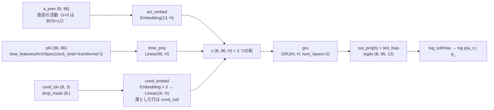
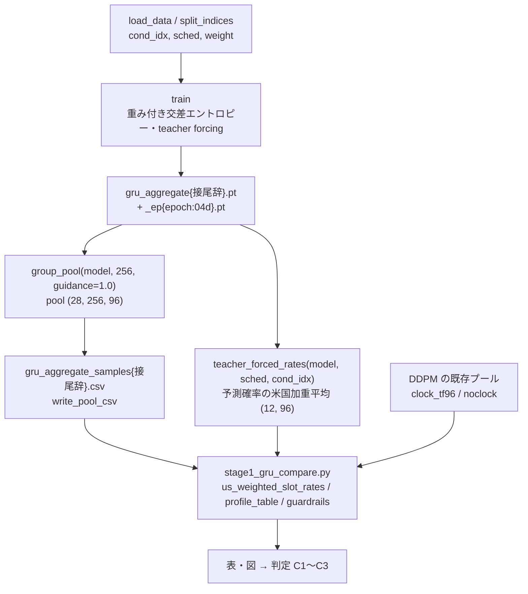
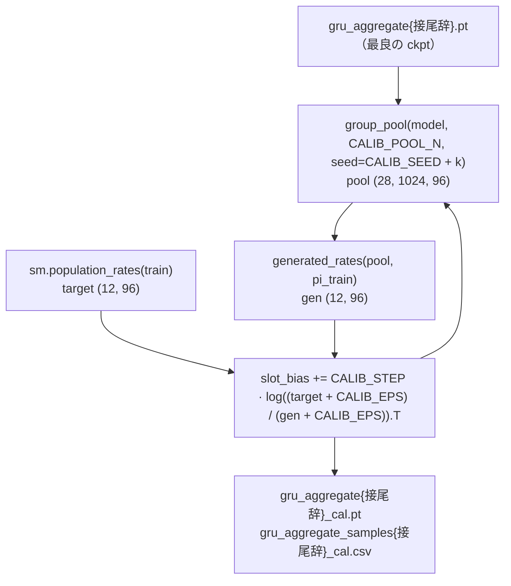

# 計画書: 再帰型（GRU）＋交差エントロピーの Stage 1（GRU_Aggregate）

作成 2026-09-27。前提の診断は [Stage1_rare_activity_diagnosis.md](../../DDPM_Aggregate_Simple/docs/Stage1_rare_activity_diagnosis.md)。

## 1. 背景と問い

- **診断の結論：** DDPM（`clock_tf96`）では、少ない活動（買い物・介護・育児・移動・スポーツ・ボランティア）の総量が学習の途中で大きく動いた（途中の ckpt での総量の比の種内 sd 0.20〜0.75）。総量は逆過程の SNR ≈ 1 の帯で決まり、val の ε-MSE はその間ほとんど変わらない。損失が総量を縛っていない。
- **狙い：** 1 日の 96 スロットを 04:00 から順に 1 つずつ生成する再帰モデルに替え、各スロットの活動の確率を交差エントロピーで学習する。出力に「スロット × 活動」ごとのバイアスを持たせ、学習が止まった点で**予測確率の加重平均が学習データの行動者率と一致する**ようにする（§3.2）。
- **範囲：** Stage 1 だけ。Stage 2 への接続は、この比較の結果を見てから決める。

| # | 問い | 見るもの |
|---|---|---|
| Q1 | 少ない活動の総量は、種によって揺れなくなるか | 総量の比の種間 sd（種 5 本） |
| Q2 | 自分の出力で履歴を作って生成したとき、総量はずれるか | 実データの履歴で条件付けた総量と、自分で生成した総量の差 |
| Q3 | 1 日の系列として崩れないか | 断片化・04:00 の境目・遷移の分布 |
| Q4 | 時刻の形（昼の食事の山・仕事の谷）は DDPM と比べてどうか | 12 活動の時刻別行動者率 |

## 2. データ（DDPM と同じ。比較のため 1 行も変えない）

| 項目 | 値 | 取り出し方 |
|---|---|---|
| ファイル | `data/processed/atus2024/atus2024_stula_common12_dataset.csv` | `DDPM_Aggregate_Simple/model.py` の `load_data` |
| 範囲 | ATUS 2024 平日、3,736 人 | 同上（`DAY_FILTER = 'weekday'`） |
| 系列 | 04:00 起点の 15 分 × 96 スロット、共通 12 分類 | 同上 |
| 条件 | 性 × 年齢 7 区分 × 就業の 28 群（`COND_SPEC`） | 同上 |
| 分割 | train 3,363 / val 373 | `split_indices`（種 42 固定） |
| 重み | TUFINLWGT | **損失の重み**に使う（DDPM はミニバッチの抽出に使っている。§3.2） |

- データの読み込み・分割・条件の符号化は、`DDPM_Aggregate_Simple/model.py` から import する。写し書きしない（分割がずれると、比較や暗記チェックの参照集合が別物になる）。
- **評価は米国加重**：生成の群別の値を ATUS の TUFINLWGT の群構成で加重する（Stage 1 の目的は元分布の再現）。

## 3. 手法

### 3.1 構造

| 部品 | 中身 | 理由 |
|---|---|---|
| `phi` | Transformer 型の時刻符号 96 次元（`clock_tf96` と同じ φ を import） | 生成するスロットの時刻を、そのステップだけの入力として明示する |
| `slot_bias` | 「スロット × 活動」ごとの自由なバイアス（96 × 12） | 総量を縛る仕組みの本体（§3.2）。φ の線形写像では各スロットの任意の値を作れない（独立な成分は 97 のうち 34） |
| `cond_null` | 条件を落とした行に使う学習可能なベクトル（確率 `P_UNCOND = 0.1`、DDPM と同じ） | 生成時の CFG のため |
| 隠れ層の幅 H | 384（パラメータ 182.9 万） | 比べる DDPM（`clock_tf96`、187.7 万）と同程度にそろえる |

`slot_bias` は、学習データの米国加重の行動者率の対数で初期化する（学習の初期を速めるため。§3.2 の一致の条件には影響しない）。

### 3.2 学習と「総量を縛る」仕組み

損失は、TUFINLWGT で重み付けした交差エントロピー（teacher forcing。各ステップの入力は実データの直前の活動）:

`L = − Σ_i w_i Σ_s log p_θ(a_{i,s} | a_{i,<s}, c_i, s) / (96 · Σ_i w_i)`

`slot_bias[s, c]` による微分は `Σ_i w_i (p_θ[i, s, c] − 1[a_{i,s} = c]) / (96 · Σ_i w_i)` なので、学習が止まった点では

`Σ_i w_i p_θ[i, s, c] = Σ_i w_i 1[a_{i,s} = c]`（全スロット s・全活動 c）

が成り立つ。つまり**実データの履歴で条件付けたとき**、予測確率の米国加重平均が学習データの行動者率と一致する。

- 一致するのは全体（米国加重）の行動者率で、群ごとではない。
- 自分の出力で履歴を作って生成したときの総量は、この一致の対象外。そのずれを Q2 で測る。
- DDPM は重みでミニバッチを引いているが、ここでは全員を毎 epoch 使い、損失を重みで掛ける。どちらも学習の目標は同じ分布で、損失を掛ける方が少ない活動の行動者を毎 epoch 必ず見る（ボランティアの行動者は学習分割に 165 人、重み付き抽出では実効 102 人）。

| 項目 | 値 |
|---|---|
| 最適化 | AdamW、学習率 1e-3、weight decay 0、勾配のノルムを 1.0 で切る |
| バッチ | 256 |
| 早期終了 | val の重み付き交差エントロピー、patience 30、最大 300 epoch |
| 途中の ckpt | 5 epoch ごとに保存（Q1 の軌跡用） |

### 3.3 生成

- s = 0..95 の順に softmax から 1 つずつ引く（温度 1.0 固定）。
- CFG は logits にかける: `logits = l_u + g·(l_c − l_u)`。**既定 g = 1.0**（CFG なし）。今回の診断で、CFG が少ない活動の総量をずらすと分かったため。g = 1.25 は比較用に 1 回だけ回す。
- 生成プール: 28 群 × 256 本、乱数の種 12345（DDPM の共通乱数プールと同じ）。形式は `write_pool_csv`（DDPM と同じ CSV）。

保存先:

| もの | パス |
|---|---|
| 最良の ckpt | `outputs/checkpoints/gru_aggregate{接尾辞}.pt` |
| 途中の ckpt | `outputs/checkpoints/gru_aggregate{接尾辞}_ep{epoch:04d}.pt` |
| 生成プール | `outputs/generated/gru_aggregate_samples{接尾辞}.csv` |

接尾辞は種 42 なら空、それ以外は `_s{seed}`（DDPM と同じ規則）。

## 4. 評価（米国加重、DDPM と同じ条件で並べる）

### 4.1 比べるもの

| 名前 | 中身 | 種 |
|---|---|---|
| `gru` | 本計画のモデル（g = 1.0） | 42〜46 |
| `ddpm_tf96` | `clock_tf96`（学習時のプール、g = 1.25） | 42〜46（既存） |
| `ddpm_noclock` | 時刻符号なしの DDPM（ガードレールの外側の基準） | 42〜44（既存） |

### 4.2 指標

| 問い | 指標 | 出所（再利用） |
|---|---|---|
| Q1 | 5 活動の総量の比（米国加重）と、その種間 sd | `stage1_rare_diagnosis.profile_table` + `group_weights("atus")` |
| Q1 | 途中の ckpt ごとの総量の比（64 人/群の小プール、DDPM の H4 と同じ大きさ） | 同上 |
| Q2 | 実データの履歴で条件付けた総量 − 自分で生成した総量 | 新設 `teacher_forced_rates` |
| Q3 | switch_emd / bigram_jsd / single_slot / wrap_closure、暗記（DCR の差） | `stage2_select.guardrails`（既に米国加重）/ `memorization_report` |
| Q4 | 12 活動の時刻別行動者率、‖実 − 生成‖²（活動ごと）、昼の食事と仕事の値 | 新設 `us_weighted_slot_rates` + `stage2_curves.pool_to_slot_rates` |
| 床 | ATUS の回答者の復元抽出での比の sd × 2（米国加重で作り直す） | `stage1_rare_diagnosis.bootstrap_floor` |

### 4.3 判定（事前に固定）

| # | 条件 | 合格の基準 |
|---|---|---|
| C1 | 総量の安定（Q1） | 5 活動のうち 4 以上で、`gru` の総量の比の種間 sd が `ddpm_tf96` の半分以下 |
| C2 | 総量の一致（Q1） | 5 活動のうち 4 以上で、`gru` の総量の比の種平均が床の内（\|比 − 1\| ≤ 床） |
| C3 | 系列の妥当さ（Q3） | switch_emd・bigram_jsd・single_slot の差・wrap_closure の差が、`ddpm_noclock` の種の最大値を超えない。暗記の判定が 0 本 |

- **採用の候補にする：** C1・C2・C3 をすべて満たす。
- **C3 で落ちた場合：** 悪化の程度を `ddpm_noclock` と並べて示し、次の手（1 ステップで 1 時間分を出す／粗 → 細の順で生成する）の判断を仰ぐ。
- Q2・Q4 は判定に使わず、数値と図で報告する。

**事前の予測**（結果の前に書いておく）:

- C1 は満たす（`slot_bias` の定常条件による）。
- Q2 のずれは、短いエピソードが多い移動で最大になる。
- C3 のうち、いちばん危ういのは switch_emd。

## 5. 実装

| ファイル | 中身 |
|---|---|
| `src/models/GRU_Aggregate/model.py`（新設） | 定数、`GRUScheduler`（nn.Module）、`train`、`sample`、`group_pool`、`teacher_forced_rates`、保存と読み込み、CLI（`--seed` `--epochs` `--save-every` `--guidance` `--no-pool` `--smoke`） |
| `src/models/GRU_Aggregate/test_model.py`（新設） | §7 の単体テスト |
| `src/eval/diagnostics/stage1_gru_compare.py`（新設） | §4 の評価。`us_weighted_slot_rates` を置く |
| `src/models/GRU_Aggregate/docs/`（新設） | この計画書、結果の報告書 |
| `src/models/GRU_Aggregate/figures/`（新設、docs と同じ階層） | 図 |

import して再利用するもの（写し書きしない）:

- `DDPM_Aggregate_Simple/model.py`：`load_data` `split_indices` `cond_to_d` `cond_grid` `COND_SPEC` `P_UNCOND` `time_features` `ArchSpec` `write_pool_csv` `memorization_report` `NUM_SLOTS` `NUM_ACT`
- `src/eval/diagnostics/stage1_rare_diagnosis.py`：`profile_table` `group_weights` `bootstrap_floor` `pool_people`
- `DDPM_Aggregate_Simple/stage2_select.py`：`guardrails`
- `DDPM_Aggregate_Simple/stage2_curves.py`：`load_sample_pool` `pool_to_slot_rates` `ACT_NAMES`

データの流れ:

## 6. 実行

- すべて手元（MPS / CPU）で回す。生成は 96 ステップなので SQUID は使わない見込み。1 本目で学習と生成の時間を測り、1 本 30 分を超えるなら SQUID の DBG に回す。
- 順序:
  1. 実装とテスト → `--smoke` で完走
  2. 種 42 を 1 本学習し、時間・学習曲線・生成の見た目を確認
  3. 種 43〜46
  4. g = 1.25 のプール（種 42 のみ）
  5. 評価と報告書
- 実装の単位ごとにコミットし、テストが通ってから `feat/stage1-clock-ablation` へ push する。

**止まる条件**（その時点で報告する）:

- 学習が発散する（val が 3 epoch 続けて悪化し、最良の 2 倍を超える）。
- 生成の見た目が明らかに崩れている（全員が同じ系列、切替が実データの 3 倍以上など）。
- C3 で落ちる。

## 7. 検証（`test_model.py`）

| # | 検証すること |
|---|---|
| a | 因果性：スロット s の logits が a_{≥s} に依存しない（未来の活動を書き換えても不変） |
| b | 損失が、手で書いた重み付き交差エントロピーと一致する |
| c | `slot_bias` の勾配が `Σ_i w_i (p − y) / (96 Σ w)` と一致する（総量を縛る仕組みの式を固定する） |
| d | 条件を落とした行は、条件なし（`cond_idx=None`）と一致する。g = 1.0 の CFG は条件付きの logits と一致する |
| e | 同じ種で生成が再現する。値域は [0, 12)。`write_pool_csv` → `load_sample_pool` で往復する |
| f | `teacher_forced_rates` が、予測確率の加重平均を手で計算したものと一致する |
| g | 保存した ckpt から同じ構造・同じ出力が戻る |

あわせて Pylance の警告をゼロにし、`--smoke` での完走を確認する。

## 8. この計画の外（結果を見て決める）

- Stage 2 への接続。各スロットの確率が微分できる形で出るので、argmax を通さずに集計の損失をかけられる見込み。
- 1 ステップで 1 時間分（4 スロット）を出す、または粗 → 細の順で生成する形への拡張（C3 で落ちた場合）。
- 休日の日誌を足す（平日に限定する方針の変更を伴う）。

## 9. 追加（2026-09-27）: 学習後の `slot_bias` の補正

[Stage1_gru_results.md](Stage1_gru_results.md) §4.3 の結果を受けて追加する。
交差エントロピーが縛るのは「実データの履歴で予測した総量」だけで、種による揺れの大部分は自分で生成する段で加わった。
そこで学習後に、生成した総量が学習データの行動者率に合うよう `slot_bias` だけを反復で補正する。

### 9.1 手順

| 項目 | 値 | 理由 |
|---|---|---|
| 変える部品 | `slot_bias`（96 × 12）だけ | ほかの重み（系列の作り方）を変えない |
| 目標 | 学習分割の米国加重の行動者率 `sm.population_rates(train)` | val の情報を使わない |
| 生成側の群の重み | 学習分割の TUFINLWGT の群ごとの和 | 目標と同じ群構成で比べる |
| 反復の回数 | `CALIB_ITERS = 8`（当初 6。§9.3） | — |
| 1 回のプール | 28 群 × `CALIB_POOL_N = 1024` 本、乱数の種は `CALIB_SEED + k`（評価のプールの種 12345 とは別） | 評価のプールの雑音に合わせ込まない |
| 更新の幅 | `CALIB_STEP = 0.5`（当初 1.0。§9.3） | 総量の応答が約 2 倍の活動で 1 回で目標に届く幅 |
| 0 の割り算を避ける値 | `CALIB_EPS = 1e-4` | 行動者率 0 のセルで発散させない |

- 補正した arm を `gru_cal` と呼ぶ。評価のプール（28 群 × 256 本、種 12345、g = 1.0）は `gru` と同じ条件で作る。
- 補正後は「実データの履歴で予測した総量」が実データからずれる（そちらの一致を手放して、生成の総量を合わせる）。

### 9.2 判定（事前に固定）

- `gru_cal` に C1〜C3 を §4.3 と同じ基準・同じ比較相手でかける。
- あわせて `gru` と比べ、系列の妥当さ（switch_emd など 4 指標）が悪化していないかを報告する。

**事前の予測:**

- C1・C2 は満たす（生成の総量を直接合わせるので、種による揺れは 1 回のプールの雑音程度まで下がる）。
- C3 の wrap_closure は変わらない（生成の順序から来るずれで、`slot_bias` では直らない）。

### 9.3 設定の変更（2026-09-27、評価のプールを見る前）

- **当初の設定（幅 1.0・6 回）で種 42 を回したところ、反復が振動した。**
  - ボランティアの総量の比（生成 / 目標）は 1.10 → 0.77 → 1.48 → 0.69 → 1.35 → 0.89 → 1.05、介護・育児は 1.18 → 0.83 → 1.27 → 0.82 → 1.11 → 1.01 → 0.99。
  - 6 回目の後は 12 活動すべて 0.95〜1.05 に収まったが、止める回によって結果が大きく変わる状態だった。
  - 記録は `outputs/logs/gru_aggregate_s42_cal_step1.log`。
- **原因：** 1 回が長い活動では、`slot_bias` の変化が「始める確率」と「続ける確率」の両方に効き、総量がバイアスの変化の約 2 倍動く（反復 0 → 1 の実測で介護・育児 2.1、買い物 1.7、家事 1.7）。幅 1.0 では毎回行き過ぎる。
- **変更：** 幅を 0.5、回数を 8 にした。応答 2 倍なら 1 回で目標に届き、応答 1 倍でも毎回ずれが半分になる。
- 判定（§9.2）は変えない。評価のプール（種 12345）はこの時点で一度も作っていない。

### 9.4 結果と判断（2026-09-27）

- `gru_cal` は C1・C2 に合格（5/5・5/5）、C3 は種 44 の switch_emd だけ超過（0.928、基準 0.852）。詳細は [Stage1_gru_results.md](Stage1_gru_results.md) §6。
- **ユーザーの判断：C3 の超過は許容する。`gru_cal` を Stage 1 の採用の候補とする。**

### 9.5 CFG の強さ g = 1.25 での補正（2026-09-27、ユーザー指示）

- **理由：** [Stage1_gru_results.md](Stage1_gru_results.md) §7.3 で、g = 1.0 では群の分離が 0.81 と縮んでいた（完全なモデル 1.02）。g = 1.25 では 1.05 に届き、群ごとの MSE と少ない活動の総量は変わらなかった。
- **やること：** §9.1 と同じ設定（幅 0.5・8 回・1 回のプール 28 群 × 1,024 本・種 20000〜）で、補正のプールだけ g = 1.25 で作る。評価のプールも g = 1.25（28 群 × 256 本、種 12345）。
- **保存先：** `gru_aggregate{接尾辞}_calg1.25.pt` と `gru_aggregate_samples{接尾辞}_calg1.25_g1.25.csv`。g = 1.0 で補正した `_cal` は残す。
- **arm の名前：** `gru_calg125`。判定 C1〜C3 は §4.3 と同じ基準・同じ比較相手でかける。

**事前の予測（結果の前に書く）:**

- C1・C2 は満たす（補正の仕組みは g = 1.0 と同じ）。
- 群の分離は 1.0〜1.1 に入る。
- C3 は switch_emd で落ちる見込み（g = 1.0 で補正した ckpt を g = 1.25 で生成したとき、種の最大が 0.92 だった。種 44 の細切れは補正では直らない）。

### 9.6 g = 1.25 での補正の結果（2026-09-28）

- `gru_calg125` は C1・C2 に合格（5/5・5/5）、C3 は種 44 の switch_emd だけ超過（1.035、基準 0.852）。群の分離は 0.98。詳細は [Stage1_gru_results.md](Stage1_gru_results.md) §8。
- **ユーザーの判断（2026-09-28）：`gru_calg125` を Stage 1 の採用の候補とする（C3 の超過は許容）。§9.4 の `gru_cal` に代わる。**

## 10. 追加（2026-09-29）: 隠れ層の幅と weight decay の掃引

### 10.1 理由

- **幅：** H = 384 は、DDPM（`clock_tf96`、187.7 万）とパラメータ数を揃えるために選んだ値（182.9 万）。ユーザーの指示で、キリのよい 256 か 512 に揃える。
  - パラメータ数は H = 256 で 82.7 万（DDPM の 0.44 倍）、H = 512 で 322.5 万（1.72 倍）。どちらにしても DDPM とは揃わない。
  - 過学習対策としてモデルを小さくする効果も測るため、H = 128（21.7 万、DDPM の 0.12 倍）も加える。
- **weight decay：** H = 384・wd = 0 の学習は、早い段階で過学習した。
  - 種 42 では val が epoch 25 で最良（0.4853）になり、打ち切った epoch 55 で 0.5745。train は同じ間に 0.4542 → 0.3314。
  - 5 本とも最良の epoch は 19〜25。
  - 正則化で過学習を遅らせれば、val が下がる余地がある。
- **weight decay を掛ける範囲：** 重み行列（Linear・GRU・Embedding）だけに掛ける（`param_groups`）。
  - `slot_bias` に掛けると、学習が止まった点で `slot_bias` の勾配が 0 にならず、§3.2 の一致が崩れるため。
  - 1 次元のパラメータ（bias・`cond_null`）にも掛けない（慣例どおり）。

### 10.2 掃引の設定

| 項目 | 値 |
|---|---|
| 幅 H | 128 / 256（512 は、2 本を回し始めた後にユーザーの指示で外した。どちらも epoch 10 前後で止め、ckpt は作っていない） |
| weight decay | 0 / 0.1 / 1 / 10（AdamW。1 epoch は 14 step なので、100 epoch での重みの縮みは exp(−1e-3 · wd · 1,400) = 0.99 / 0.87 / 0.25 / 約 0） |
| 種 | 42 だけ |
| そのほか | §3.2 と同じ（lr 1e-3、バッチ 256、val の重み付き交差エントロピーで早期終了、patience 30、最大 300 epoch） |
| 保存先 | `outputs/checkpoints/gru_sweep/gru_h{H}_wd{wd}.pt`（採用中の ckpt は上書きしない） |
| 集計 | `data/processed/aggregates/stage1_gru_width_decay_sweep.csv` |

### 10.3 決め方（結果を見る前に固定）

- 規準は、最良の epoch での val の重み付き交差エントロピー（早期終了と同じ量）。
- 差が 0.001 未満なら同点とみなす。0.001 は、H = 384・wd = 0 の 5 本（種 42〜46）の val の幅（0.4853〜0.4863）。
- 最小の値と同点の組が複数あれば、幅は小さい方（パラメータが少ない）、weight decay は小さい方（単純な方）を選ぶ。
- 選んだ H と wd を `HIDDEN` と `WEIGHT_DECAY` の既定値にする。
- その後の学習し直し（種 42〜46）・`slot_bias` の補正・Stage 2 の再実行は、結果を見てから決める。
  - 採用中の H = 384 の ckpt と生成プールは同じパス名なので、学習し直す前に退避する。
- dropout（GRU の層の間と出力の前）は、この掃引で選んだ H・wd に対して、次の段で試すかを決める。

### 10.4 掃引の結果と決定（2026-09-29）

| H | weight decay | 最良 epoch | val（最良） | 打ち切り時の val | teacher forcing の率の差 最大 |
|---|---|---|---|---|---|
| 128 | 0 | 49 | 0.4872 | 0.4998 | 0.019 |
| 128 | 0.1 | 49 | 0.4866 | 0.4959 | 0.019 |
| **128** | **1** | **96** | **0.4810** | 0.4823 | 0.012 |
| 128 | 10 | 16 | 0.5659 | 0.5770 | 0.051 |
| 256 | 0 | 24 | 0.4871 | 0.5227 | 0.033 |
| 256 | 0.1 | 24 | 0.4871 | 0.5180 | 0.034 |
| 256 | 1 | 37 | 0.4834 | 0.5020 | 0.028 |
| 256 | 10 | 22 | 0.5297 | 0.5434 | 0.053 |
| 384（参考、§3） | 0 | 25 | 0.4853 | 0.5745 | — |

- **§10.3 の規則により H = 128・wd = 1 を既定値にした。** 次点（H = 256・wd = 1）との差は 0.0024 で、同点の幅 0.001 を超える。
- wd = 1 では過学習がほぼ消えた（H = 128 で最良 0.4810、打ち切り時 0.4823）。wd = 10 は学習が進まない（train も 0.56）。
- wd = 0.1 は wd = 0 とほとんど同じ（14 step/epoch では縮みが小さい。§10.2 の見積もりどおり）。
- 種 42 の 1 本ずつの比較で、種による揺れは測っていない。
- 集計は `data/processed/aggregates/stage1_gru_width_decay_sweep.csv`、ログは `outputs/logs/gru_sweep_*.log`。
- 続けて、H = 384 の成果物を `outputs/archive/gru_h384/` に退避し、種 42〜46 の学習し直し・`slot_bias` の補正・Stage 1 の評価・Stage 2（δ を足す版だけ、ユーザー指示）を回す。表と図は接尾辞 `_h128` を付けて書く。

### 10.5 判断（2026-09-30、ユーザー）

- **H = 128・wd = 1 に切り替える。** Stage 1 の採用の候補は H = 128 の `gru_calg125` とする（§9.6 の H = 384 に代わる）。結果は [h128_results.md](h128_results.md)。
- 重みを更新する版の Stage 2（`stage2_finetune.py`）も H = 128 で回し直す。設定は変えない（H = 384 の版と同じ v2）。
  - H = 384 の重みを更新する版の出力（v1・v2）は `outputs/archive/gru_h384/` に退避する。

## 11. 追加（2026-09-30、ユーザー指示）: 評価指標に「生成の多様性」を足す

「生成の多様性」は、生成した個票どうしの違いの大きさを指す（[pretrain_variation_plan.md](pretrain_variation_plan.md) の「学習データの多様さ」とは別の量）。

### 11.1 理由

- §4.2 の指標（総量・時刻別行動者率・系列の妥当さ・暗記）は、どれも全員が似た系列を出しても悪化しない。
- 集計への適合は、多様性を犠牲にすれば良くできる。Tang et al. では、WGAN の SRMSE が最も低いのは生成した組合せが少ないためだった（`[[concepts/evaluation-metrics]]`）。
- 採用の候補 `gru_calg125` は g = 1.25 の CFG を使う。CFG は多様性を下げる方向のノブ（`[[concepts/classifier-free-guidance]]`）。
- Stage 2 で集計に合わせ込むと多様性が潰れうる（DRaFT の実測、`[[concepts/sampling-zeros]]`）。
- 現状：`sel.guardrails` は多様性の指標を既に計算しているが、Stage 1 の C3 には入っていない。Stage 2 の J3 には `pairwise_hamming_std` だけが入っている（[stage2_plan.md](stage2_plan.md) §6）。

### 11.2 足す指標（すべて `sel.guardrails` が既に計算する）

| 指標 | 中身 | 捉える崩れ |
|---|---|---|
| `pairwise_hamming_mean`・`pairwise_hamming_std`・`pairwise_hamming_iqr` | プールから 2 万組を引き、個票間のハミング距離（96 スロットのうち活動が異なる割合）の平均・標準偏差・四分位範囲をとる（`im.pairwise_distance_dist`） | 全体が似た系列に寄る。平均は生成と実データで 1% しか違わないので、分布の広さ（std・iqr）を主に見る |
| `group_hamming_mean` | 群の中の個票間ハミング距離の平均を、28 群で平均する（`im.group_dispersion`） | 条件付け（CFG）が強すぎて、群の中が潰れる |
| `var_ratio_median`・`var_ratio_switches` | 個人ごとの要約量 26 種（切替回数・触れた活動の種類数・活動ごとの分数とエピソード数）の分散の比（生成 / 実 ATUS）の中央値と、切替回数の分の値（`im.compare_dispersion`、米国加重） | 個人差が縮む（比が 1 より小さい） |

- 比べ方は §4.2 のほかの系列の指標と同じ：実 ATUS に同じ関数をかけた値との差の絶対値（`var_ratio_*` は実 ATUS の値が 1）。

### 11.3 実装で直すこと

- `im.pairwise_distance_dist` と `im.group_dispersion` は、組を重みなしで引いている。
  - 生成プールは群一様（28 群 × 256 本）、実 ATUS は標本の群構成なので、`pairwise_hamming_*` には群構成の違いが混ざる。
  - 組を重み（生成は `im.group_reweight` の `w_gen`、実 ATUS は TUFINLWGT）に比例して引く引数を足し、米国加重に揃える。`group_hamming_mean` は 28 群の平均を米国加重の群の重みでとる。
- 重みなしの値も並べて出す。Stage 2 の J3 の `pairwise_hamming_std`（[Stage2_results.md](Stage2_results.md) §3）は重みなしで測っているので、過去の数値と比べられるようにする。

### 11.4 使い方

| 対象 | 扱い |
|---|---|
| Stage 1（本計画） | 判定は §9.6・§10.5 で済んでいるので、C1〜C3 は変えない。`gru_calg125`（H = 128）・`gru`・`ddpm_tf96`・`ddpm_noclock` の多様性を報告する（`stage1_gru_compare.py` の `guard_summary` に列を足す） |
| Stage 2（[stage2_plan.md](stage2_plan.md)） | J3 の判定は変えない。§11.2 の残りの指標を J3 とは別の行で報告する |
| データのバリエーション実験（[pretrain_variation_plan.md](pretrain_variation_plan.md)） | まだ回していないので、判定に入れる（同計画 §4 の S5・T8） |

### 11.5 この計画の外（採否は判断を仰ぐ）

- **系列版の precision / recall。** precision は「生成が実データの近くにある割合」（実行可能性）、recall は「実データが生成の近くにある割合」（被覆）。
  - wiki の枠組み（Kim & Bansal → Tang、`[[concepts/sampling-zeros]]`）は組合せの被覆で定義されるが、本ドメインの組合せは 12^96 通りで数えられない。
  - ハミング距離の k 近傍で各点の近傍を作る方法（Kynkäänniemi et al. 2019、wiki 外の情報）なら、組合せを数えずに測れる。wiki の未解決ギャップ③（`[[queries/three-open-gaps-hypotheses]]`）に当たる。

## 12. 追加（2026-09-30、ユーザー指示）: `slot_bias` なしの GRU

### 12.1 目的

- `slot_bias`（96 × 12）が何を担っているかを、外した版と比べて測る。
- 外した版では、時刻の情報は φ → `time_proj` → GRU を通ってしか出力に届かない。

### 12.2 構造（`gru` との違いはこの 1 点だけ）

| 部品 | `gru` | `gru_no_slot_bias` |
|---|---|---|
| 出力のバイアス | `slot_bias`（96 × 12、スロットごと） | `out_proj` の bias（12、時刻によらない） |
| 初期値 | log(スロットごとの行動者率) | log(1 日平均の活動シェア) |
| 学習が止まった点で一致するもの（§3.2） | 実データの履歴での予測の加重平均 = 行動者率（96 × 12 のセルごと） | 同じ量の 96 スロット平均（12 活動ごと）だけ |
| パラメータ数（H = 128） | 217,288 | 216,148 |
| 学習後の補正（§9） | できる | できない（補正する部品が無い） |

- ほかは `gru` と同じ（H = 128・wd = 1・lr 1e-3・早期終了・種 42〜46・生成プールは 28 群 × 256 本・種 12345）。
- `out_proj` の bias は 1 次元なので weight decay を掛けない（§10.1 と同じ規則）。
- 保存先は `gru_aggregate_no_slot_bias{接尾辞}.pt`・`gru_aggregate_samples_no_slot_bias{接尾辞}{_gG}.csv`（`model.py --no-slot-bias`）。

### 12.3 評価（結果を見る前に固定）

- 主な比較相手は `gru`（`slot_bias` あり・補正なし・g = 1.0）。採用候補 `gru_calg125` も並べる。
- 判定 C1〜C3 は §4.3 と同じ基準・同じ比較相手でかける。
- あわせて報告するもの:

| 項目 | 中身 |
|---|---|
| 学習 | val の最良値・最良 epoch |
| Q2 | 実データの履歴で予測した率と行動者率の差（学習分割、96 × 12 の最大と平均） |
| Q4 | 12 活動の曲線（米国加重）の MSE、昼の食事・仕事などの代表点 |
| 群別 | 群ごとの MSE、群の分離（g = 1.0 と 1.25） |

**事前の予測:**

- val は `gru` と同程度か少し悪い（差 0.005 未満）。時刻は φ から GRU が学べる。
- Q2 の差は `gru` より大きくなる（スロットごとの一致の条件が無くなるため）。
- 曲線の MSE は `gru` より悪くなり、ずれは時刻の形が急に変わる所（起床・昼食・仕事の始まりと終わり）に出る。
- C1 は `gru` と同じく不合格（`gru` も 2/5）。C3 は `gru` と同程度。

### 12.4 結果（2026-09-30）

- val は `slot_bias` なしの方が少し良い（平均 0.4794 vs 0.4819）が、生成は悪い：C2 不合格（3/5、移動 +9%・スポーツ +18%）、C3 の wrap_closure が 5 本とも超過、曲線の MSE は 10/12 活動で悪化。詳細は [no_slot_bias_results.md](no_slot_bias_results.md)。
- 事前の予測のうち、val（悪くなる）と C3（`gru` と同程度）は外れた。
- 提案：`slot_bias` は残す（判断はユーザー）。
