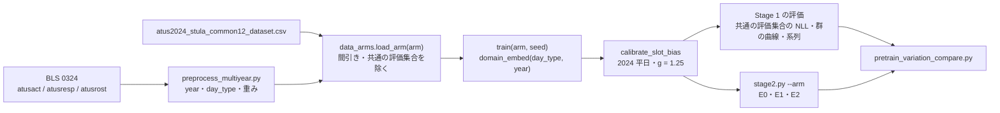

# 事前学習データのバリエーション実験 計画書

- **日付：** 2026-09-28
- **状態：** 計画（未実装）
- **対象：** GRU_Aggregate（[Stage1_gru_results.md](Stage1_gru_results.md)、[Stage2_results.md](Stage2_results.md)）

## 1. 目的と問い

事前学習（Stage 1）のデータに**土日**と**過去の年**を足すと、Stage 1 と日本への転移（Stage 2）がどう変わるかを測る。

| # | 問い | 比べる arm |
|---|---|---|
| Q1 | **多様さの効果：** 人数を今と同じに揃えたまま土日や過去の年を混ぜると、日本への転移は良くなるか | `base` と `day_n`、`base` と `year_n` |
| Q2 | **人数の効果：** 多様さを揃えたまま人数を増やすと、何が変わるか | `day_n` と `day_all`、`year_n` と `year_all` |
| Q3 | 両方を足した上限 | `both_all`（記述だけ） |

- **背景：** Stage 2 の J3 で、遷移（`bigram_jsd`）と 15 分で終わる活動の割合が ATUS から離れた（[Stage2_results.md](Stage2_results.md) §5.1）。多様なデータで学習した事前分布なら、日本へ寄せるのに要る δ が小さくなり、系列の崩れも小さくなるかもしれない。
- **wiki での位置づけ：** [[queries/three-open-gaps-hypotheses]] のギャップ②（source を混ぜるのは転移に損か得か）の、国ではなく曜日と年での小さな版にあたる。同ページの仮説は「素朴に混ぜると損、source を条件にすると得」。本計画は曜日と年を条件にする側を主にする。

## 2. データ

| データ | 出所 | 人数 | 状態 |
|---|---|---|---|
| ATUS 2024 平日 | `data/processed/atus2024/atus2024_stula_common12_dataset.csv` | 3,736 | 手元（今の事前学習） |
| ATUS 2024 土日 | 同じファイル | 3,703 | 手元（今は `DAY_FILTER` で捨てている） |
| ATUS 2003〜2024 | BLS の複数年ファイル（`atusresp-0324.zip`・`atusrost-0324.zip`・`atusact-0324.zip`、計 約 96 MB） | 約 24 万人（見込み） | **未取得** |

- **複数年ファイルの注意（wiki外の情報、BLS の [datafiles-0324](https://www.bls.gov/tus/data/datafiles-0324.htm)・[pooling](https://www.bls.gov/tus/other-documentation/pooling.htm)）：**
  - 重みは年によって変数が違う：2003〜2005 は `TU06FWGT`、2006〜2019 と 2021 以降は `TUFINLWGT`、2020 は `TU20FWGT`。
  - 活動コードは 2003〜2024 共通の Lexicon に揃えてある。12 活動への対応は tier 1（大分類）で決めているので、年によるコードの変更の影響は小さい見込み。取得後に確かめる（§6 の検証 a）。
- **2020 年は除く：** 3 月中旬〜5 月中旬に調査が止まり、重みの作り方も違うため。
- **重み：** 年ごとに上の変数を使う。年の間の配分は各年の重みの合計どうしに任せる（年ごとの規格化はしない）。平日と土日の配分も ATUS の重みのまま（土日は 2/7）。

## 3. 方法

### 3.1 条件の足し方

- **新しい条件：** `day_type`（平日 / 土日）と `year`（2003〜2024、2020 を除く 21 水準）。どちらも埋め込みにして `x` に足す（`domain_embed`）。
- **CFG で落とさない：** 条件を落とす確率 `P_UNCOND` は、今までどおり性・年齢・就業の条件だけにかける。`day_type` と `year` は常に与える。
  - 理由：これも落とすと、条件なしの枝に土日や過去の年が混ざり、g = 1.25 の意味が `base` と変わってしまう。
- **生成：** 常に `day_type = 平日`、`year = 2024` を与える。
- **slot_bias の補正と Stage 2：** `base` と同じ（2024 平日の米国加重の率を目標に g = 1.25 で補正し、そのあと Stage 2 の E0・E1・E2）。
- **`base` の扱い：** 条件が 1 通りしかないので、`domain_embed` を持たない今の ckpt（`gru_calg125`）と同じ関数を表す。今の結果をそのまま使う。

### 3.2 arm

| arm | 学習データ | 学習の人数（目安） | 足した多様さ |
|---|---|---|---|
| `base` | 2024 平日 | 3,363 | なし（今の `gru_calg125`） |
| `day_n` | 2024 平日＋土日を 3,363 人に間引く | 3,363 | 曜日 |
| `day_all` | 2024 平日＋土日 | 約 6,700 | 曜日 |
| `year_n` | 2003〜2024 の平日を 3,363 人に間引く | 3,363 | 年 |
| `year_all` | 2003〜2024 の平日 | 約 12 万 | 年 |
| `both_all` | 2003〜2024 の平日＋土日 | 約 24 万 | 曜日・年 |

- **共通の評価集合：** 2024 平日の検証分割（373 人、今の `sm.split_indices` と同じ人）。どの arm の学習にも入れない。
- **間引き：** 共通の評価集合を除いた残りから、乱数を固定して重複なしで一様に引く。
  - 人数を揃えると、2024 平日の人は減る（`day_n` は約半分、`year_n` は約 100 人）。「同じ人数なら、多様さに回す方が良いか」を問う設計である。
- **種：** 各 arm で 42〜44 の 3 本。E2（群を外す評価）は種 42 だけで 7 fold。

## 4. 評価（結果を見る前に固定）

| # | 指標 | 何を見るか |
|---|---|---|
| S1 | 共通の評価集合での重み付き NLL（条件は 平日・2024） | Stage 1 の当てはまり（**Stage 1 の主指標**） |
| S2 | 群ごとの時刻別行動者率の MSE（米国加重）と群の分離（`separation_ratio`） | 全国の曲線は補正で揃うので、群で比べる |
| S3 | 系列の指標（`bigram_jsd`・`switch_emd`・`single_slot_ratio` ほか）、Pre-trained | ATUS 2024 平日との距離 |
| S4 | 暗記（exact copy・`dcr_gap`）、最良 epoch | 人数が増えると暗記と過学習が減るか |
| T1 | E0 の 28 群の `rate_mse_split` | Pre-trained がすでに日本にどれだけ近いか |
| T2 | E1 の δ の大きさ（`to_group_bias` の人口加重 RMS） | 日本へ寄せるのに要る移動量 |
| T3 | E1 の J3（`bigram_jsd`・`single_slot_ratio` の実 ATUS との距離） | 系列の崩れ（**転移の主指標その 1**） |
| T4 | E2 の held-out `rate_mse_split`（7 fold） | 教師に使っていない群への転移（**転移の主指標その 2**） |
| T5 | E1 の J4（`bed_bias`・`wake_bias`・`exact_mae`） | 公表表との一致 |

**判定の規則：**

- **S1〜S3、T1〜T3、T5：** 3 種の中央値で比べる。`base` の 5 種の最小〜最大の外に出たときだけ「差あり」とする。
  - 例：E1 の `bigram_jsd` の `base` の幅は 0.0071〜0.0086。
- **T4：** fold ごとに比べ、7 fold 中 6 以上で小さければ「良い」とする（J2 と同じ基準）。
- **Q1 の結論：** T3 と T4 の両方が `base` より良ければ「多様さは転移に効く」、両方が悪ければ「効かない（損）」とする。片方だけなら、どちらかの結論にはせず、両方の値を並べて示す。
- **Q2 の結論：** S1 と T4 で判定する。

**事前の予測：**

- Q2：人数を増やすと S1 と S4 は良くなる（今は epoch 22 から過学習し、暗記の兆候がある）。
- Q1：S1 は `base` より少し悪くなる（2024 平日の人が減るため）。T3・T4 は予測できない。これが本実験で答える問い。

## 5. 実装

| ファイル | 中身 |
|---|---|
| `src/common/preprocess/atus/preprocess_multiyear.py`（新規） | 0324 の 3 ファイルから 96 スロットの系列を作る（`preprocess.py` の関数を使う）→ `crosswalk_atus_stula.atus_to_common` で 12 活動へ。`year`・`day_type` と、年ごとの重みの列を足して `data/processed/atus0324/` に出す |
| `src/models/GRU_Aggregate/data_arms.py`（新規） | `ARMS`（arm 名 → 年・曜日・間引く人数）、`load_arm(arm)`、`common_holdout()`（2024 平日の検証分割を `TUCASEID` で固定） |
| `model.py` | `domain_embed` と、CLI の `--arm`。`--arm` がなければ今と同じ（今の ckpt がそのまま読める）。ckpt 名は `gru_aggregate_{arm}_s{seed}` |
| `stage2.py` | `--arm` を ckpt・CSV・δ の保存先に通す。`--judge --arm` |
| `src/eval/diagnostics/pretrain_variation_compare.py`（新規） | S1〜S4・T1〜T5 の表と図 2 枚（人数と S1、arm ごとの T3・T4）。タイトルは名前だけ |
| `test_data_arms.py`（新規） | §6 の検証 |

## 6. 検証（`test_data_arms.py`）

- **a.** 複数年ファイルの 2024 年の部分から作った系列が、今の `atus2024_stula_common12_dataset.csv` と一致する（`TUCASEID` で突き合わせ、全スロット）。一致しない場合は、人数と原因を報告してから進める。
- **b.** 共通の評価集合の `TUCASEID` が、どの arm の学習データにも入っていない。
- **c.** 間引きは、同じ乱数なら同じ人になり、人数が 3,363 になる。
- **d.** `--arm` なしのモデルの出力が、今の ckpt と一致する。
- **e.** `drop_mask` を立てても、`day_type`・`year` の埋め込みは落ちない。
- Pylance の警告をゼロにする。

## 7. 実行の順序と時間の見積もり

| 段 | 中身 | 場所 | 時間の見積もり |
|---|---|---|---|
| 1 | BLS から 3 ファイルを取得 → 前処理 → 検証 a〜e | 手元 | 半日 |
| 2 | `day_n`・`day_all`・`year_n` × 3 種（学習・補正・Stage 1 評価・E0・E1）と E2（種 42） | 手元（MPS、2 本並列、`caffeinate`） | 約 10 時間 |
| 3 | `year_all`・`both_all` × 3 種と E2（種 42） | SQUID の GPU か、手元で夜間 | 1 epoch 目の時間で見積もり直す（手元なら 1 本 1〜5 時間の見込み） |
| 4 | 比較の表と図、報告書 `Pretrain_variation_results.md` | 手元 | 半日 |

- 段 1 の検証 a の結果と、段 3 の 1 epoch 目の時間は、わかった時点で報告する。

## 8. この計画の外

- **素朴に混ぜる arm（`year`・`day_type` を条件にしない）：** wiki の仮説の「損」の側。段 2 の結果を見てから追加を判断する。
- **国を足す（MTUS）：** [[concepts/MTUS]] によれば 25 カ国が調和化されていて、日本は含まれない（韓国が近い）。利用手続きが未確認なので外した。
- **NHTS 2022：** 移動の調査で、家の中の活動を区別できないので外した。
- **日本の土曜日への転移：** 土曜の公表表は手元にある。`day_type` を入れると、将来は生成で土日を指定できる。
