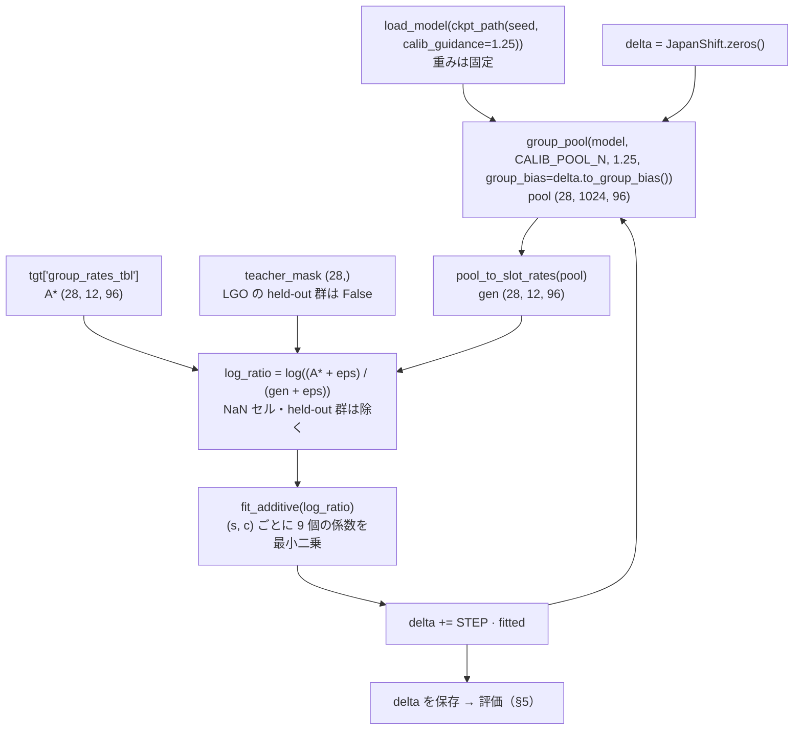

# 計画書: GRU_Aggregate の Stage 2（日本の集計へのバイアス補正）

作成 2026-09-28。Stage 1 の結果は [Stage1_gru_results.md](Stage1_gru_results.md)（採用の候補は `gru_calg125`、§8.3）。
比べる DDPM の Stage 2 は [Stage2_evaluation_results.md](../../DDPM_Aggregate_Simple/docs/Stage2_evaluation_results.md)。

## 1. 背景と方針

- **Stage 2 の目的：** Stage 1（ATUS で学習）の生成器を、日本の公表集計（教師 A*：社会生活基本調査 時間帯編の 28 群 × 12 活動 × 96 スロットの時刻別行動者率）に合わせる。個票は使わない。
- **方針：** GRU の重みは Stage 1 のまま固定する。生成時の logits に日本へのずれ δ を足し、**生成した群別の時刻別行動者率が A* に合うよう δ だけを反復で補正する**（Stage 1 の `slot_bias` の補正と同じ反復）。
- **δ は属性の足し算で持つ**（§3.1）。28 群を個別に持つと A* の標本誤差まで合わせ、LGO で外した群に何も伝わらない。

| DDPM の Stage 2 で出た問題 | この方針での扱い |
|---|---|
| 集計の損失とリハーサルの勾配が逆向き（cos −0.27）で綱引きになる | 重みを動かさないので、リハーサルが要らない |
| 時刻の細かい形（倍音 k ≥ 3）が 2% しか埋まらない（これまでの記録） | δ は 96 スロットそれぞれに自由に置ける |
| 離散の出力で勾配が切れる（[[concepts/reward-fine-tuning]]） | 勾配を使わず、生成したプールの集計を直接比べる |
| 派生時刻（起床・就寝）が日本から離れる（DDPM §7） | 夜のスロットの睡眠の割合を直接動かせる。§6 の J4 で確かめる |

- **位置付け：** 種テーブルの同時構造を保ったまま周辺に合わせる IPF（[[concepts/IPF]]）を、生成器の logits に対して行う形。
- **限界：** 1 日の組み立て（遷移・エピソードの長さ）は ATUS のまま。日本特有の並び方は、周辺のずれとしてしか入らない（IPF の種テーブル依存と同じ）。

## 2. 使うもの

| 項目 | 値 | 出所 |
|---|---|---|
| 生成器 | `gru_aggregate{接尾辞}_calg1.25.pt`（種 42〜46）、生成は g = 1.25 | Stage 1 の採用の候補 |
| 教師 A* | `group_rates_tbl` (28, 12, 96)、NaN = 非公表 | `stage2_targets.load_stula_targets` |
| 採点に使う活動 | 12 活動すべて（非公表セルは除く）。11 活動（その他を除く）でも併記 | `stage2_targets.mask_12act` / `mask_11act`（DDPM と同じ） |
| LGO の分割 | 28 群を 4 群 × 7 fold、人口シェアで層化・乱数なし | `stage2_lgo.stratified_folds`（DDPM と同じ分割） |
| 評価の関数 | 教師適合・ガードレール・暗記・公表表 | `stage2_select.teacher_fit_rows` / `guardrails` / `memorization_guardrail` / `published_metrics` |

## 3. 手法

### 3.1 日本へのずれ δ

```
logits_jp[d, s, :] = logits_gru(a_<s, c_d, s) + delta[d, s, :]
delta[d, s, c] = base[s, c] + sex[g_d, s, c] + age[a_d, s, c] + emp[e_d, s, c]
```

| 部品 | 形 | 識別の条件 |
|---|---|---|
| `base` | (96, 12) | — |
| `sex` | (2, 96, 12) | 男 = 0（基準） |
| `age` | (7, 96, 12) | 15-24 = 0（基準） |
| `emp` | (2, 96, 12) | 無業 = 0（基準） |

- 1 セル（s, c）あたり 1 + 1 + 6 + 1 = 9 個、合計 9 × 96 × 12 = 10,368 個。
- 主効果だけにする（交互作用は入れない）。説明しやすさと、LGO で外した群への伝わりやすさを優先する。
- CFG では、δ を条件付き・条件なしの両方の logits に足す。

  `(l_u + δ) + g·((l_c + δ) − (l_u + δ)) = l_u + g·(l_c − l_u) + δ`

  δ は g によらず 1 回だけ効く。

### 3.2 補正の反復



| 項目 | 値 | 理由 |
|---|---|---|
| 反復の回数 | 10 回で固定（途中で止めない） | 教師の値を見て止める回を選ぶと、DDPM で step を固定したのと同じ約束が崩れる |
| 更新の幅 `STEP` | 0.5 | Stage 1 の補正で、1.0 は振動し 0.5 は収束した |
| 1 回のプール | 28 群 × 1,024 本、種 30000 + k（評価のプールの種 12345 とは別） | Stage 1 の補正と同じ大きさ |
| 最小二乗の重み | 群を等しく扱う（公表のあるセルの単純平均） | 主な指標 `rate_mse_split` がセルの単純平均だから |
| `eps` | 1e-4 | Stage 1 と同じ |

- held-out 群のセルは、最小二乗に一度も入れない。held-out 群の δ は、残りの群から推定した属性の効果だけで決まる。

## 4. 実行

| 実行 | 教師にする群 | 種 | 本数 | 目的 |
|---|---|---|---|---|
| E1 | 28 群すべて | 42〜46 | 5 | 種による揺れ、ガードレール、公表表（軸 2・3） |
| E2 | LGO：fold ごとに 4 群を外す | 42 | 7 | 教師に使っていない群での適合（軸 1、非循環） |
| E0 | なし（δ = 0 の zero-shot） | 42〜46 | 5 | 起点（fold ごとの held-out 群でも採点する） |

- E1・E2 の 1 本は約 15〜20 分（g = 1.25 の補正のプール 11 回と評価のプール 1 回）。E0 は評価のプールだけで 1 本約 3 分。合わせて約 4 時間で、手元の MPS で回す。
- DDPM の LGO の結果（報告 §5.2）は fold ごとに 1 本なので、E2 も fold ごとに 1 本（種 42）にする。

## 5. 評価（DDPM の Stage 2 と同じ 3 つの軸）

- 評価のプールは群あたり 2,000 本（`stage2_select.DEFAULT_N`）、種 12345、g = 1.25。
- 群の中で前半・後半に分け、`rate_mse_split`（生成側の雑音を抜いた二乗誤差）を出す。

| 軸 | 指標 | 循環性 |
|---|---|---|
| 軸 1 | `rate_mse_split`・`dev_rmse`（教師 A* への群別の適合）。in-teacher と held-out を分ける | held-out だけが非循環 |
| 軸 1 | 全国の曲線の MSE：28 群を日本人口で加重した時刻別行動者率（`stage2_curves.weighted_slot_rates`）と、同じ加重をした教師の曲線の差の 2 乗の平均（12 活動 × 96 スロット） | 28 群すべてが教師なら循環 |
| 軸 2 | bigram_jsd・switch_emd・switch_mean・single_slot・wrap_closure・night_intrusion・pairwise_hamming_std・暗記（exact copy・dcr_gap）。群の分離（separation_ratio）は報告だけ（日本の群の違いが ATUS と同じである必要はないため判定に使わない） | 非循環（教師が縛らない量） |
| 軸 3 | 起床・就寝の平均時刻の bias（`wake_bias` / `bed_bias`）、日次行動者率（`exact_mae` / `union_outside_rate`） | 非循環（教師に使っていない公表表） |

- 軸 2 は DDPM と同じく、zero-shot からどちらへ動いたかではなく、**実 ATUS の値との距離**で判定する。
- 軸 3 は日本人口で加重する（`eval_derived_times` の `weight_basis = stula_pop`）。

## 6. 判定（結果を見る前に固定）

| # | 条件 | 合格の基準 |
|---|---|---|
| J1 | 教師に使っていない群での改善（軸 1） | E2 で held-out の `rate_mse_split` が **7 fold すべてで** zero-shot（E0 の同じ群）より小さい（符号検定 p = 0.0156、DDPM と同じ基準） |
| J2 | DDPM との比較（軸 1） | E2 の held-out の `rate_mse_split` が、7 fold のうち **6 以上で** DDPM の Stage 2（λ = 0.003、step 200。DDPM の報告 §5.2 の値）より小さい |
| J3 | 系列を壊さない（軸 2） | E1 の 5 本の中央値で、軸 2 の各指標の「実 ATUS との距離」が zero-shot の **1.2 倍を超えない**。exact copy と暗記の判定は 0 本 |
| J4 | 日本の生活時間へ寄る（軸 3） | E1 の 5 本の中央値で、\|`bed_bias`\| と \|`wake_bias`\| が zero-shot より小さい。`exact_mae` も zero-shot より小さい |
| J5 | 全国の時刻別行動者率への適合（28 群すべて） | E1 の 5 本の中央値で、全国の曲線の MSE が DDPM の Stage 2（1.281e-3）より小さい |
| J6 | 群別の時刻別行動者率への適合（28 群すべて） | E1 の 5 本の中央値で、28 群の `rate_mse_split` が DDPM の Stage 2（2.590e-3）より小さく、`dev_rmse` も DDPM（0.0387）より小さい |

- **採用の条件：** J1・J3・J5・J6。
- **DDPM に対する優位を主張する条件：** J2 と J4。
- J5・J6 は 28 群すべてが教師なので循環している（学習した当のものを測っている）。教師に使っていない群での裏付けは J1・J2 が担う。
- DDPM の値は、DDPM の報告と同じ出力（`outputs/generated/stage2_step200_rates.npz`：λ = 0.003・step 200・群あたり 1,000 本。zero-shot は `ddpm_simple_pretrain_common12_weekday_20260819_rates.npz`）から 2026-09-28 に計算し直し、記録の値（`rate_mse` 2.635e-3・`dev_rmse` 0.0387）と一致することを確かめた。
  - 全国の曲線の MSE は zero-shot 1.381e-3 → step 200 1.281e-3。
  - `rate_mse_split` は `stage2_lam0.003_selection.csv` の step 200 の値。
- 1.2 倍は、zero-shot の種の間のばらつきより大きく、明らかな悪化だけを拾う値として置いた。
- **J3 で落ちた場合：** 悪化した指標と程度を DDPM の Stage 2 と並べて示し、判断を仰ぐ。

**事前の予測:**

- J1 は満たす（δ が生成した集計を直接動かし、属性の効果は held-out 群にも伝わる）。
- J2 は満たす（時刻の細かい形を δ で直接作れる）。
- J3 でいちばん危ういのは switch_emd / switch_mean。Stage 1 の補正で、バイアスは長さではなく始める回数を増やした。
- J4 の就寝は日本へ寄る（夜のスロットの睡眠の割合を直接動かす）。
- J5 は満たす（δ の共通の成分 `base` が全国の曲線を直接動かす）。
- J6 は満たす見込みだが、主効果だけでは群ごとの細かい違い（交互作用）が残るので、J5 より余裕は小さい。

## 7. 実装

| ファイル | 中身 |
|---|---|
| `src/models/GRU_Aggregate/model.py`（変更） | `sample` / `group_pool` に群ごとの追加バイアス `group_bias` (28, 96, 12) を渡せるようにする（None なら従来と同じ） |
| `src/models/GRU_Aggregate/stage2.py`（新設） | `JapanShift`（base / sex / age / emp と `to_group_bias`）、`fit_additive`、`calibrate_to_teacher`、`evaluate`（`stage2_select` の採点関数を呼ぶ）、CLI（`--seed` `--fold` `--zero-shot`） |
| `src/models/GRU_Aggregate/test_stage2.py`（新設） | §8 の単体テスト |
| `src/models/GRU_Aggregate/docs/Stage2_results.md`（新設） | 結果の報告書。図は `figures/` |

- 評価の出力は `stage2_select` と同じ縦持ちの形式にし、`stage2_lgo` の held-out の集計（`collect_heldout` / `heldout_vs_baseline`）をそのまま使う（使えるかは実装の最初に確かめる）。

## 8. 検証（`test_stage2.py`）

| # | 検証すること |
|---|---|
| a | `fit_additive` が、既知の足し算の効果で作った log 比から係数を復元する（NaN セルを除いても） |
| b | δ = 0 の `group_pool` が、従来の `group_pool` と同じ乱数で同じ出力になる |
| c | held-out 群の A* を書き換えても、補正で得る δ が変わらない（held-out が最小二乗に入っていない） |
| d | CFG で δ を両方の logits に足すと、g によらず δ が 1 回だけ効く |
| e | `to_group_bias` の群 d の値が、`sm.cond_grid()[d]` の属性の係数の和になる |

あわせて Pylance の警告をゼロにし、小さな設定（反復 1 回・群あたり 4 本）での完走を確認する。

## 9. この計画の外

- 交互作用（性 × 就業など）を δ に足す。主効果だけで残った差が大きい場合に検討する。
- 残った 1 日の組み立ての違いを直すため、重みも小さく動かす 2 段目（実データの履歴で予測した確率への集計の損失）。
- 休日の日誌。
